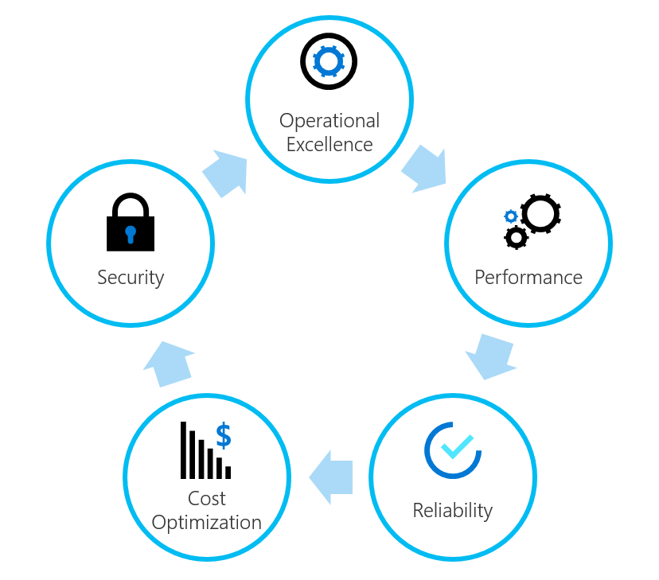

# Enable customer success with a sound operating model and organizational alignment

Customer success in cloud adoption efforts often has little to do with technical skills or adoption-related projects. Your operating model creates opportunities to enable adoption or roadblocks that might slow down cloud adoption.

## Alignment

As you drive innovation, alignment between business and technical teams is paramount to the success of your solution.

- For business stakeholders, we've created the [Microsoft AI Business School](https://www.microsoft.com/ai/ai-business-school) to support business strategy development and provide example best practices.
- For technical stakeholders, the [Microsoft AI learning paths](/learn/) are available to help you build new AI skills.

## Blockers

When adoption of the cloud is slowed or stalled, it might be wise to evaluate your operating model to enable continued success. When success is inconsistent from workload to workload or project to project, the operating model might be misaligned. If more than one project is stalled by blocking policies, outdated processes, or misalignment of people, the operating model is likely blocking success.

## Opportunities

Beyond the common blockers, a few key opportunities can be scaled across the portfolio through incremental improvements to your operating model. In particular, customers commonly want to scale operational excellence, cost optimization, security, reliability, performance, or people management. Scaling these conversations at the portfolio level can help bring best practices for specific workload-focused teams to all other projects and workloads.

## Getting started guides to enable teams through an operating model

The following guides will help you get started with operating model alignment and improve over time.

| Guide                                                                                    | Description                                                                                                                               |
|-------------------------------------------------------------------------------------|--------------------------------------------------------------------------------------------------------------------------------|
| [How do we deliver operational excellence during cloud transformation?](./operational-excellence.md)                   | The steps in this guide will help the strategy team lead organizational change management to consistently ensure operational excellence. |
| [How do we manage enterprise costs?](./manage-costs.md)                                          | Start optimizing enterprise costs and manage cost across the environment.                                                                           |
| [How do we consistently secure the enterprise cloud environment?](./security.md)             | This getting started guide can help ensure that the proper security requirements have been applied across the enterprise to minimize risk of breach and accelerate recovery when a breach occurs.                                       |
| [How do we apply the right controls to improve reliability?](./reliability.md)                   | This getting started guide helps minimize disruptions related to inconsistencies in configuration, resource organization, security baselines, or resource protection policies. |
| [How do we ensure performance across the enterprise?](./performance.md)                               | This getting started guide can help you establish processes for maintaining performance across the enterprise.                               |
| [How do we align our organization?](./org-alignment.md)                               | This getting started guide can help you establish an appropriately staffed organizational structure.                               |

## Shared architecture principles

The core principles of a well-managed operating model are based on a set of common architecture principles. The getting started guidance in this article series will help supporting teams as they scale these principles across the cloud platform and throughout the portfolio of workloads.

_Figure 1: The principles of shared architecture._

These principles are shared across Azure Advisor, the Microsoft Azure Well-Architected Framework, and solutions in the Azure Architecture Center:

- [Azure Advisor](/azure/advisor/advisor-overview) evaluates the principles for individual assets across solutions, workloads, and the full portfolio.
- [Azure Architecture Center](/azure/architecture/) applies these principles to develop and manage specific technical solutions.
- [Microsoft Azure Well-Architected Framework](/azure/architecture/framework/) helps balance these principles across a workload, to guide architecture decisions.
- [Cloud Adoption Framework](../index.yml) ensures that the principles scale across the portfolio to enable adoption teams through a well-managed environment.
