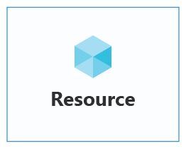
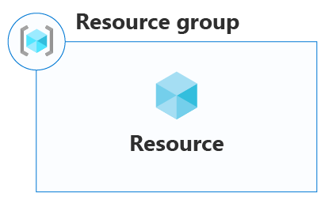
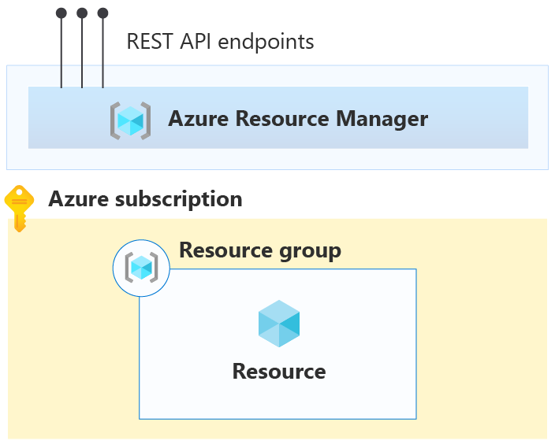
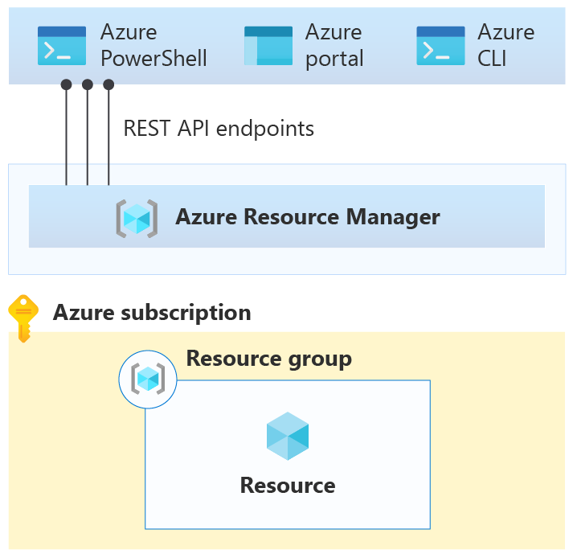
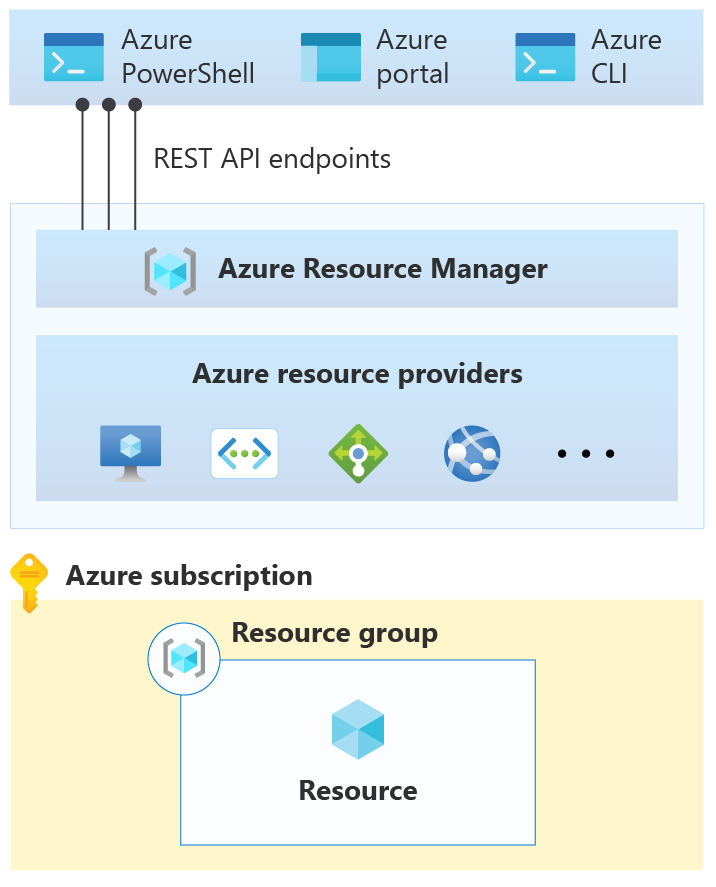
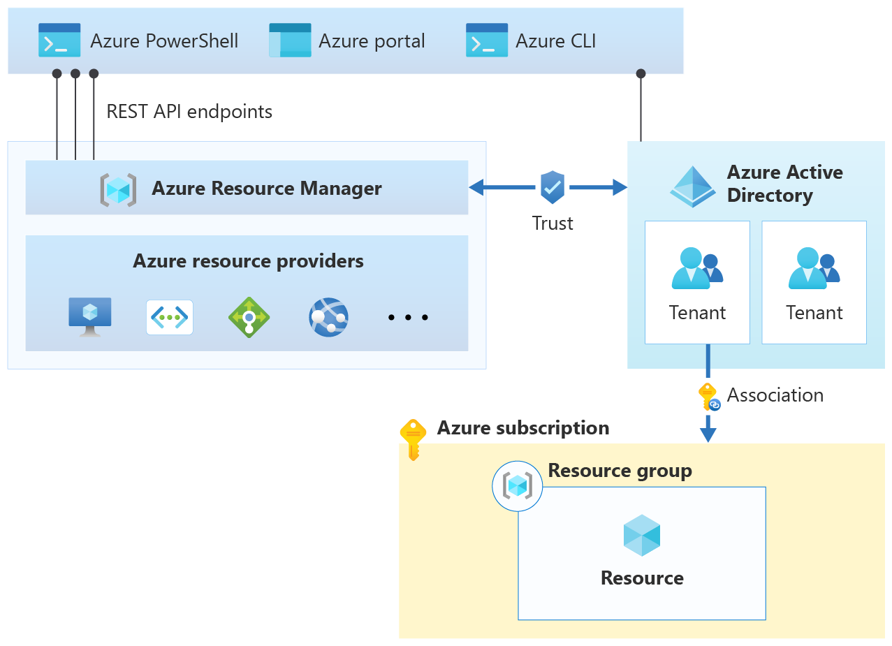
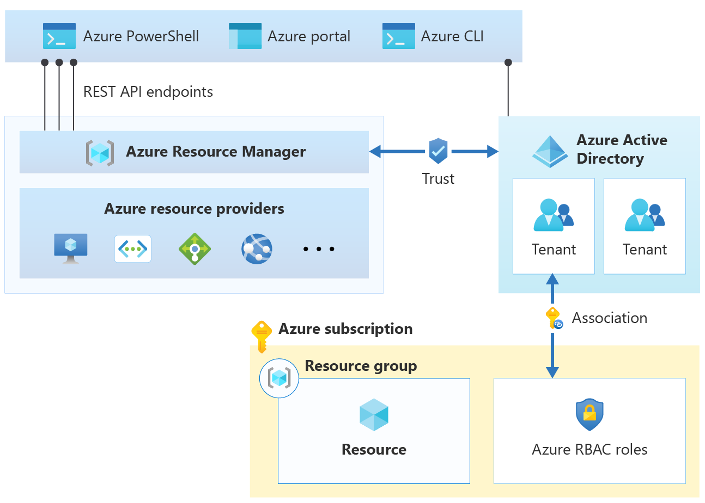
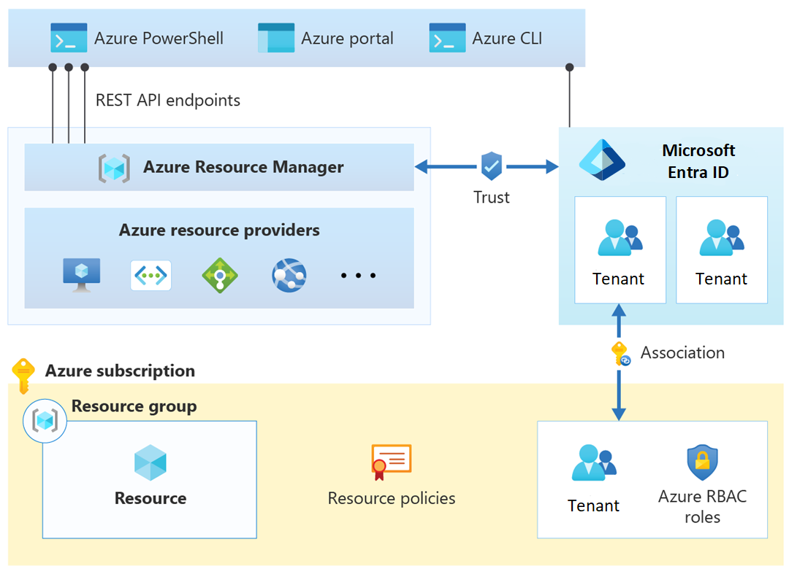
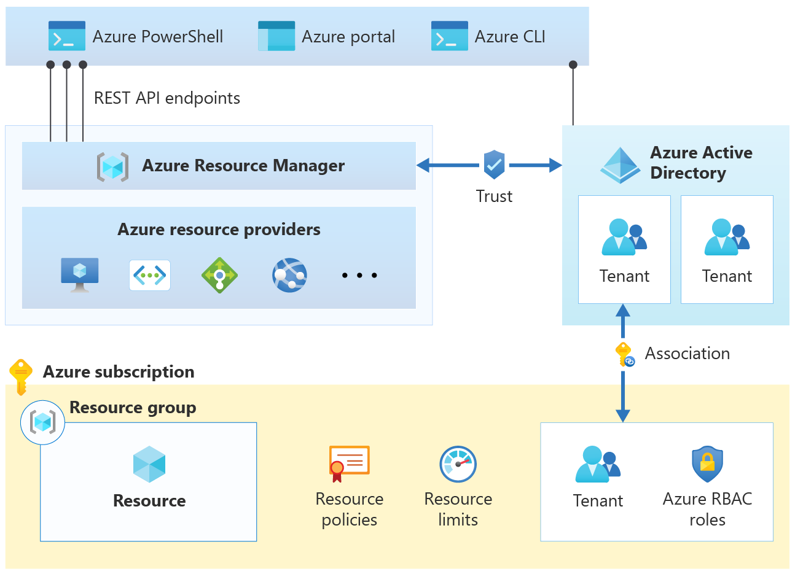

# Resource access management in Azure

In this article, learn how resources are deployed in Azure, starting with the fundamental Azure constructs of resources, subscriptions and resource groups. You will then learn how Azure Resource Manager (ARM) deploys resources.

## What is an Azure resource?

In Azure, a resource is an entity managed by Azure. Virtual machines, virtual networks, and storage accounts are all examples of Azure resources.

## What is an Azure resource group?

Each resource in Azure must belong to a [resource group](/azure/azure-resource-manager/management/overview#resource-groups). A resource group is a logical container that associates multiple resources so you can manage them as a single entity, based on lifecycle and security. For example, you can create or delete resources as a group if the resources share a similar lifecycle, such as the resources for an [n-tier application](/azure/architecture/guide/architecture-styles/n-tier). In other words, everything that you create, manage, and deprecate together is associated within a resource group.

Recommended best practice is to associate resource groups, and the resources they contain, with an Azure subscription.

## What is an Azure subscription?

An Azure subscription is similar to a resource group in that it's a logical container that associates resource groups and their respective resources. An Azure subscription is also associated with Azure Resource Manager controls. Learn about [Azure Resource Manager](/training/modules/use-azure-resource-manager/) and its relationship to Azure subscriptions.

## What is Azure Resource Manager?

In [How does Azure work?](what-is-azure.md), you learn that Azure includes a front end with services that orchestrate Azure's functions. One of these services is [Azure Resource Manager](/azure/azure-resource-manager/). This service hosts the RESTful API clients use to manage resources.

The following figure shows three clients: [Azure PowerShell](/powershell/azure/), the [Azure portal](https://portal.azure.com), and the [Azure CLI](/cli/azure/):

While these clients connect to Resource Manager using the REST API, Resource Manager doesn't include functionality to manage resources directly. Rather, most resource types in Azure have their own [resource provider](/azure/azure-resource-manager/management/overview#terminology).

When a client makes a request to manage a specific resource, Azure Resource Manager connects to the resource provider for that resource type to complete the request. For example, if a client makes a request to manage a virtual machine resource, Azure Resource Manager connects to the `Microsoft.Compute` resource provider.

Azure Resource Manager requires the client to specify an identifier for both the subscription and the resource group to manage the virtual machine resource.

Once you understand how Azure Resource Manager works, you can learn how to associate an Azure subscription with the Azure Resource Manager controls. Before Azure Resource Manager can execute any resource management request, review the following a set of controls.

The first control is that a validated user must make a request. Also, Azure Resource Manager must have a trusted relationship with [Azure Active Directory (Azure AD)](/azure/active-directory/) to provide user identity functionality.

In Azure AD, you can segment users into tenants. A *tenant* is a logical construct that represents a secure, dedicated instance of Azure AD that someone typically associates with an organization. You can also associate each subscription with an Azure AD tenant.

Each client request to manage a resource in a particular subscription requires that the user has an account in the associated Azure AD tenant.

The next control is a check that the user has sufficient permission to make the request. Permissions are assigned to users using [Azure role-based access control (Azure RBAC)](/azure/role-based-access-control/).

An Azure role specifies a set of permissions a user can take on a specific resource. When the role is assigned to the user, those permissions are applied. For example, the [built-in Owner role](/azure/role-based-access-control/built-in-roles#owner) allows a user to run any action on a resource.

The next control is a check that the request is allowed under the settings specified for [Azure resource policy](/azure/governance/policy/). Azure resource policies specify the operations allowed for a specific resource. For example, an Azure resource policy can specify that users are only allowed to deploy a specific type of virtual machine.

The next control is a check that the request doesn't exceed an [Azure subscription limit](/azure/azure-resource-manager/management/azure-subscription-service-limits). For example, each subscription has a limit of 980 resource groups per subscription. If you receive a request to deploy another resource group when the limit has been reached, deny it.

The final control is a check to verify the request is within the financial commitment that you associate with the subscription. For example, Azure Resource Manager verifies the subscription has sufficient payment information if the request is to deploy a virtual machine.

## Summary

In this article, you learned about how resource access is managed in Azure using Azure Resource Manager.

## Next steps

Learn more about cloud adoption with the Microsoft Cloud Adoption Framework for Azure.

> [!div class="nextstepaction"]
> [Microsoft Cloud Adoption Framework for Azure](../index.yml)
