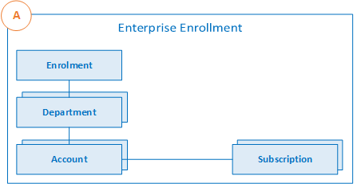

# A. Enterprise Enrolment and Azure AD Tenants

Figure 3 – EA Enrolment Hierarchy

## 1. Planning for Enterprise Enrolment

An Enterprise Enrolment, often referred to as the Enterprise Agreement, represents the commercial relationship between Microsoft and the customer regarding their use of Azure. It provides the basis for billing across all customer subscriptions and therefore has an impact on administration of the customer estate.

***Design Considerations***

- The Enrolment provides a hierarchical organizational structure to govern the management of customer subscriptions.

- Different customer environments can be separated at an EA account level to support holistic isolation.

- There can be multiple administrators appointed to a single Enrolment.

- Each Subscription must have an associated Account owner.

- Each Account owner will be made a subscription owner for any subscriptions provisioned under that account.

- A Subscription can only belong to one Account at any given time.

- A Subscription can be suspended based on a specified set of criteria.

***Design Recommendations***

- Setup the notification account email address to ensure notifications are sent to an appropriate group mailbox.

- Assign a budget for each account and establish an alert associated with the budget.

- Leverage the Department organisational element to map customer business divisions.

- Create a new Department if business domains have independent IT capabilities.

- Restrict and minimise the number of Account owners within the Enrolment to avoid the proliferation of admin access to Subscriptions and associated Azure resources.

- If multiple AAD tenants are used, ensure the Account owner is associated with the same tenant as where subscriptions for the account are provisioned.

- Separate Dev/Test/Prod environments at an EA account level to support holistic isolation.

<!-- -->

- Do not ignore notification emails sent to the notification account email address. Microsoft sends important EA wide communications to this account.

- Do not move or rename an EA Account in Azure AD.

## 2. Define Azure AD Tenants

An Azure AD tenant is an instance of Azure Active Directory which contains accounts and groups, and acts as an authentication source for subscriptions, which must be rooted to a single AAD tenant.

***Design Considerations***

- Multiple tenants can be leveraged under the same Enterprise Enrolment.

***Design Recommendations***

- Leverage AAD SSO based on the selected [planning topology](/azure/active-directory/hybrid/plan-connect-topologies).

- Enforce MFA and conditional access policies for all privileged accounts.

- Use AAD PIM for Identity and Access management.

- If Dev/Test/Prod are going to be completely isolated environments from an identity perspective, separate them at a tenant level (i.e. use multiple tenants).

<!-- -->

- Avoid creating a new AAD tenant unless there is a strong IAM justification and processes are already in-place.

## Next steps

Suggested design for [Identity and Access Management](./B-Identity-and-Access-Management.md)

> [!div class="nextstepaction"]
> [Identity and Access Management](./B-Identity-and-Access-Management.md)