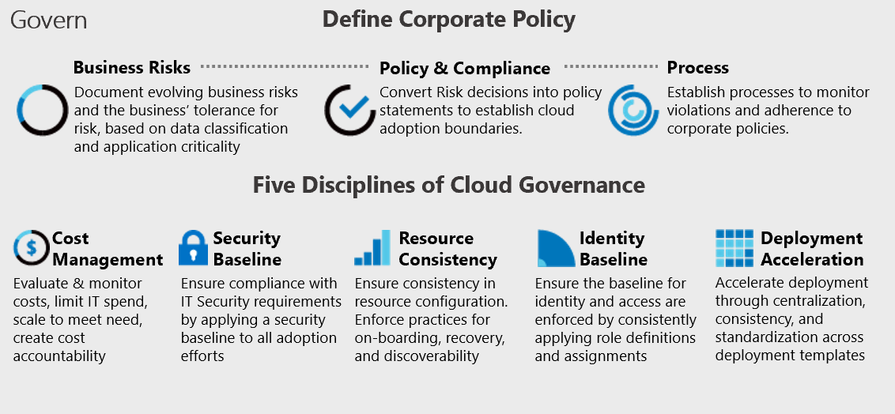

# Governance for the retail industry

Use the Cloud Adoption Framework methodology to systematically and incrementally improve governance of your cloud portfolio across five governance disciplines pictured below.

This article refines the methodology for governance needs specific to the retail industry.

When developing your cloud governance strategy, follow the approach in the standard methodology. For more information, see [Governance in the Microsoft Cloud Adoption Framework for Azure](../../govern/index.md). Use this article for potential additions to accelerate or extend your cloud governance capabilities specific to retail.

## Governing hybrid and multicloud assets

Aside from online-only retailers, retail organizations operate from several distributed physical locations to deliver brick and mortar retail. Because of latency limitations, those locations can contain technology assets. You must govern, operate, and secure those assets to help protect your business from risks.

Your governance strategy may require distributed governance, but that may not be a part of your cloud adoption strategy. Does your cloud adoption strategy include digital transformation for [Supply chain optimization](./retail-supply-chain-optimization.md), [Building management optimization](./retail-building-management-optimization.md), or in-store experience for your customers?

If you have distributed locations and need to drive a cloud adoption strategy for assets in those locations, consider a unified operations strategy. This strategy can deliver governance and operations across public cloud, private cloud, and edge locations. For more information, see [Introduction to unified operations](../../scenarios/hybrid/unified-operations.md)

## Compliance with Payment Card Industry Data Security Standards

Most retail organizations require compliance with Payment Card Industry (PCI) Data Security Standards (DSS) to process credit cards. For more information, see [PCI DSS](/azure/compliance/offerings/offering-pci-dss). Microsoft Azure maintains PCI-DSS validation, which can make it easier to govern PCI-DSS compliant deployments in the cloud. For more information, see [Azure and PCI DSS](/azure/compliance/offerings/offering-pci-dss#azure-and-pci-dss). Your organization also shares in responsibilities to fully comply with PCI-DSS standards.

If your cloud deployments require PCI-DSS compliance, review the [control mapping of PCI-DSS v3.2.1](/azure/governance/blueprints/samples/pci-dss-3.2.1/control-mapping). You can deploy the blueprint sample and assign it to specific Azure environments. It can automate many of the required PCI controls. For more information, see [Deploy the PCI-DSS v3.2.1 blueprint sample](/azure/governance/blueprints/samples/pci-dss-3.2.1/deploy).

For compliance standards that have been automated in a similar Azure blueprint approach, see [Azure Blueprint Samples](/azure/governance/blueprints/samples/). If you prefer to work with built-in Azure policy initiatives, see [Regulatory Compliance built-ins in Azure Policy](/azure/governance/policy/samples/iso-27001).

## Next steps

The following article provides guidance to help you succeed in the cloud adoption scenario:

- [Management in the Retail industry](./manage.md)
