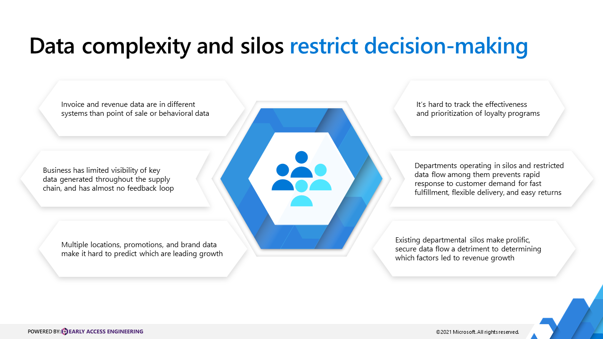
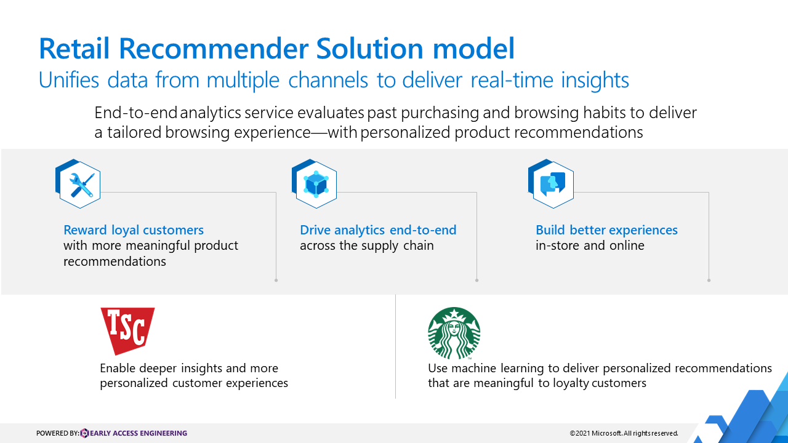
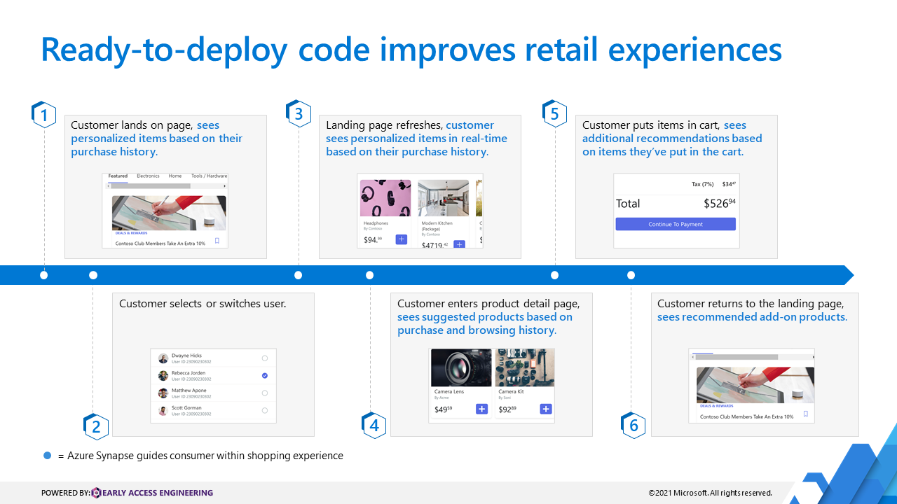

# Improve retail experience with a Retail Recommender Solution Accelerator

In the retail world, digital channels have rapidly become the driving force towards creating improved customer engagement. Retailers are being pushed to reimagine the way they communicate value proposition, sharing updates on their product lines. They are being forced to move towards the perspective of the purchasing consumer—aiming to better understand what customers are looking for. Retailers are seeking fresh ways to strengthen the connection between shoppers and products—increasing their attach rate, and creating additive value beyond the products in shopping carts.

Onsite shopping typically leads to impulse buying, as shoppers have a variety of products displayed before them. Impulse buying doesn't typically occur in the online shopping experience. Shoppers look for specific products, add to their basket, and proceed to checkout.

The Retail Recommender Solution Accelerator helps retailers highlight associated products that might be of interest to a shopper. Its purpose is to create a personalized online shopping experience. Using AI and advanced data analytics cloud technologies, the Retail Recommender Solution Accelerator presents shoppers with relevant content and products in the following ways:

- A shopper visits a retailer online commercial page, which prompts the user with personalized selections, based on purchase history.
- When the shopper adds items to the cart, the site offers more recommendations, based on what products would be purchased with these items.
- As the shopper moves around the retailer's site, the site offers new recommendations based on what the shopper looks at.

## Retail Recommender Solution Accelerator

The Retail Recommender Solution Accelerator is ready-to-deploy code that levers analytics capabilities within Azure Synapse to evaluate your shoppers' past purchasing and browsing habits—delivering a tailored browsing experience with personalized product recommendations.

Exceeding customer expectations in the retail sector is the most important lever to improve your business. Deeper insights can drive your organization's revenue, and increase retention. Machine learning helps you to evaluate how operational decisions factor into business outcomes.

## Connect your data and understand your customer, however they buy

**Unlock innovation—and remove data silos in your organization**. Earn repeat customers by delivering an improved, more customized omnichannel customer experience with unified data strategy. Gain a holistic view of customer information and sales data, in addition to macroeconomic influences, financial transactions, and supply—everything that enables your organization to automate workflows, plan for future sales, and proactively manage risk.

**Accelerate your existing business growth with ready-to-deploy code**** that you can quickly implement into your infrastructure—and overcome the challenge of optimizing the capture, visualization, and levering of your customers' data.

## Retail Recommender Solution Accelerator overview

- **Reward your loyal customers** with meaningful product recommendations
- **Drive end-to-end analytics** across the supply chain
- **Build better in-store and online experiences**
- **Enable deeper insights—and a more customized customer experience**
- **Use machine learning to make personalized recommendations** that are meaningful to your loyalty customers

## Transform customer experience with real-time personalization

The Retail Recommender Solution Accelerator uses machine learning and a filtering model that connects what the customer looks at with data from what other users have in real time to provide a recommendation. For example, if other customers viewed phones and headsets, and you view phones, you are more likely to view a headset as well—an that particular customer view will become your recommendation. The system will then construct a matrix of similar data to inform your future recommendations.

Here is what the Retail Recommender Solution Accelerator model looks like:

### How do real-time shopping recommendation work for your organization?

- Customer lands on page, sees personalized items based on their purchase history.
- Customer selects or switches user.
- Landing page refreshes, customer sees personalized items in real-time based on their purchase history.
- Customer enters product detail page, sees suggested products based on purchase and browsing history.
- Customer puts items in cart, sees additional recommendations based on items they’ve put in the cart.
- Customer returns to the landing page, and sees recommended add-on products.

## Get started with the Retail Recommender Solution Accelerator MVP

Launch the [Retail Recommender Solution Accelerator](https://github.com/microsoft/Azure-Synapse-Retail-Recommender-Solution-Accelerator) with the resources needed to quickly build a Retail Recommender Solution based on the comprehensive Azure Analytics Platform.

## Create your personalized MVP

- **Deploy resources**. Create a resource group you can use as a container to begin deploying the resources to Azure.

- **Prepare data**. Configure your development environment for Azure Machine Learning. Notebook VM is a highly-compatible, preconfigured way to get up and running quickly.

- **Train data with custom scripts**. The scripting process is outlined in a series of Jupyter Notebooks. Review them sequentially to walk you through training, scoring, and making predictions using Azure Machine Learning.

Create your MVP in less than a day With demo data, or in 2-5 weeks with your custom data and a prep session.

Here is a high-level diagram of operations through Azure Data Lake Storage Gen2 (enterprise-scale data lake), Azure Synapse, Azure Synapse Analytics, Azure Cognitive Search, Azure Machine Learning Service, Azure API Management, and Azure Machine Learning services.

### Azure and analytics platform prerequisites

Working knowledge of Azure, Azure Cosmos DB, Azure Machine Learning, and Azure Kubernetes.

[Read the full Tractor Supply Company story](https://corporate.tractorsupply.com/newsroom/news-releases/news-releases-details/2020/Tractor-Supply-Company-To-Expand-Relationship-With-Microsoft/default.aspx).

Read more:

- [Azure Synapse Analytics](/azure/synapse-analytics/)
- [Azure Kubernetes Service](/azure/aks/)
- [Azure Machine Learning](/azure/machine-learning/overview-what-is-azure-ml)
- [Azure Synapse content on Microsoft Learn](/learn/browse/?terms=synapse)
- [Azure Kubernetes on Microsoft Learn](/learn/browse/?terms=kubernetes)
- [Data scientist learning path](/learn/browse/?roles=data-scientist)

For comprehensive technical guidance, including a deployment guide, see the [Retail Recommender Solution Accelerator GitHub page](https://github.com/microsoft/Azure-Synapse-Retail-Recommender-Solution-Accelerator).

Tractor Supply Company, the largest rural lifestyle retailer in the United States, selected Microsoft as its strategic cloud provider to support technology architecture and modernization for the company's e-commerce website and enterprise analytics platform. [Read the full Tractor Supply Company customer story](https://corporate.tractorsupply.com/newsroom/news-releases/news-releases-details/2020/Tractor-Supply-Company-To-Expand-Relationship-With-Microsoft/default.aspx).

Starbucks has been using reinforcement learning technology to provide a personalized experience for customers using the company's mobile app. This machine learning training method learns to make decisions in complex, unpredictable environments based upon external feedback. [Read the full Starbucks customer story](https://news.microsoft.com/transform/starbucks-turns-to-technology-to-brew-up-a-more-personal-connection-with-its-customers/).

## Next steps

Try the live [Synapse/AI-Retail-Recommender](https://synapsefornextgenretail.azurewebsites.net/) demo.

Use the Azure DevOps template to deploy in your own environment. Follow the steps included in the [Retail Recommender Azure DevOps template](https://azuredevopsdemogenerator.azurewebsites.net/):

1. Sign in to the generator.
1. Navigate to the Cloud Adoption Framework.
1. Select the [`Retail Recommender` Azure DevOps template](https://azuredevopsdemogenerator.azurewebsites.net/).
1. Deploy to your Azure DevOps environment.

The following articles will help you succeed in your cloud adoption journey.

- [Governance in the retail industry](./govern.md)
- [Management in the retail industry](./manage.md)
