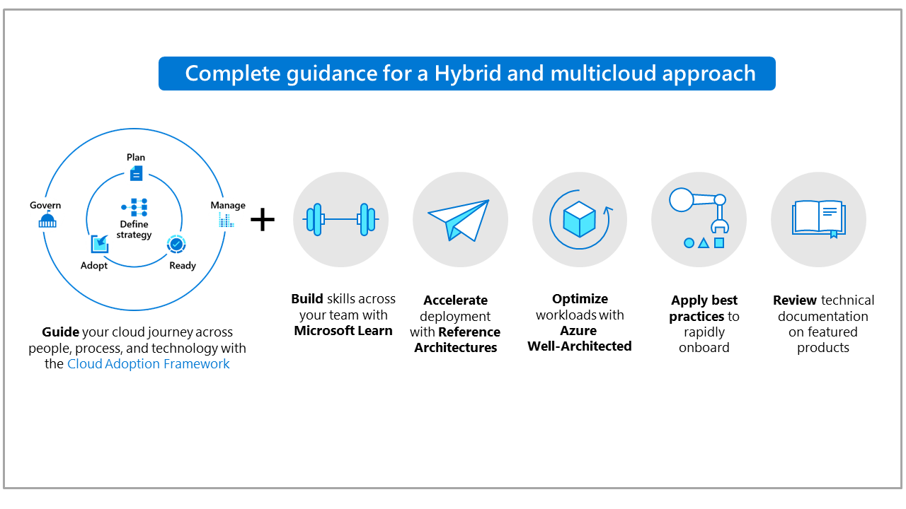

# Cloud adoption for the Retail industry

As retail companies address larger, more sophisticated forms of cloud adoption, their journey to the cloud becomes more complex. This article series consolidates various technical and non-technical considerations required to prepare for a cloud adoption scenario specific to the retail industry.

## Scenario components

This scenario is designed to guide the end-2-end customer journey during the cloud adoption lifecycle.

Delivery of the full journey requires certain key components, or guidance sets:

| &nbsp; | &nbsp; |
|--|--|
|   :::image type="icon" source="../../_images/hybrid/cloud-journey.png"::: |   [Microsoft Cloud Adoption Framework for Azure](../../get-started/index.md): These articles walk through the smallest set of considerations and implementations of each CAF methodology. Use these articles to prepare business decision makers, technology leaders, solution architects, and infrastructure architects for the cloud adoption journey. |
|   :::image type="icon" source="../../_images/hybrid/hybrid-well-architected.png"::: |   [Microsoft Azure Well-Architected Framework](/azure/architecture/framework/): These articles outline the considerations that each workload owner should make when their retail workloads need to be deployed or managed in the cloud. |
|   :::image type="icon" source="../../_images/hybrid/hybrid-architectures.png"::: |   [Retail solutions](/azure/architecture/industries/retail.md?bc=/azure/cloud-adoption-framework/_bread/toc.json&toc=/azure/cloud-adoption-framework/industry/retail/toc.json): These reference solutions aid in accelerating deployment for a number of common retail architectures. |
|   :::image type="icon" source="../../_images/hybrid/hybrid-best-practices.png"::: |   Best practices: These level 300+ articles help Central teams prepare for the technical tasks required to support retail cloud adoption. |
|   :::image type="icon" source="../../_images/hybrid/hybrid-product-docs.png"::: |   Feature Azure products: Learn more about the products that support your retail industry strategy in Azure. |
|   :::image type="icon" source="../../_images/hybrid/hybrid-skills.png"::: |   [Microsoft Learn modules](/learn/azure/): Gain the hands-on skills required to implement, maintain, and support retail solutions. |

## Common customer challenges and supporting guidance

**Prepare for centralized operations or cloud center of excellence:** Review the [Cloud Adoption Framework](../../get-started/index.md) articles in the table of contents to the right. Establish the processes and approaches required to support an entire portfolio of workloads.

**Monitor assets across an existing retail portfolio:** Focus on the govern and manage articles to integrate Azure into your existing operations processes. Use the ready article to deploy those improvements across all of your cloud environments.

**Influence changes to individual workloads (Central IT/CCoE):** As controls improve, the central IT teams will encounter requirements that depend on knowledge of the architecture behind individual workloads. Use the [Azure Well-Architected Framework](/azure/architecture/framework/) guidance to help workload owners understand potential improvements to their workloads that will improve retail industry operations.

**Optimize individual workloads (workload teams):** Workload owners should start with the [Microsoft Azure Well-Architected Review](/assessments/?id=azure-architecture-review&mode=pre-assessment) guidance to understand the best ways to integrate retail industry strategies into their workloads. If the team is also supported by central IT or a CCoE team, this guidance will provide insights into best practices and architectures (that the central IT team is typically responsible to deliver) to accelerate your workload development.

**Implement specific Azure products:** Accelerate and improve Azure capabilities using a variety of products outlined in the featured products section.

## Next step: The cloud adoption journey for the Retail industry

The following list of articles will take you to guidance found at specific points throughout the cloud adoption journey to help you be successful in the cloud adoption scenario.

- [Cloud adoption strategy for the Retail industry](./strategy.md)
- [Cloud adoption plan for the Retail industry](./plan.md)
- [Review your environment or Azure Landing Zone(s)](./ready.md)
- [Migrate common Retail industry technologies](./migrate.md)
- [Innovation in the Retail industry](./innovate.md)
- [Governance in the Retail industry](./govern.md)
- [Management in the Retail industry](./manage.md)
