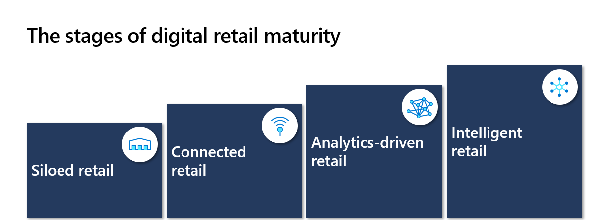

# Innovation in the retail industry

The [Innovate methodology](../../innovate/index.md) of the Microsoft Cloud Adoption Framework for Azure aligns innovation and DevOps practices to disciplines that drive repeatable innovation and increase customer impact. The steps outlined in the Innovate methodology apply to retail industry innovations. This article points out ways to innovate even faster as you strive to improve your retail outcomes.

## Align to the retail industry maturity model

The [retail cloud maturity model](./retail-cloud-maturity.md) describes the stages of digital retail maturity. Innovation becomes critical when organizations move into the analytics-driven retail and intelligent retail stages.

One example of achieving intelligent retail maturity is the [retail recommender](./improve-retail-experience.md), which uses data, applications, analytics, and AI to enhance the retail experience.

The tools and techniques presented in this article can help you develop innovation and reach retail maturity.

## Democratize data

The most important step to innovation is [democratizing data](../../innovate/best-practices/data.md), because data that's accessible *and* understandable across the organization fuels innovation.

This step is accelerated through the use of a common industry-specific data model. Maintaining a common model breaks down silos that stifle communication between applications and limit data democratization. When all employees, processes, and applications operate from a common data model, they can all apply technology to improve products and services.

To extend your common data model, use cloud native tools in Azure:

- **Microsoft Power BI** to create rich visualizations and build business insights from your data models. Build and share reports and dashboards, and provide notifications, to bring the power of your data to your workforce.
- **Azure Purview** to classify and add metadata to data sources, making it easier for all users to the find the data they need.
- **Azure Data Factory** to move and transform data for use by various applications and reports.
- Other **big data** sources, such as **Hadoop**, **HDInsight**, and **Databricks**, to allow data scientists to build advanced analytics solutions from existing data.

## Engage via applications

Learn more about ways you can [build applications](../../innovate/best-practices/apps.md) to extend, improve, and automate your retail processes.

- **Power Platform** empowers citizen developers from business teams across sales, payroll, finance, and so on. Extend your common data model by empowering teams to create their own Power Apps and Power Automate solutions.
- **Intelligent experiences** build modern applications in the cloud with web apps or serverless functions. Infuse intelligence into the applications with speech, text, vision, and chat bots.

## Interact on devices

Learn more about using [device interactions](../../innovate/best-practices/devices.md) to get closer to your customers through connected devices, perhaps devices you already have.

- **Mobile experiences:** Extend customer interactions through the rapid development of mobile apps and Power Apps for mobile experiences.
- **IoT:** Collect data in near-real-time from devices in your retail, supply chain, and other environments.

## Next steps

The following articles will help you succeed in your cloud adoption journey.

- [Governance in the retail industry](./govern.md)
- [Management in the retail industry](./manage.md)
