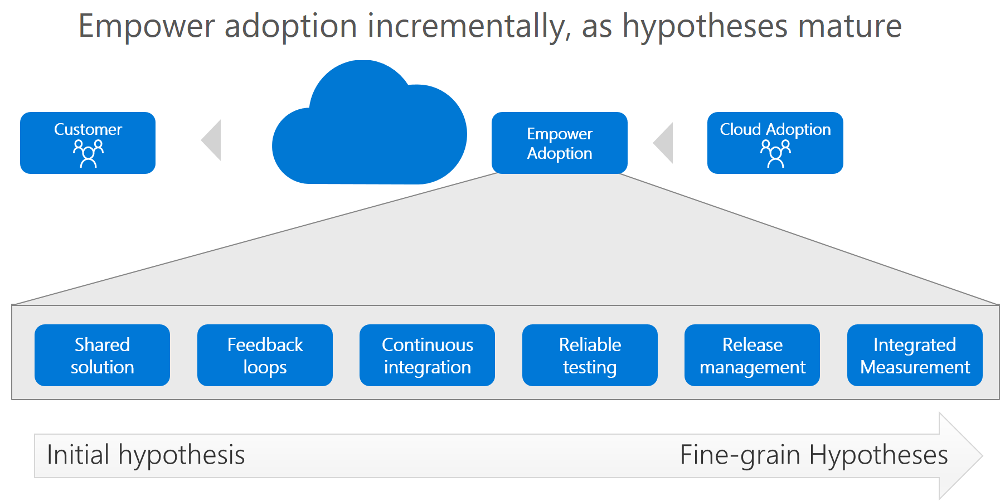

# Tools to empower adoption in Azure

As described in [Empower adoption](../considerations/ci-cd.md), building true innovation at scale requires an investment in removing friction which could slow adoption. In the early stages, while first testing a hypothesis, the solution will be small. The investment in removing friction will likely be small as well. As hypotheses prove true, the solution and the investment in empowering adoption will grow. This article will provide key links to get started with each stage of maturity.

## Alignment to the methodology

This type of digital invention can be accelerated through the following levels of maturity, in alignment with maturity model pictured above. Technical guidance to accelerate digital invention is listed in the table of contents on the left. Those articles have been grouped into the same maturity levels.

- **Shared solution:** Establish a centralized repository for all aspects of the solution.
- **Feedback loops:** Ensure feedback loops can be managed consistently through iterations.
- **Continuous integration:** Regularly build and consolidate the solution.
- **Reliable testing:** Validate solution quality and expected changes to drive ensure measures.
- **Solution deployment:** Deployment of a solution to allow the team to quickly share changes with customers.
- **Integrated measurement:** Add learning metrics to the feedback loop for clear analysis by the full team.

## Toolchain

For adoption teams comprised of mature professional development teams with many contributors, the Azure toolchain starts with GitHub and Azure DevOps. As the need grows, this foundation can expand to leverage other features of each tool. It may also involve other tools like Azure Blueprints, Azure Policy, Azure Resource Manager templates, and Azure Monitor. Guidance on each tool is listed in the table of contents to the left to align with the maturity model above.

## Get started

The table of contents on the left outlines many articles to get you started with each of the tools in this toolchain.

> [!NOTE]
> Some links may leave the Cloud Adoption Framework to help go beyond the scope of this framework.
