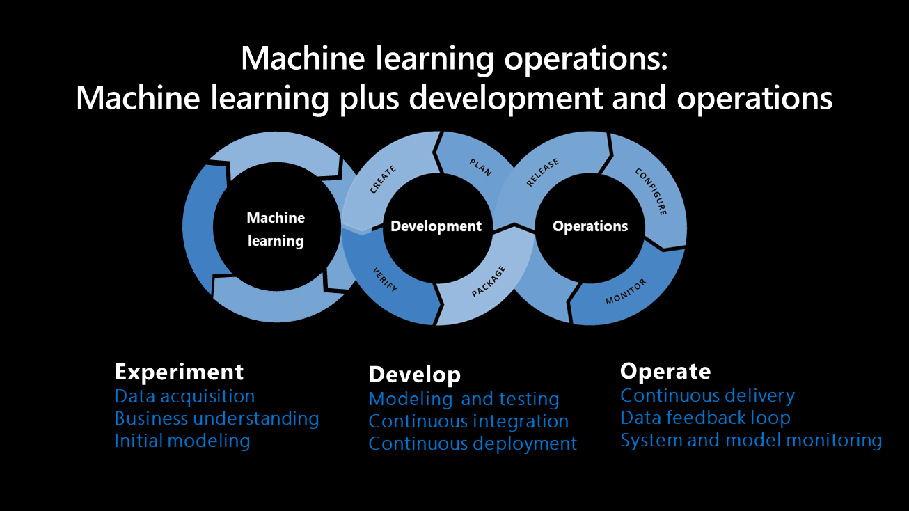
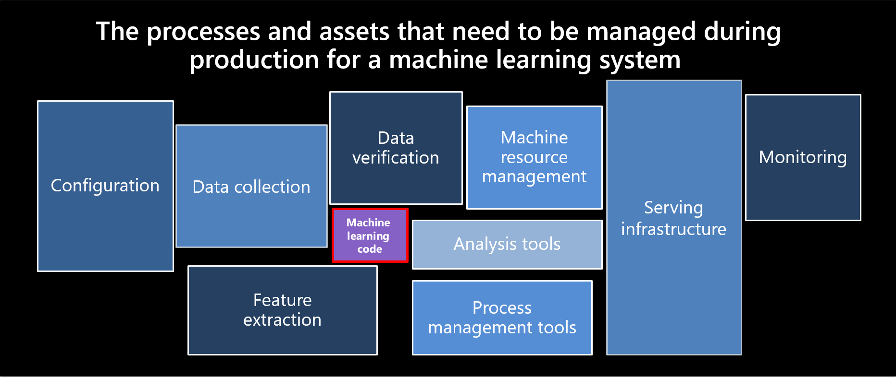

# How to approach machine learning operations

## An overview of machine learning operations

Machine learning operations consist of principles and best practices about how to organize and standardize machine model development, deployment, and maintenance in a scalable way.

The main components of how a machine learning system develops are outlined below:

<!-- docutune:disable -->

_Sculley et al. 2015. Hidden technical debt in machine learning systems. Proceedings of the 28th International Conference on Neural Information Processing Systems, Volume 2 (NIPS 2015).*

<!-- docutune:enable -->

## Machine learning operations vs. development operations

While development operations (DevOps) influence machine learning operations, there are differences between their processes. In addition to DevOps practices, machine learning operations address the following concepts not covered in DevOps:

- **Data versioning:** There must be code versioning and dataset versioning, as the schema and actual data can change over time. This allows data to be reproduced, makes the data visible other team members, and helps use cases to be audited.

- **Model tracking:** Model artifacts are often stored in a model registry that should identify storage, versioning, and tagging capabilities. These registries need to identify the source code, its parameters, and the corresponding data used to train the model, all of which indicate where a model was created.

- **Digital audit trail:** When working with code and data, all changes need to be tracked.

- **Generalization:** Models are different than code for reuse, as models must be tuned based on the input data or scenario. You might need to fine-tune the model for the new data to use it for a new scenario.

- **Model retraining:** Model performance can decrease over time, and it's important to retrain models for them to remain useful.

## Approaches to machine learning operations

Data scientists within an organization apply a broad spectrum of experience, maturity, skills, and tools to experimenting with machine learning operations. Since it's important to encourage as many participants as possible to embrace AI, a consensus about how all organizations should approach machine learning operations isn't likely or desirable. In light of this variety, a clear starting point for your organization is to understand how its size and resources will influence its approach to machine learning operations.

A company's size and maturity indicate if data science teams or individuals with unique roles will own the machine learning lifecycle and navigate each phase. The following approaches to the lifecycle are the most common to each scenario:

### A centralized approach

Data science teams will likely monitor the machine learning lifecycle in small companies with limited resources and specialists. This team applies their technical expertise to cleaning and aggregating data, developing and deploying models, and monitoring and maintaining deployed models.

One advantage of this method is that it progresses the model quickly to production, but it increases costs because of the specialized skill levels that need to be maintained on the data science team. Quality suffers when those required levels of expertise aren't present.

### A decentralized approach

Individuals with specialized roles will likely monitor and be responsible for the machine learning lifecycle in companies with dedicated operations teams. Once a use case is approved, a machine learning engineer is assigned to assess its current state and the amount of work needed to elevate it to format that can be supported.

The data scientist will need to gather information for the following questions:

- Who will be the business owner?
- How will the model be consumed?
- What level of service availability will be needed?
- How will the model be retrained?
- How often will the model be retrained?
- Who will decide the conditions for model promotion?
- How sensitive is the use case, and is the code shareable?
- How will the model and code be modified in the future?
- How much of the current experiment is reusable?
- Are there existing project workflows that can assist?
- How much work will be required to advance the model to production?

Next, a machine learning engineer designs the workflow and estimates the amount of work required. One best practice is to involve the data scientist(s) in building out the workflow; this time presents a key opportunity to cross-train and familiarize them with the final repo since it's common for the data scientist to work on the use case in the future.

## How machine learning operations benefit business

Machine learning operations connect traditional development operations, data operations, and data science/AI. Understanding how machine learning operations can benefit your business will help your AI journey.

Integrating machine learning operations with your business can create the following benefits:

- Enterprise model management streamlines and automates the lifecycle for model development, training, deployment, and operationalization. This allows businesses to be agile and respond to immediate needs and business changes in a repeatable and managed way.

- Model versioning and data realization allow the enterprise to generate iterated and versioned models to adjust to the nuances of the data or the particular use case. This provides flexibility and agility in responding to business challenges and changes.

- When organizations monitoring and manage their models, this helps them to quickly respond to significant changes in the data or the scenario. For example, an implemented model might experience extreme data drift because of an external factor or a change in the underlying data. This would make the previous models unusable and require the current model to be retrained as soon as possible. Machine learning models to be tracked for accuracy and performance. It alerts stakeholders when changes impact model reliability and performance, which leads to quick retraining and deployment.

- Applied machine learning operations processes support business outcomes by allowing rapid auditing, compliance, governance, and access control throughout the development lifecycle. The visibility of model generation, data usage, and regulatory compliance is clear as changes take place in the business.

## Next steps

- The [Microsoft AI Business School](/learn/topics/ai-business-school) is a resource that outlines AI, including how to approach implementation holistically, understand dependencies beyond the technology, and drive lasting business impact.

- Read further about [the machine learning operations process](../best-practices/mlops-process.md) to explore this in more detail.
