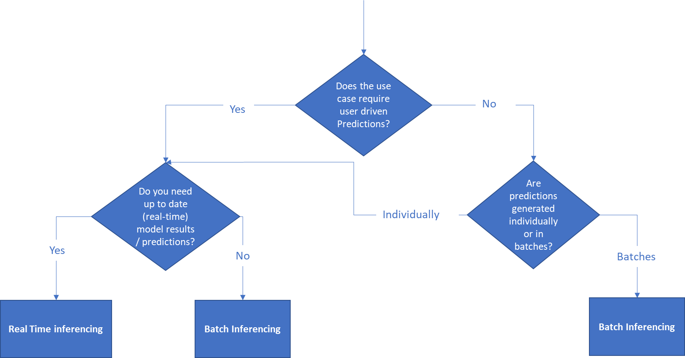
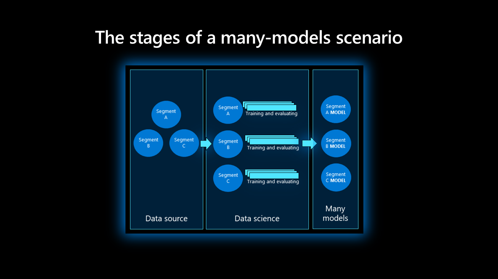
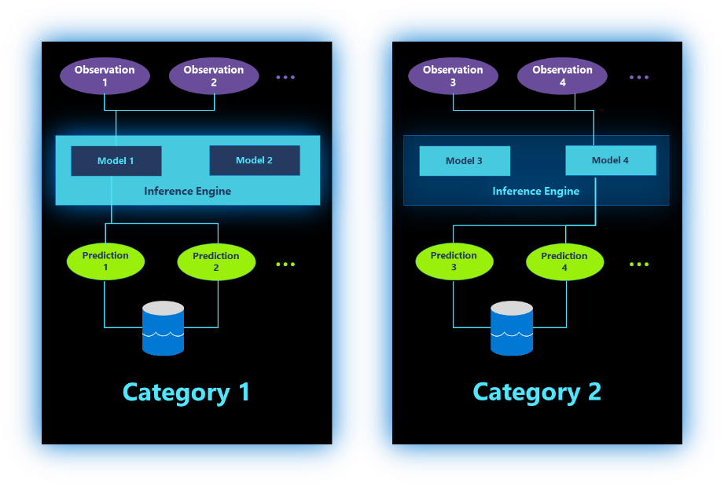
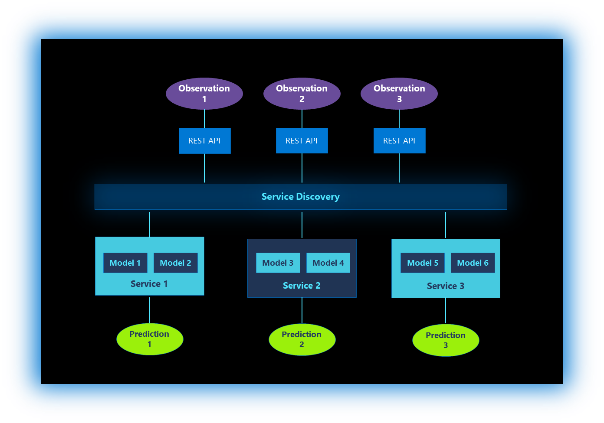

# Machine Learning Deployment – Inferencing

When deploying your AI model in production you will need to consider how you will use model for prediction. There are 2 main patterns for AI models:

- **Batch Inference:** Batch inference is an asynchronous process, the result of model inference shall be stored as files or in a database for further consumptions by end-users or business applications.

- **Real Time Inference**: Real-time or interactive inference imply that model inference can be triggered any time and immediate response is expected. This pattern can be used to analyses streaming data, interactive application data.

To compare and select between the two models, you need to take into consideration some aspects, like:

- How often predictions should be generated?
- Are the results needed urgently?
- Should predictions be generated individually, by small batches, or by big batches?
- Are there latency considerations for the model?
- How much compute power is needed for model execution?
- Are there operational implications and costs for the model maintenance?

The decision tree outlined below can help guide the decision on which deployment model is right for your use case.

## Batch Inferencing

Batch inferencing, sometimes called offline inferencing, is the simpler form of inferencing and allows models to be run at a timed interval and the results (or predictions) stored for use by the end business application.

If Batch Inferencing is the right model for running your model there are a number of considerations and best practices to be aware of:

- **Triggering batch scoring:** The best way to trigger batch-scoring is setting up schedule or some sort of event-based automation. This can be done via Azure Machine Learning pipelines and using the ParallelRunStep feature in Azure Machine Learning. See [How to do Batch Inferencing using Azure Machine Learning ParallelRunStep](https://channel9.msdn.com/Shows/AI-Show/How-to-do-Batch-Inference-using-AML-ParallelRunStep) for more information.

- **Compute options for batch inferencing:** Since batch inference process is not running all the time, It is recommended to have reusable clusters that can be automatically start, stop and scale up and down depending on the workload. One of the important considerations is that different models can require a different environment to be executed. Thus, your solution needs to offer the ability to deploy a specific environment for a models execution when it's needed and then remove that environment when inferencing is complete so the compute can be re-used for the next model / process. See the decision tree below to identify the right compute for you.

- **Implement Batch inferencing:** There are multiple options to implement Batch inferencing. In Azure Machine Learning, it's recommended to utilize a feature called ParallelRunStep, which allows customers to inference terabytes of structured or unstructured data on Azure. ParallelRunStep provides out of the box parallelism and works within Azure Machine Learning pipelines.

- **Challenges of Batch inferencing:** Batch inferencing is a simpler way to use and deploy your model in production, but it does pose some challenges. Depending on the frequency at which inferencing is run the data / result available may be considered aged and not as relevant as an up-to-date result. A second challenge is a variation of the cold start problem, if there is new data, there may not be a result available for that data i.e. for a retail recommendation system, if a new user creates and account and starts shopping there will be no product recommendations available until after the next batch inferencing run. If this is a significant issue for your use case, you should consider real time inferencing.

- **Multiregional deployment and High Availability:** Multiregional deployment and high availability is not as significant as a concern in a batch inference scenario as the model does not need to be deployed regionally, rather the model results data store may need to be deployed in many locations with a HA strategy. This will normally follow the application HA design and strategy.

**More information:**
- [Build an Azure Machine Learning pipeline for batch scoring](/azure/machine-learning/tutorial-pipeline-batch-scoring-classification)
- [Run batch prediction using Azure Machine Learning designer](/azure/machine-learning/how-to-run-batch-predictions-designer)
- [Batch Inferencing in Azure Machine Learning](https://techcommunity.microsoft.com/t5/azure-ai/batch-inference-in-azure-machine-learning/ba-p/1417010#:~:text=%20Batch%20Inference%20in%20Azure%20Machine%20Learning%20,Learning%20Pipelines.%20ParallelRunStep%20is%20available%20through...%20More%20)

## Real-time inferencing

Real-time or interactive inferencing is the architecture where model inferencing can be triggered any time and immediate response is expected. This pattern can be used to analyze streaming data, interactive application data etc. This mode allows you to take advantage of your machine learning model in real time and resolves the cold start problem outlined above in Batch inferencing.

If real-time Inferencing is the right model for running your model there are a number of considerations and best practices to be aware of:

- **Challenges of real-time inferencing:** Real time inferencing is a more complex architecture for using your model due to latency and performance requirements. Typically a system may need to respond in 100ms or less and during that time the system needs to retrieve the data, perform inference, validate, and store the model results, run any business logic required and return the results to the system or application.

- **Compute options for real-time-inferencing:** The best way to implement real time inferencing is to deploy the model in a container form to Docker or Kubernetes cluster and expose it as a web-service with rest API. In this way, the model will be executed in its own isolated environment and can be managed as any other web-services in the environment. Docker/Kubernetes capabilities can be used then for management, monitoring, scaling and so on. This can then be deployed on premise, in the cloud or on the edge. See the Compute Decision Tree diagram for the compute decision tree for real time inferencing.

- **Multi-regional deployment and high availability**: In Real time inferencing scenarios regional deployment and high availability architectures need to be considered as latency and performance of the model will be one of the critical issues to resolve. It is recommended that in multiregional deployments to locate the model as close as possible to the consumption point will reduce latency. It is recommended that the model and supporting infrastructure follows the business application HA and DR principles and strategy.

## Many Models Scenario

Sometimes, a single model may not be able to capture the complex nature of real-world problems, such as predicting the sales of a supermarket, where the customers’ behavior may significantly vary depending on the demography, brand, SKUs and other features.  Or, building predictive maintenance of smart meters, which may vary significantly depending on the regions.  In such cases, having many models to capture the regional based or store level relationship may yield in better accuracy than a single model.  However, this assumes that there is sufficient data available to model such level of granularity.

At a high level, we can think of a many-models scenario in three stages: data source, data science, and many models.

**Data source:** In the data source stage, it's important to group your data into various segments without having too many cardinalities.  Features such as product Id, or Barcode should not be considered as the main partition, as this will result in too many segments, and may not produce meaningful models. Features such as brand, SKU or locality may be a better option to consider.  It is also important to homogenize the data by removing any anomalies that may skew the distribution of the data.

**Data science:** In the data science phase, several experiments are run in parallel for each data partition, this is typically an iterative process whereby models generated by the experiments are evaluated to find the best model.  

**Many models:** The best models for each segment or category are registered in the model registry. It is recommended to give meaningful names to the models that would make it easier to identify for inferencing.  Where there is a need to group the model into certain categories, it's recommended to use tagging.  

## Many-models batch inferencing

In batch inferencing for many models, predictions typically occur in a recurring scheduled manner and can handle large volumes of data running in parallel. The interesting thing to note here, is that unlike the single model scenario, many models are inferenced at the same time, it's therefore important that the correct models are selected.

The diagram below shows the reference pattern for many models batch inferencing.

The core part of the pattern is the ability to handle many observations per model, as well as being able to run multiple models simultaneously to achieve a highly scalable inference solution that can handle very large volumes of data. Many models can also be split into multiple categories to achieve hierarchical model inferencing, with each category having its own inference storage, such as a Datalake.  When implementing this pattern, one needs to strike the right balance between the horizontal and vertical scaling of the models, as this would have implications on the cost and performance.  Running too many model instances in parallel, may increase the performance but will have an impact on the cost and likewise, too few instances with high spec nodes may be more cost effective, but may run into scaling issues.

## Many-models real-time inferencing

In the many models real-time inferencing requires relatively low latency, and on-demand request, typically via a REST endpoint.  This is particularly useful when there are external applications or services that require a standard interface to interact with the model, typically via the REST interface with JSON payload.

The core part of this pattern is the ability to discover the list of services with associated metadata, through the service discovery service, this can be implemented as an Azure Function.  This enables the clients to identify and obtain relevant details of service, which can be invoked via a secure REST URI.  A JSON payload would send to the service, that would invoke the relevant model, and provide a JSON response back to the client.

Each service (AKS) is stateless microservice, therefore can handle multiple requests simultaneously, limiting to the physical VM resource constraint.  A service can deploy multiple models, depending on the choice of groupings.  It is recommended to use homogeneous grouping, such as category, SKU, etc.  The mapping between the service request and model selection for a given service needs to be baked into the inference logic, typically via the score script.  If the size of models is relatively small (few MB), it's recommended to load them in memory for performance reasons, otherwise each model can dynamically be loaded as per request.