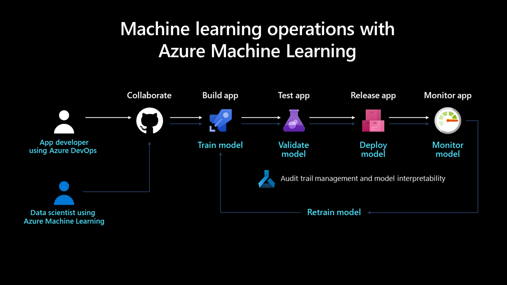
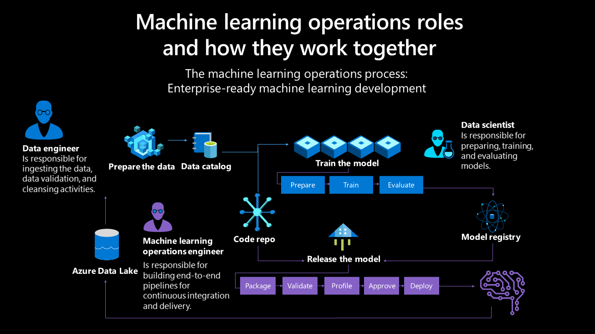

# The machine learning operations process

## The model development process

The development process should produce the following outcomes:

- Training is automated, and models are validated, which includes testing functionality and performance (for example, using accuracy metrics).

- Deployment to the infrastructure used for inferencing (including monitoring) is automated.

- Mechanisms create an end-to-end data audit trail. Automatic model retraining occurs when data drifts over time, which is relevant to large-scale, machine-learning-infused systems.

The following diagram depicts the deployment lifecycle of a machine learning system:

Once developed, a machine learning model is trained, validated, deployed, and monitored. From an organizational perspective and on the managerial and technical level, it's important to define who owns and implements this process. In larger enterprises, a data scientist might own the model training and validation steps, and a machine learning engineer might tend to the remaining steps. In smaller companies, a data scientist might own all steps.

### Train the model

In this step, a training dataset trains the machine learning model. The training code is version-controlled and reusable, and this feature optimizes button clicks and event triggers (such as a new version of the data becoming available) to automate how the model is trained.

### Validate the model

This step uses established metrics like an accuracy metric to automatically validate the newly trained model and compare it to older ones. Did its accuracy increase? If yes, this model might be registered in the model registry for ensuring that next steps can consume it. If the new model performs worse, then a data scientist can be alerted to investigate why or discard the newly trained model.

### Deploy the model

Deploy the model as an API service for web applications in the deployment step. This approach enables the model to be scaled and updated independently of the applications. Alternatively, the model can be used to perform batch scoring where it's used once or periodically to calculate predictions on new data points. This is useful when large amounts of data need to be processed asynchronously. More details on deployment models can be found on the [machine learning inference during deployment](./ml-deployment-inference.md) page.

### Monitor the model

It's necessary to monitor the model for two key reasons. First, monitoring the model helps to ensure that it's technically functional; for example, able to generate predictions. This is important if an organization's applications depend on the model and use it in real time. Monitoring the model also helps organizations to gauge if it continuously generates useful predictions. This might not be useful when data drift occurs, such as when the data used to train the model significantly differs from the data that's sent to the model during prediction phase. For example, a model trained for recommending products to young people might produce undesirable results when recommending products to people from a different age group. Model monitoring with data drift can detect this type of mismatch, alert machine learning engineers, and automatically retrain the model with more relevant or newer data.

### How to monitor models

Since data drift, seasonality, or newer architecture tuned for better performance can all cause model performance to wane over time, it's important to establish a process to continuously deploy models. Some best practices include:

- **Ownership:** An owner should be assigned to the model performance monitoring process to actively manage its performance.

- **Release pipelines:** Set up a release pipeline in [Azure DevOps](/azure/devops/user-guide/what-is-azure-devops) first, and set the trigger to the model registry. When a new model is registered in the registry, the release pipeline triggers and signs off on a deployment process.

## Prerequisites for retraining models

[Collecting data from models in production](/azure/machine-learning/how-to-enable-data-collection) is one prerequisite to retraining models in a continuous integration/continuous development framework, and this process uses input data from scoring requests. This capability is currently limited to tabular data that can be parsed as JSON with minimal formatting and manipulation; video, audio, and images are excluded. This capability is available for models on the Azure Kubernetes Service (AKS). The collected data is stored in an Azure blob.

To prepare for retraining a model:

1. **Monitor data drift from the input data collected.** Setting up a monitoring process requires extracting the timestamp from the production data. This is required to compare the production data and the baseline data (the training data used to build the model). The preferred way to monitor data drift is through Azure Monitor Application Insights. This feature provides an [alert](/azure/machine-learning/how-to-monitor-datasets#metrics-alerts-and-events) that can trigger actions like email, SMS text, push, or Azure Functions. You need to [enable](/azure/machine-learning/how-to-enable-app-insights#configure-logging-with-azure-machine-learning-studio) Application Insights to log data.

1. **Analyze the collected data.** Make sure to [collect data from models in production](/azure/machine-learning/how-to-enable-data-collection), and include the results in the model scoring script. Collect all features used for model scoring, as this ensures that all necessary features are present and can be used as training data.

1. **Decide whether retraining with the collected data is necessary.** Many things cause data drift, including sensor issues to seasonality, changes in user behavior, and data quality issues related to the data source. Model retraining isn't required in all cases, so it's recommended to investigate and understand the cause of the data drift before pursuing this.

1. **Retrain the model.** Model training should already be automated, and this step involves triggering the current training step. This could be for when data drift has been detected (and it isn't related to a data issue), or when a data engineer has published a new version of a dataset. Depending on the use case, these steps can be fully automated or supervised by a human. For example, while some use cases like product recommendations could run autonomously in the future, others in finance would factor standards like model fairness and transparency and require a human to approve newly trained models.

At first, it's common for an organization to only automate a model's training and deployment but not the validation, monitoring, and retraining steps, which are performed manually. Eventually, automation steps for these tasks can progress until the desired state is achieved. DevOps and machine learning operations are concepts that develop over time, and organizations should be aware of their evolution.

## The Team Data Science Process lifecycle

The Team Data Science Process (TDSP) provides a lifecycle to structure the development of your data science projects. The lifecycle outlines the major stages that projects typically execute, often iteratively:

- Business understanding
- Data acquisition and understanding
- Modeling
- Deployment

The goals, tasks, and documentation artifacts for each stage of the TDSP lifecycle are described in the [Team Data Science Process lifecycle](/azure/architecture/data-science-process/lifecycle).

## The roles and activities within machine learning operations

Per the TDSP lifecycle, the key roles in the AI project are data engineer, data scientist, and machine learning operations engineer. These roles are critical to your project's success and must work together toward accurate, repeatable, scalable, and production-ready solutions.

- **Data engineer:** This role ingests, validates, and cleans the data. Once the data is refined, it's cataloged and made available for data scientists to use. At this stage, it's important to explore and analyze duplicate data, remove outliers, and identify missing data. These activities should be defined in the pipeline steps and are executed as the train pipeline is preprocessed. Unique and specific names should be assigned to core and generated features.

- **Data scientist (or AI engineer):** This role navigates the training pipeline process and evaluates models. A data scientist receives data from the data engineer and identifies patterns and relationships within it, possibly selecting or generating features for the experiment. Since feature engineering plays a major role in building a sound generalized model, it's key for this phase to be completed as thoroughly as possible. Various experiments can be performed with different algorithms and hyperparameters. Azure tools like automated machine learning can automate this task, which can also help with underfitting or overfitting a model. A successfully trained model is then registered in the model registry. The model should have a unique and specific name, and a version history should be retained for traceability.

- **Machine learning operations engineer:** This role builds end-to-end pipelines for continuous integration and delivery. This includes packing the model in a Docker image, validating and profiling the model, awaiting approval from a stakeholder, and deploying the model in a container orchestration service such as AKS. Various triggers can be set during continuous integration, and the model's code can trigger the train pipeline and the release pipeline afterward.
