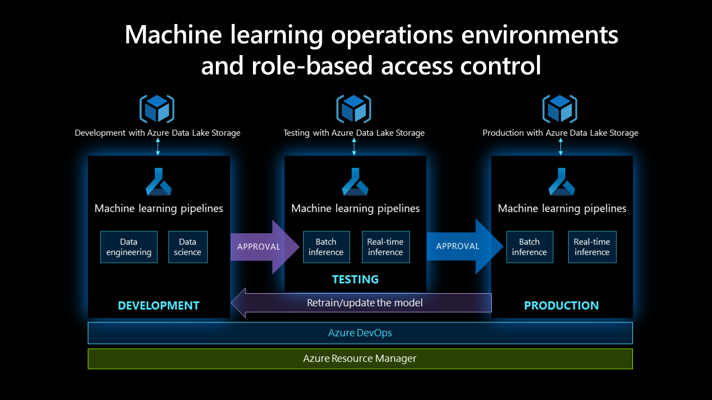
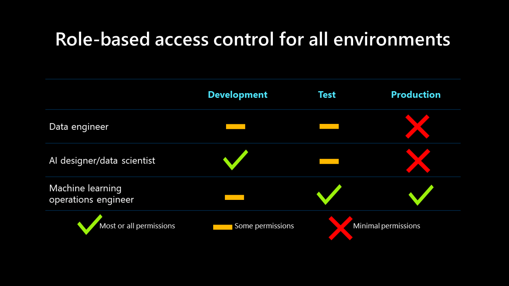
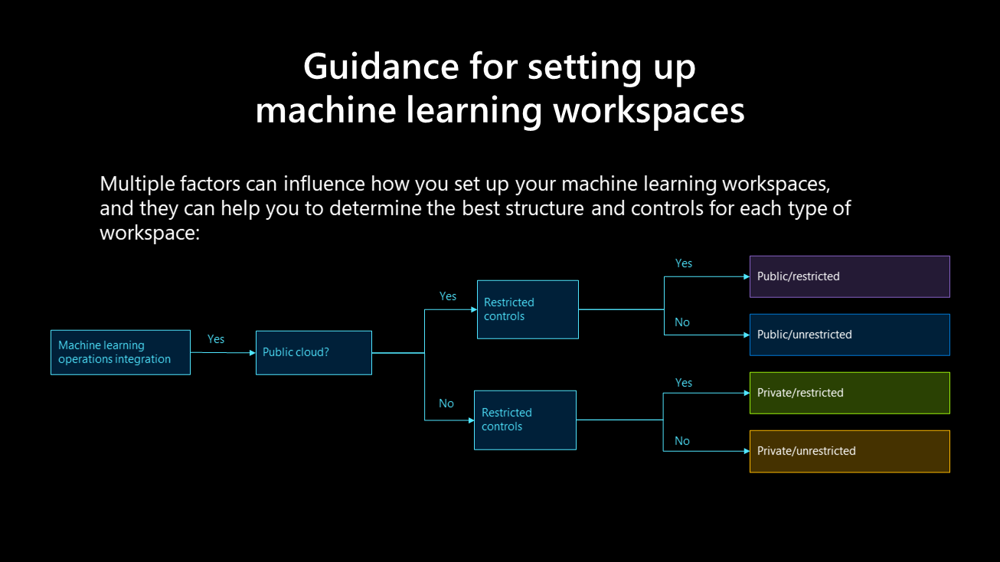

# How to set up machine learning workspaces

## Machine learning environments and role-based access control

Development, testing, and production environments support machine learning operations processes.

**In a development environment:** Machine learning pipelines should support the data science and engineering activities carried out by data scientists and data engineers. It's recommended that they have full access to all the permissions related to carrying out experiments, such as provisioning training clusters or building models. However, they should not have permission for activities such as delete or create workspaces, add, or remove workspace users.

**In a test environment:** Various tests are performed on the model's environment, and it's recommended to use either champion/challenger or A/B testing for the model. The test environment should mimic the deployment environment; it's recommended to run tests such as load, model response time, and others. Data scientists and engineers have limited access to this environment, primarily read-only access and some configuration rights. A DevOps engineer hand has full access to the environment. It's recommended to automate as many tests as possible. Once all the tests are completed, stakeholder approval is required for deployment in the production environment.

**In a production environment:** A model is deployed during batch or real-time inference. A production environment is typically read-only; however, a DevOps engineer has full access to this environment and is responsible for continually supporting and maintaining it. Data scientists and data engineers have limited access to the environment, and it's read-only.

Role-based access control for all environments is shown in the following diagram:

This table shows that the data engineer and data scientist's access levels decrease within higher environments while the DevOps engineer's access increases. This is because a machine learning operations engineer builds the pipeline, glues things together, and deploys models in production. This level of granularity is recommended for each role.

## Factors that influence machine learning workspaces

Multiple factors can influence how you set up your machine learning workspaces, and they can help you to determine the best structure and controls for each type of workspace:

- **Public, restricted:**
  - Development, test, and production workspace
  - Custom role: Data scientist
  - Git integration for version control and continuous integration/continuous development (CI/CD)

- **Public, unrestricted:**
  - Development, test, and production workspace
  - Role: Contributor
  - Git integration for version control and CI/CD

- **Private, restricted:**
  - Development, test, and production workspace
  - Private Link enabled
  - Custom role: Data scientist
  - Git integration for version control and CI/CD

- **Private, unrestricted:**
  - Development, test, and production workspace
  - Private Link enabled
  - Role: Contributor
  - Git integration for version control and CI/CD

- **All workspaces:**
  - One Azure Machine Learning studio workspace per project
  - One compute instance per data scientist
  - One compute cluster per virtual machine size shared with data scientists for development
  - One compute cluster per production pipeline
  - Setting the compute cluster minimum node size to 0 to reduce costs
  - Instructing users to shut down compute instances manually after use
  - A 'workspace admin' custom role with access to create compute instances and clusters
  - A 'data scientist' custom role requiring all infrastructure to be set up by another user before the data scientist can begin work

## Next steps

- Learn more about how to [create and manage a workspace in Azure Machine Learning](/azure/machine-learning/how-to-manage-workspace).

- [Use the Python SDK](/azure/machine-learning/tutorial-1st-experiment-sdk-setup-local) to create a workspace in your development environment.

- [Use the Azure portal and Jupyter notebooks](/azure/machine-learning/tutorial-1st-experiment-sdk-setup) during the development lifecycle to set up your Azure Machine Learning development environment and train your model.
