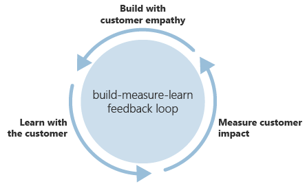

# Create customer partnerships through the build-measure-learn feedback loop

True innovation comes from the hard work of building solutions which demonstrate customer empathy, measuring the impact of those changes on the customer, and learning with the customer. Most importantly, they come from repeated iterations of this cycle.

If the past decade has taught us anything about innovation, it's that the old rules of business have changed. Large wealthy incumbents no longer have an unbreakable hold on the market. The first or best to market are always the winners. Having the best idea doesn't lead to market dominance. In a business climate that changes rapidly, market leaders are the most agile. Those who can adapt to changing conditions lead.

Large or small, the companies that are thriving in the digital economy as innovative leaders are those with the ability to best listen to their customer base. That skill can be cultivated and managed. At the core of all good partnerships is a clear feedback loop. The process for building customer partnerships within the Cloud Adoption Framework is the build-measure-learn feedback loop.

## The build-measure-learn feedback loop

As described in the [innovate methodology](./index.md), innovation requires a balance of **invention** and **adoption**.
Customer feedback and partnership is required to drive adoption. Creating strong partners with your customers during innovation cycles lead to better products and quicker traction in the market.

This process for managing customer partnerships and integrating them into innovation efforts consists of three phases of development:

- [Build with customer empathy](./build.md)
- [Measure for customer impact](./measure.md)
- [Learn with customers](./learn.md)

Each phase of the process will aid in building better solutions with your customers.

## Next steps

Learn how to [Build for customer empathy](./build.md) to begin your build-measure-learn cycle.

> [!div class="nextstepaction"]
> [Build for customer empathy](./build.md)
