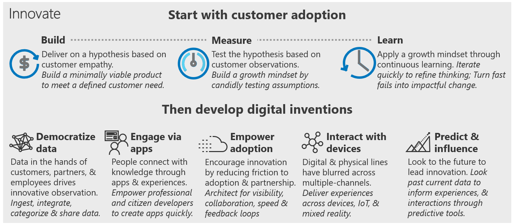

# Developing digital inventions

As described in the [innovate methodology](./index.md), innovation requires a balance of **invention** and **adoption**. Customer feedback and partnership are required to drive adoption. The disciplines below define a series of approaches to developing digital inventions with adoption and customer empathy in mind. Each of the disciplines is briefly described below, with deeper links into each process.

## Summary of each discipline of digital invention

The following disciplines are not all required to drive innovation. Following the guidance in [build with empathy](./build.md), the objective is to test a hypothesis in every iteration. Defining the output of each iteration as a [minimum viable product (MVP)](./build.md#build-a-minimum-viable-product-mvp) would result in the use of as few of the disciplines as possible.

- **[Democratize data](./data.md):** Data in the hands of customers, partners, and employees drives innovative observation. Ingest, centralize, govern and share data.
- **[Engage via apps](./apps.md):** People connect with knowledge through apps and experiences. Empower professional and citizen developers to create apps quickly.
- **[Empower adoption](./ci-cd.md):** Encourage innovation by reducing friction to adoption and partnership. Architect for visibility, collaboration, speed, and feedback loops.
- **[Interact with devices](./devices.md):** Digital and physical lines have blurred across multiple-channels. Deliver experiences across devices, IoT, and mixed reality.
- **[Predict and influence](./predict.md):** Look to the future to lead innovation. Look past current data to inform experiences, and interactions through predictive tools.

## Next steps

The first discipline of innovation to evaluate is the [democratization of data](./data.md).

> [!div class="nextstepaction"]
> [Democratize data](./data.md)
