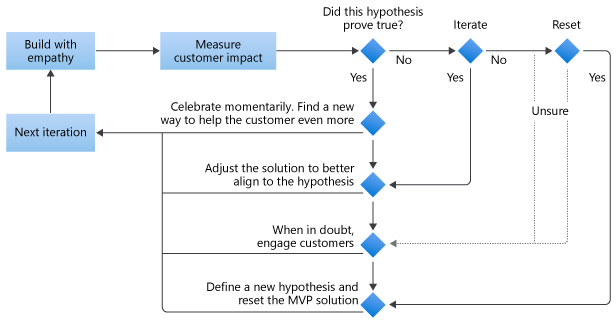

# Learn with customers

Our current customers represent our best resource for continuous learning. By partnering with us, customers help us [build with customer empathy](./build.md) to find the best solution to their needs. They also help create a minimum viable product (MVP) solution by generating metrics from which we [measure customer impact](./measure.md). In this article, we'll describe how to drive innovation learning with and from our customer-partners.

## Continuous learning

Continuous learning is the process of learning new skills and abilities continuously. This continuous learning can come from both formal training and taking on challenges. At the end of every iteration, we have an opportunity to learn from the build and measure cycles. The following image offers an overview of the continuous learning process flow.

Continuous learning is a method for responding to learning metrics and assessing their impact on customer needs. Here are the primary learning decisions to make at the end of each iteration:

- **Did the hypothesis prove true?** When the answer is yes, celebrate for a moment and then move on. There are always more things to learn, more hypotheses to test, and more ways to help the customer in your next iteration. When a hypothesis proves true, it's a good time to decide on a new feature that enhances the solution's utility for the customer.
- **Can you get closer to a validated hypothesis by iterating on the current solution?** The answer is usually yes. Learning metrics typically suggest points in the process that lead to customer deviation. Use these data to find the root of a failed hypothesis. At times, the metrics may also suggest a solution.
- **Is a reset of the hypothesis required?** Sometimes you learn that the hypothesis or underlying need was flawed. When you find a flaw, an iteration alone isn't necessarily the right answer. When a reset is required, rewrite the hypothesis and review the solution in light of the new hypothesis. The sooner this type of learning occurs, the easier it is to pivot. Early hypotheses should focus on testing the riskiest aspects of the solution to avoid pivots later in development.
- **Unsure?** The second most common response after "iterate" is "we're not sure." Embrace this response. This response represents an opportunity to engage the customer, foster customer empathy, and to look beyond the data.

The answers to these questions shape the iteration to follow. Companies that demonstrate an ability to apply continuous learning and boldly make the right decisions for their customers are more likely to emerge as leaders in their markets.

The practice of continuous learning requires a great deal of trial and error. It also requires some science and data-driven decision-making. Perhaps the most difficult part of adopting continuous learning concerns the cultural requirements. To effectively adopt continuous learning, your business culture must be open to a fail-first, customer-focused approach. The following section provides more details about this approach.

## Growth mindset

Few could deny the radical transformation within Microsoft culture that's occurred over the last several years. This multifaceted transformation, led by Satya Nadella, has been hailed as a surprising business success story. At the heart of this story is the growth mindset. Here are a few key points of the growth mindset that inform learning with customers:

- **Customer first:** If a hypothesis is designed to improve the experience of real customers, you have to meet real customers where they are. Don't just rely on metrics. Compare and analyze metrics based on firsthand observation of customer experiences.
- **Continuous learning:** Customer focus and customer empathy stem from a learn-it-all mindset. The Innovate methodology strives to be learn-it-all, not know-it-all.
- **Beginner's mindset:** Demonstrate customer empathy by approaching every conversation with a beginner's mindset. Whether you're new to your field or a 30-year veteran, assume you know little, and you'll learn a lot.
- **Listen more:** Customers want to partner with you. An ego-driven need to be right blocks that partnership. To learn beyond the metrics, speak less and listen more.
- **Encourage others:** Don't just listen. Use the things you **do** say to encourage others. In every meeting, find ways to pull in diverse perspectives from those people who may not be quick to share.
- **Share the code:** If our obligation is to own a code base, we lose sight of the true power of innovation. Focus on owning and driving outcomes for your customers. Share your code, publicly with the world or privately within your company, to invite diverse perspectives into the solution and the code base.
- **Challenge what works:** Success doesn't mean you're demonstrating true customer empathy. Avoid having a fixed mindset and a bias toward doing what's worked before. Look for learning in positive and negative metrics by engaging your customers.
- **Be inclusive:** Work hard to invite diverse perspectives into the mix. There are many variables that can divide humans into segregated groups. Cultural norms, past behaviors, gender, religion, sexual preference, even physical abilities. True innovation comes when we challenge ourselves to see past our differences and consciously strive to include all customers, partners, and coworkers.

## Next steps

As a next step to understanding this methodology, see [Common blockers and challenges to innovation](./challenges.md) to prepare for the changes ahead.

> [!div class="nextstepaction"]
> [Understanding common blockers and challenges](./challenges.md)

Some of the concepts in this article build on topics first described in [The Lean Startup](http://theleanstartup.com/book), written by Eric Ries.
