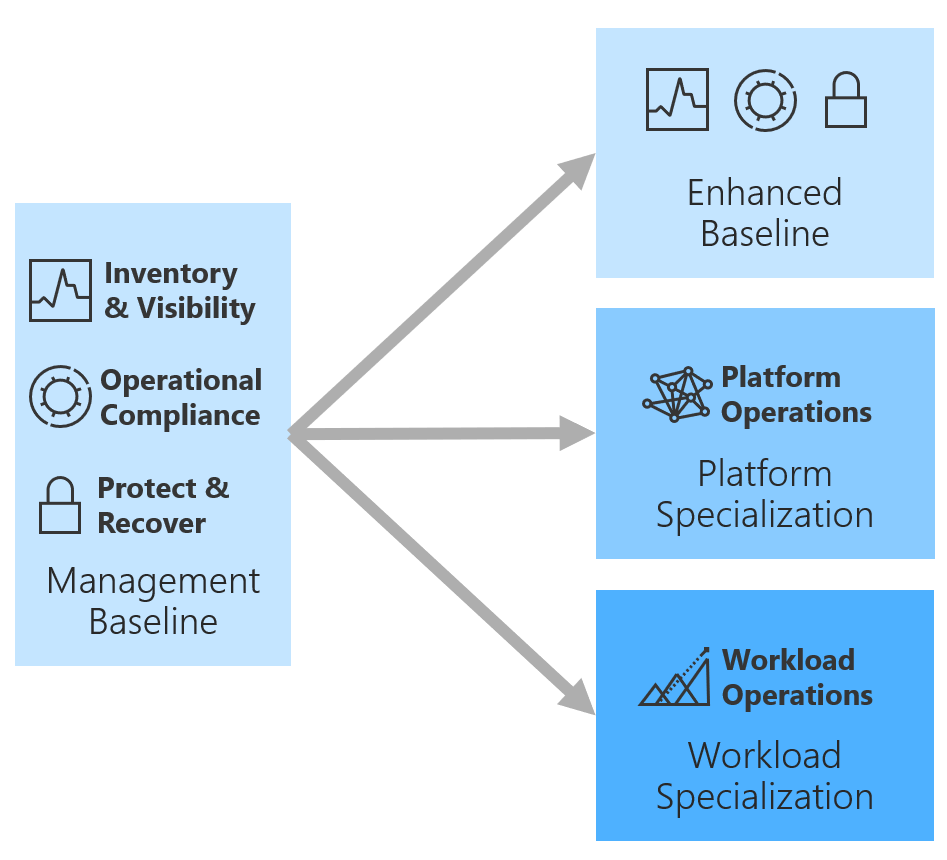

# Workload specialization for cloud management

Workload specialization builds on the concepts outlined in [Platform Specialization](./platform-specialization.md).

- **Workload operations:** Largest per workload operations investment. Highest degree of resiliency. Suggested for the +/- 20% of workloads that drive business value. Usually reserved for High criticality or mission critical workloads.
- **Platform operations:** Operations investment is spread across many workloads. Resiliency improvements impact all workloads which leverage the defined platform. Suggested for the +/- 20% of the highest criticality platforms. Usually reserved for medium to high criticality workloads.
- **Enhanced management baseline:** Lowest relative operations investment. Slightly improved business commitments using additional cloud-native operations tools and processes.

## High-level process

Workload specialization consists of a disciplined execution of the following four processes in an iterative approach. Each process is explained in more detail in the [Platform Specialization](./platform-specialization.md) article.

- **Improve system design:** Improve the design of a specific workload to effectively minimize interruptions.
- **Automate remediation:** Some improvements are not cost effective. In such cases, it may make more sense to automate remediation and reduce the impact of interruptions.
- **Scale the solution:** As systems design and automated remediation are improved, those changes can be scaled across the environment through the service catalog.
- **Continuous improvement:** Various monitoring tools can be used to discover incremental improvements that can be addressed in the next pass of system design, automation, and scale.

## Cultural change

Workload specialization often triggers a cultural change. Traditional IT builds processes that focus on delivering a management baseline, enhanced baselines, and platform operations. Those types of offering can be scaled across the environment. Workload specialization is very similar in execution to platform specialization. But, unlike common platforms, the specialization required by individual workloads doesn't often scale.

When workload specialization is required, it is common for operational management to evolve beyond a Central IT perspective. The approach suggested in the Cloud Adoption Framework is a distribution of cloud management functionality.

In this model, operational tasks like monitoring, deployment, DevOps, and other innovation focused functions are shifted to an application development or business unit organization. The Cloud Platform and core Cloud Monitoring team still delivers on the management baseline across the environment. Those centralized teams also guide and instruct workload specialized teams on operations of their workloads. But the day to day operational responsibility falls on a cloud management team that is managed outside of IT. This type of distributed control is one of the primary indicators of Cloud Center of Excellence maturity.

## Beyond platform specialization - Application Insights

Greater detail on the specific workload is required to provide clear workload operations. During the continuous improvement phase, Application Insights will be a necessary addition to the cloud management toolchain.

|Application Monitoring|Application Insights|Monitoring and diagnostics for apps|
|Performance, Availability, Usage|Application Insights|Advanced application monitoring with App Dashboard, composite maps, usage, and tracing|

### Deploy Application Insights

1. In the Azure portal, search for **Application Insights**.
2. Click **+ Add** to create an application insights resource to monitor your live web application.
3. Follow the on-screen prompts

See the [Azure Monitor Application Insights hub](https://docs.microsoft.com/azure/azure-monitor/azure-monitor-app-hub) for guidance on configuring your application for monitoring.

::: zone target="chromeless"

::: form action="OpenBlade[#create/Microsoft.AppInsights]" submitText="Create Application Insight resources" :::

::: zone-end

### Monitor performance, availability, and usage

1. In the Azure portal, search for **Application Insights**.
2. Choose one of the application insights resources from the list

The navigation for Application Insights contains a variety of options for monitoring performance, availability, usage, and dependencies. Each of these views of the application data will provide clarity into the continuous improvement feedback loop.

::: zone target="chromeless"

<!-- markdownlint-disable DOCSMD001 -->

::: form action="OpenBlade[#blade/HubsExtension/BrowseResourceBlade/resourceType/microsoft.insights%2Fcomponents]" submitText="Monitor applications" :::

<!-- markdownlint-enable DOCSMD001 -->

::: zone-end
