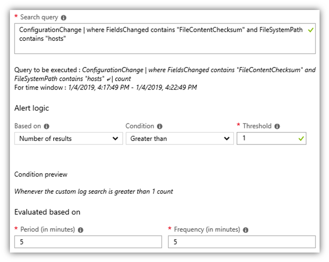
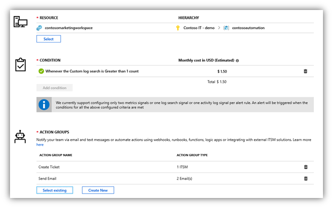

<!-- cSpell:ignore HKEY kusto -->

# Enable tracking and alerting for critical changes

Azure Change Tracking and Inventory provide alerts on the configuration state of your hybrid environment and changes to that environment. It can report critical file, service, software, and registry changes that might affect your deployed servers.

By default, the Azure Automation inventory service doesn't monitor files or registry settings. The solution does provide a list of registry keys that we recommend for monitoring. To see this list, go to your Azure Automation account in the Azure portal, then select **Inventory** > **Edit settings**.


For more information about each registry key, see [Registry key change tracking](/azure/automation/change-tracking/overview#registry-key-change-tracking). Select any key to evaluate and then enable it. The setting is applied to all VMs that are enabled in the current workspace.

You can also use the service to track critical file changes. For example, you might want to track the `C:\windows\system32\drivers\etc\hosts` file because the OS uses it to map host names to IP addresses. Changes to this file could cause connectivity problems or redirect traffic to dangerous websites.

To enable file-content tracking for the hosts file, follow the steps in [Enable file content tracking](/azure/automation/change-tracking/manage-change-tracking#enable-file-content-tracking).

You can also add an alert for changes to files that you're tracking. For example, you might want to set an alert for changes to the hosts file. To do this, select **Log Analytics** on the command bar or **Log Search** for the linked Log Analytics workspace. In Log Analytics, use the following query to search for changes to the hosts file:

  ```kusto
  ConfigurationChange | where FieldsChanged contains "FileContentChecksum" and FileSystemPath contains "hosts"
  ```


This query searches for changes to the contents of files that have a path that contains the word "hosts." You can also search for a specific file by changing the path parameter. (For example: `FileSystemPath ==  "c:\\windows\\system32\\drivers\\etc\\hosts"`.)

After the query returns the results, select **New alert rule** to open the alert-rule editor. You can also get to this editor via Azure Monitor in the Azure portal.

In the alert-rule editor, review the query and change the alert logic if you need to. In this case, we want the alert to be raised if any changes are detected on any machine in the environment.



After you set the condition logic, you can assign action groups to perform actions in response to the alert. In this example, when the alert is raised, emails are sent and an ITSM ticket is created. You can take many other useful actions, like triggering an Azure function, an Azure Automation runbook, a webhook, or a logic app.



After you've set all the parameters and logic, apply the alert to the environment.

## Tracking and alerting examples

This section shows other common scenarios for tracking and alerting that you might want to use.

### Driver file changed

Use the following query to detect if driver files are changed, added, or removed. It's useful for tracking changes to critical system files.

  ```kusto
  ConfigurationChange | where ConfigChangeType == "Files" and FileSystemPath contains " c:\\windows\\system32\\drivers\\"
  ```

### Specific service stopped

Use the following query to track changes to system-critical services.

  ```kusto
  ConfigurationChange | where SvcState == "Stopped" and SvcName contains "w3svc"
  ```

### New software installed

Use the following query for environments that need to lock down software configurations.

  ```kusto
  ConfigurationChange | where ConfigChangeType == "Software" and ChangeCategory == "Added"
  ```

### Specific software version is or isn't installed on a machine

Use the following query to assess security. This query references `ConfigurationData`, which contains the logs for inventory and provides the last-reported configuration state, not changes.

  ```kusto
  ConfigurationData | where SoftwareName contains "Monitoring Agent" and CurrentVersion != "8.0.11081.0"
  ```

### Known DLL changed through the registry

Use the following query to detect changes to well-known registry keys.

  ```kusto
  ConfigurationChange | where RegistryKey == "HKEY_LOCAL_MACHINE\\System\\CurrentControlSet\\Control\\Session Manager\\KnownDlls"
  ```

## Next steps

Learn how Azure Automation can [create update schedules](./update-schedules.md) to manage updates for your servers.

> [!div class="nextstepaction"]
> [Create update schedules](./update-schedules.md)
