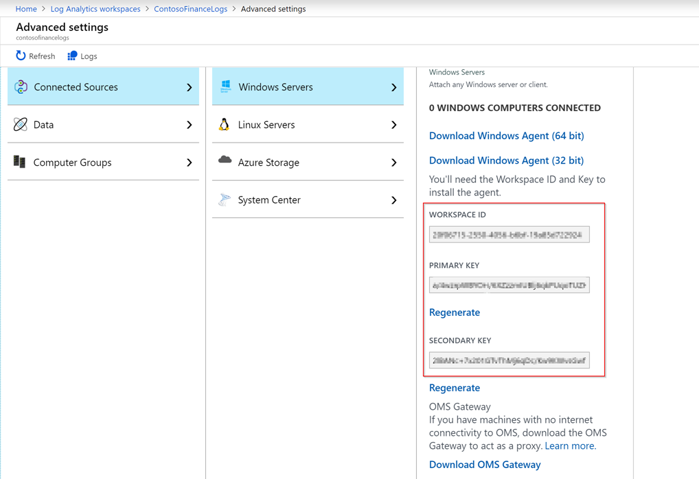
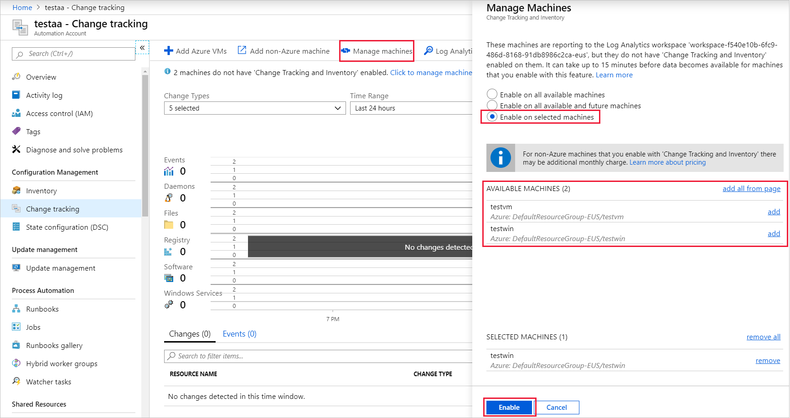

<!-- cSpell:ignore VMUUID kusto -->

# Configure Azure server management services at scale

You must complete these two tasks to onboard Azure server management services to your servers:

- Deploy service agents to your servers.
- Enable the management solutions.

This article covers the three processes that are necessary to complete these tasks:

1. Deploy the required agents to Azure VMs by using Azure Policy.
1. Deploy the required agents to on-premises servers.
1. Enable and configuring the solutions.

> [!NOTE]
> Create the required [Log Analytics workspace and Azure Automation account](./prerequisites.md#create-a-workspace-and-automation-account) before you onboard virtual machines to Azure server management services.

## Use Azure Policy to deploy extensions to Azure VMs

All the management solutions that are discussed in [Azure management tools and services](./tools-services.md) require that the Log Analytics agent is installed on Azure virtual machines and on-premises servers. You can onboard your Azure VMs at scale by using Azure Policy. Assign policy to ensure that the agent is installed on your Azure VMs and connected to the correct Log Analytics workspace.

Azure Policy has a [built-in policy initiative](https://docs.microsoft.com/azure/governance/policy/concepts/definition-structure#initiatives) that includes the Log Analytics agent and the [Microsoft Dependency agent](https://docs.microsoft.com/azure/azure-monitor/insights/vminsights-onboard#the-microsoft-dependency-agent), which is required by Azure Monitor for VMs.

<!-- TODOBACKLOG: Add these when available.
**Preview:** Enable Azure Monitor for virtual machine scale sets.
**Preview:** Enable Azure Monitor for VMs.
 -->

> [!NOTE]
> For more information about various agents for Azure monitoring, see [Overview of the Azure monitoring agents](https://docs.microsoft.com/azure/azure-monitor/platform/agents-overview).

### Assign policies

To assign the policies that described in the previous section:

1. In the Azure portal, go to **Azure Policy** > **Assignments** > **Assign initiative**.

    

2. On the **Assign Policy** page, set the **Scope** by selecting the ellipsis (…) and then selecting either a management group or subscription. Optionally, select a resource group. Then choose **Select** at the bottom of the **Scope** page. The scope determines which resources or group of resources the policy is assigned to.

3. Select the ellipsis (**…**) next to **Policy definition** to open the list of available definitions. To filter the initiative definitions, enter **Azure Monitor** in the **Search** box:

    

4. The **Assignment name** is automatically populated with the policy name that you selected, but you can change it. You can also add an optional description to provide more information about this policy assignment. The **Assigned by** field is automatically filled based on who is signed in. This field is optional, and it supports custom values.

5. For this policy, select **Log Analytics workspace** for the Log analytics agent to associate.

    

6. Select the **Managed Identity location** check box. If this policy is of the type `[DeployIfNotExists](https://docs.microsoft.com/azure/governance/policy/concepts/effects#deployifnotexists)`, a managed identity will be required to deploy the policy. In the portal, the account will be created as indicated by the check box selection.

7. Select **Assign**.

After you complete the wizard, the policy assignment will be deployed to the environment. It can take up to 30 minutes for the policy to take effect. To test it, create new VMs after 30 minutes, and check if the Microsoft Monitoring Agent is enabled on the VM by default.

## Install agents on on-premises servers

> [!NOTE]
> Create the required [Log Analytics workspace and Azure Automation account](./prerequisites.md#create-a-workspace-and-automation-account) before you onboard Azure server management services to servers.

For on-premises servers, you need to download and install the [Log Analytics agent and the Microsoft Dependency agent](https://docs.microsoft.com/azure/azure-monitor/insights/vminsights-enable-hybrid-cloud) manually and configure them to connect to the correct workspace. You must specify the workspace ID and key information. To get that information, go to your Log Analytics workspace in the Azure portal, then select **Settings** > **Advanced settings**.



## Enable and configure solutions

To enable solutions, you need to configure the Log Analytics workspace. Onboarded Azure VMs and on-premises servers will get the solutions from the Log Analytics workspaces that they're connected to.

### Update Management

The Update Management, Change Tracking, and Inventory solutions require both a Log Analytics workspace and an Automation account. To ensure that these resources are properly configured, we recommend that you onboard through your Automation account. For more information, see [Onboard Update Management, Change Tracking, and Inventory solutions](https://docs.microsoft.com/azure/automation/automation-onboard-solutions-from-automation-account).

We recommend that you enable the Update Management solution for all servers. Update Management is free for Azure VMs and on-premises servers. If you enable Update Management through your Automation account, a [scope configuration](https://docs.microsoft.com/azure/automation/automation-onboard-solutions-from-automation-account#scope-configuration) is created in the workspace. Manually update the scope to include machines that are covered by the Update Management service.

To cover your existing servers as well as future servers, you need to remove the scope configuration. To do this, view your Automation account in the Azure portal. Select **Update Management** > **Manage machine** > **Enable on all available and future machines**. This setting allows all Azure VMs that are connected to the workspace to use Update Management.


### Change Tracking and Inventory solutions

To onboard the Change Tracking and Inventory solutions, follow the same steps as for Update Management. For more information about how to onboard these solutions from your Automation account, see [Onboard Update Management, Change Tracking, and Inventory solutions](https://docs.microsoft.com/azure/automation/automation-onboard-solutions-from-automation-account).

The Change Tracking solution is free for Azure VMs and costs $6 per node per month for on-premises servers. This cost covers Change Tracking, Inventory, and Desired State Configuration. If you want to enroll only specific on-premises servers, you can opt in those servers. We recommend that you onboard all your production servers.

#### Opt in via the Azure portal

1. Go to the Automation account that has Change Tracking and Inventory enabled.
2. Select **Change tracking**.
3. Select **Manage machines** in the upper-right pane.
4. Select **Enable on selected machines**. Then select **Add** next to the machine name.
5. Select **Enable** to enable the solution for those machines.



#### Opt in by using saved searches

Alternatively, you can configure the scope configuration to opt in on-premises servers. Scope configuration uses saved searches.

To create or modify the saved search, follow these steps:

1. Go to the Log Analytics workspace that is linked to the Automation account that you configured in the preceding steps.

1. Under **General**, select **Saved searches**.

1. In the **Filter** box, enter **Change Tracking** to filter the list of saved searches. In the results, select **MicrosoftDefaultComputerGroup**.

1. Enter the computer name or the VMUUID to include the computers that you want to opt in for Change Tracking.

  ```kusto
  Heartbeat
  | where AzureEnvironment=~"Azure" or Computer in~ ("list of the on-premises server names", "server1")
  | distinct Computer
  ```

  > [!NOTE]
  > The server name must exactly match the value in the expression, and it shouldn't contain a domain name suffix.

1. Select **Save**. By default, the scope configuration is linked to the **MicrosoftDefaultComputerGroup** saved search. It will be automatically updated.

### Azure Activity Log

[Azure Activity Log](https://docs.microsoft.com/azure/azure-monitor/platform/activity-logs-overview) is also part of Azure Monitor. It provides insight into subscription-level events that occur in Azure.

To implement this solution:

1. In the Azure portal, open **All services**, then select **Management + Governance** > **Solutions**.
2. In the **Solutions** view, select **Add**.
3. Search for **Activity Log Analytics** and select it.
4. Select **Create**.

You need to specify the **Workspace name** of the workspace that you created in the previous section where the solution is enabled.

### Azure Log Analytics Agent Health

The Azure Log Analytics Agent Health solution reports on the health, performance, and availability of your Windows and Linux servers.

To implement this solution:

1. In the Azure portal, open **All services**, then select **Management + Governance** > **Solutions**.
2. In the **Solutions** view, select **Add**.
3. Search for **Azure Log Analytics agent health** and select it.
4. Select **Create**.

You need to specify the **Workspace name** of the workspace that you created in the previous section where the solution is enabled.

After creation is complete, the workspace resource instance displays **AgentHealthAssessment** when you select **View** > **Solutions**.

### Antimalware Assessment

The Antimalware Assessment solution helps you identify servers that are infected or at increased risk of infection by malware.

To implement this solution:

1. In the Azure portal, open **All services**, select select **Management + Governance** > **Solutions**.
2. In the **Solutions** view, select **Add**.
3. Search for and then select **Antimalware Assessment**.
4. Select **Create**.

You need to specify the **Workspace name** of the workspace that you created in the previous section where the solution is enabled.

After creation is complete, the workspace resource instance displays **AntiMalware** when you select **View** > **Solutions**.

### Azure Monitor for VMs

You can enable [Azure Monitor for VMs](https://docs.microsoft.com/azure/azure-monitor/insights/vminsights-overview) through the view page for the VM instance, as described in [Enable management services on a single VM for evaluation](./onboard-single-vm.md). You shouldn't enable solutions directly from the **Solutions** page as you do for the other solutions that are described in this article. For large-scale deployments, it may be easier to use [automation](./onboarding-automation.md) to enable the correct solutions in the workspace.

### Azure Security Center

We recommend that you onboard all your servers at least to the Free tier of Azure Security Center. This option provides basic security assessments and actionable security recommendations for your environment. The Standard tier provides additional benefits. For more information, see [Azure Security Center pricing](https://docs.microsoft.com/azure/security-center/security-center-pricing).

To enable the Free tier of Azure Security Center, follow these steps:

1. Go to the **Security Center** portal page.
2. Under **POLICY & COMPLIANCE**, select **Security policy**.
3. Find the Log Analytics workspace resource that you created in the pane on the right side.
4. Select **Edit settings** for that workspace.
5. Select **Pricing tier**.
6. Choose the **Free** option.
7. Select **Save**.

## Next steps

Learn how to use automation to onboard servers and create alerts.

> [!div class="nextstepaction"]
> [Automate onboarding and alert configuration](./onboarding-automation.md)
