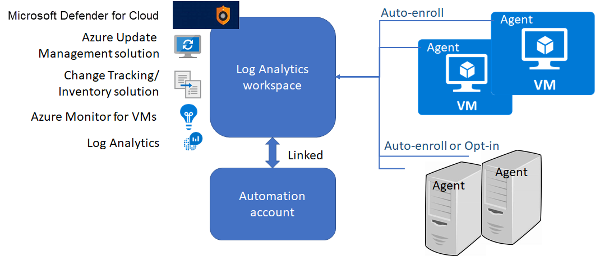

# Phase 2: Onboarding Azure server management services

After you're familiar with the [tools](./tools-services.md) and [planning](./prerequisites.md) involved in Azure management services, you're ready for the second phase. Phase 2 provides step-by-step guidance for onboarding these services for use with your Azure resources. Start by evaluating this onboarding process before adopting it broadly in your environment.

> [!NOTE]
> The automation approaches discussed in later sections of this guidance are meant for deployments that don't already have servers deployed to the cloud. They require that you have the Owner role on a subscription to create all the required resources and policies. If you've already created Log Analytics workspaces and Automation accounts, we recommend that you pass these resources in the appropriate parameters when you start the example automation scripts.

## Onboarding processes

This section of the guidance covers the following onboarding processes for both virtual machines in Azure and on-premises servers:

- **Enable management services on a single VM for evaluation by using the portal.** Use this process to familiarize yourself with the Azure server management services.
- **Configure management services for a subscription by using the portal.** This process helps you configure the Azure environment so that any new VMs that are provisioned will automatically use management services. Use this approach if you prefer the Azure portal experience to scripts and command lines.
- **Configure management services for a subscription by using Azure Automation.** This process is fully automated. Just create a subscription, and the scripts will configure the environment to use management services for any newly provisioned VM. Use this approach if you're familiar with PowerShell scripts and Azure Resource Manager templates, or if you want to learn to use them.

The procedures for each approach differ.

> [!NOTE]
> When you use the Azure portal, the sequence of onboarding steps differs from the automated onboarding steps. The portal offers a simpler onboarding experience.

The following diagram shows the recommended deployment model for management services:

As shown in the preceding diagram, the Log Analytics agent has two configurations for on-premises servers:

- **Auto-enroll:** When the Log Analytics agent is installed on a server and configured to connect to a workspace, the solutions that are enabled on that workspace are applied to the server automatically.
- **Opt-in:** Even if the agent is installed and connected to the workspace, the solution isn't applied unless it's added to the server's scope configuration in the workspace.

> [!TIP]
> Consider using [Azure Automanage machine best practices](/azure/automanage/overview-about). This service makes it simple to discover, onboard, and configure certain services in Azure that would benefit your virtual machines and assist with [onboarding at scale](./onboard-at-scale.md).

## Next steps

Learn how to onboard a single VM by using the portal to evaluate the onboarding process.

> [!div class="nextstepaction"]
> [Onboard a single Azure VM for evaluation](./onboard-single-vm.md)
