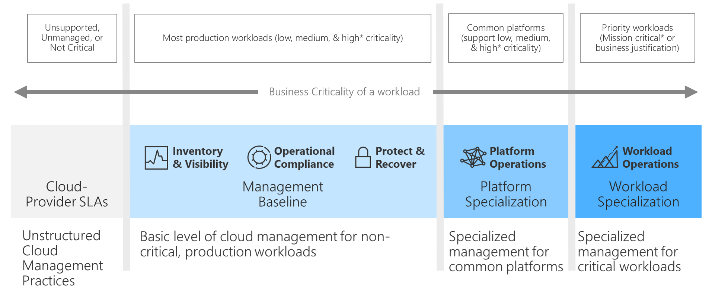

# Business criticality in cloud management

Across every business, there exist a small number of workloads that are too important to fail. When those workloads experience outages or performance degradation, an adverse impact to revenue and profitability can be felt across the entire company. Those workloads are considered to be mission critical.

At the other end of the spectrum, some workloads can go months at a time without being used. Poor performance or outages for those workloads is not desirable, but the impact is isolated and limited.

Understanding the criticality of each workload in the IT portfolio is the first step toward mutual commitments to cloud management.
The image below outlines a common alignment between the criticality scale to follow and the standard commitments made by the business.

## Criticality scale

The first step in any business criticality alignment effort is the creation of a criticality scale. Below is a sample scale that can be used as a reference, or a template to create your own scale.

|Criticality  |Business View  |
|---------|---------|
|Mission Critical|Impacts the mission of the company and may noticeable impact corporate profit and loss statements.|
|Unit Critical|Impacts the mission of a specific business unit and that business units profit and loss statements.|
|High|May not hinder the mission, but impacts high importance processes. Measurable losses can be quantified in the case of outages.|
|Medium|Impact to processes are likely. Losses are low or immeasurable, but brand damage or upstream losses is likely.|
|Low|Impact to business processes are immeasurable. Neither brand damage or upstream losses are likely. Localized impact to a single team is likely.|
|Unsupported|No business owner, team, or process associated with this workload can justify any investment in ongoing management of the workload|

It is common for businesses to include additional criticality classifications specific to an industry, vertical, or specific business processes. Examples of the additional classifications include:

- **Compliance-critical:** In heavily regulated industries, some workloads may be critical as part of an effort to maintain compliance requirements.
- **Security-critical:** Some workloads may not be mission critical, but outages could result in loss of data or unintended access to protected information.
- **Safety-critical:** When lives or physical safety of employees and customers are at risk during an outage, it can be wise to classify workloads as safety-critical.

## Importance of accurate criticality

Later in this process, the cloud management team will use this classification to determine the amount of effort required to meet aligned levels of criticality. In on-premises environments, operations management is often purchased central and treated like a necessary business burden, with little/no additional operating costs. In the cloud, operations management (like all of the cloud) is purchased on a per-asset basis as monthly operating costs.

Since there is a clear and direct cost to operations management in the cloud, it is important to properly align costs and desired criticality scales.

## Select a default criticality

An initial review of every workload in the portfolio could be time consuming. To ensure this effort doesn't block the broader cloud strategy, it is suggested that it and the business agree on a default criticality to apply to all workloads.

Based on the criticality scale above, it is suggested that "Medium" criticality be used as the default. Doing so will allow the cloud strategy team to quickly identify workloads that require a higher level of criticality.

## Using the template

The following steps apply to readers who are using the [Ops Management workbook](https://raw.githubusercontent.com/microsoft/CloudAdoptionFramework/master/manage/opsmanagementworkbook.xlsx) to plan for cloud management.

1. The criticality scale can be recorded on the scale tab of the workbook.
2. Each workload in the "Example" or "Clean Template" should be updated to reflect the default criticality in the "Criticality" column.
3. Correct values should be input by the business to reflect any deviations from the default criticality.

## Next steps

Once criticality is defined, [calculate and record business impact](./impact.md).

> [!div class="nextstepaction"]
> [Calculate and record business impact](./impact.md)
