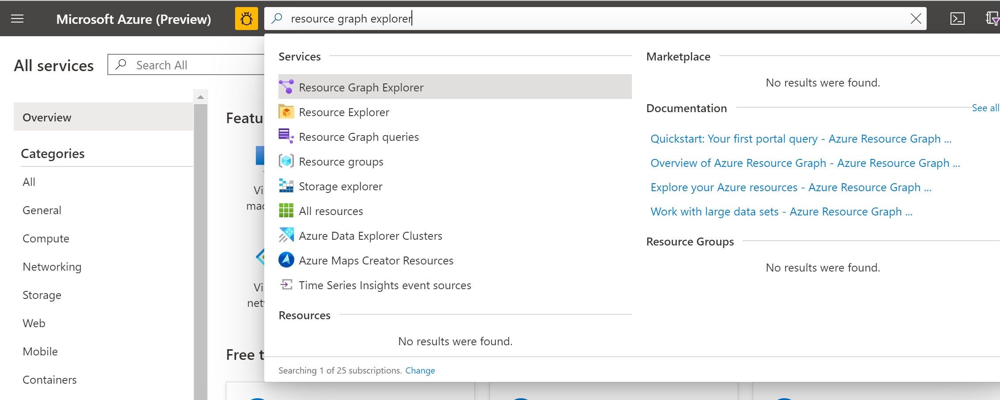
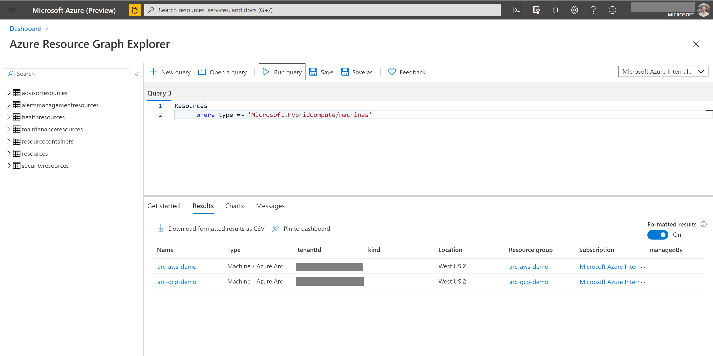
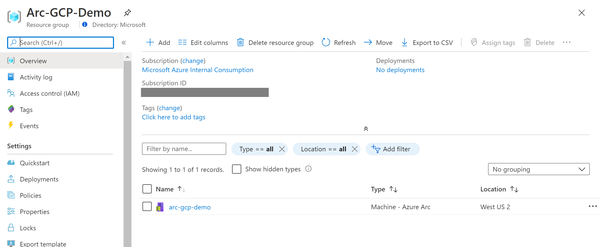
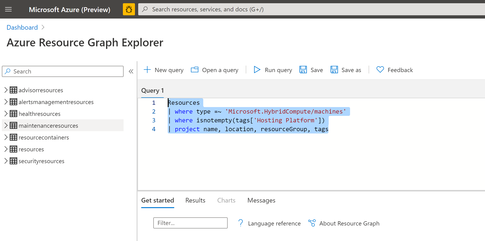
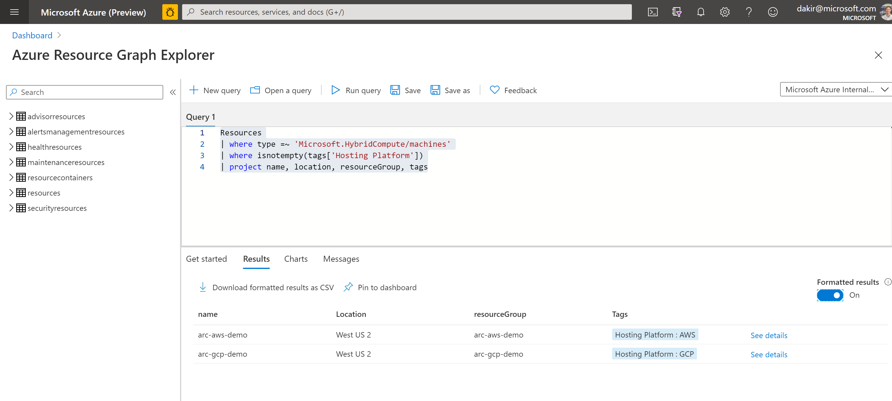

# Apply inventory tagging to Azure Arc enabled servers

This article provides guidance on how to use Azure Arc enabled servers to provide server inventory management capabilities across hybrid multicloud and on-premises environments.

Azure Arc enabled servers enable you to manage your Windows and Linux machines hosted outside of Azure on your corporate network or other cloud providers. This is similar to how you manage native virtual machines in Azure. When a hybrid machine is connected to Azure, it becomes a connected machine and is treated as a resource in Azure. Each connected machine has a resource ID, is managed as part of a resource group inside a subscription, and benefits from standard Azure constructs such as Azure Policy and applying tags. The ability to easily organize and manage server inventory using Azure as a management engine greatly reduces administrative complexity and provides a consistent strategy for hybrid and multicloud environments.

The following procedures use [Resource Graph Explorer](/azure/governance/resource-graph/first-query-portal) and [Azure CLI](/cli/azure/install-azure-cli) to demonstrate how to tag and query server inventory across multiple clouds from a single pane of glass in Azure.

> [!IMPORTANT]
> The procedures in this article assumes you've already deployed VMs, or servers that are running on-premises or on other clouds, and you have connected them to Azure Arc. If you haven't, the following information can help you automate this.

- [GCP Ubuntu instance](./gcp-terraform-ubuntu.md)
- [GCP Windows instance](./gcp-terraform-windows.md)
- [AWS Ubuntu EC2 instance](./aws-terraform-ubuntu.md)
- [AWS Amazon Linux 2 EC2 instance](./aws-terraform-al2.md)
- [VMware vSphere Ubuntu VM](./vmware-terraform-ubuntu.md)
- [VMware vSphere Windows Server VM](./vmware-terraform-winsrv.md)
- [Vagrant Ubuntu box](./local-vagrant-ubuntu.md)
- [Vagrant Windows box](./local-vagrant-windows.md)

## Prerequisites

1. Clone the Azure Arc Jumpstart repository.

   ```console
   git clone https://github.com/microsoft/azure_arc
   ```

2. [Install or update Azure CLI to version 2.7 or later](/cli/azure/install-azure-cli). Use the following command to check the current installed version.

   ```console
   az --version
   ```

## Verify that your Azure Arc connected servers are ready for tagging

Use Resource Graph Explorer to query and view resources in Azure.

1. Enter **Resource Graph Explorer** in the top search bar in the Azure portal and select it.

    

1. In the query window, enter the following query, and then select **Run Query**:

    ```kusto
    Resources
    | where type =~ 'Microsoft.HybridCompute/machines'
    ```

1. If you have correctly created Azure Arc enabled servers, they are listed in the results pane of Resource Graph Explorer. You can also view the Azure Arc enabled serves from the Azure portal.

    

    

## Create a basic Azure tag taxonomy

Open Azure CLI and run the following commands to create a basic taxonomy structure that lets you easily query and report on where your server resources are hosted (whether in Azure, AWS, GCP , or on-premises). For more guidance on building out a tag taxonomy please review the [resource naming and tagging decision guide](../../../../decision-guides/resource-tagging/index.md).

```console
az tag create --name "Hosting Platform"
az tag add-value --name "Hosting Platform" --value "Azure"
az tag add-value --name "Hosting Platform" --value "AWS"
az tag add-value --name "Hosting Platform" --value "GCP"
az tag add-value --name "Hosting Platform" --value "On-premises"
```


## Tag your Azure Arc resources

After you've created a basic taxonomy structure, apply tags to the Azure Arc enabled server resources. The following procedure demonstrates tagging resources in both AWS and GCP. If you only have resources in one of these providers, you can skip to the appropriate section for AWS or GCP.

### Tag the Azure Arc connected AWS Ubuntu EC2 instance

In CLI, run the following commands to apply the `Hosting Platform : AWS`  tag to your AWS Azure Arc enabled servers.

> [!NOTE]
> If you connected your AWS EC2 instances using a method other than the one described in the [Azure tutorial](./aws-terraform-ubuntu.md), then you need to adjust the values for `awsResourceGroup` and `awsMachineName` to match values specific to your environment.

```console
export awsResourceGroup="arc-aws-demo"
export awsMachineName="arc-aws-demo"
export awsMachineResourceId="$(az resource show --resource-group $awsResourceGroup --name $awsMachineName --resource-type "Microsoft.HybridCompute/machines" --query id)"
export awsMachineResourceId="$(echo $awsMachineResourceId | tr -d "\"" | tr -d '\r')"
az resource tag --ids $awsMachineResourceId --tags "Hosting Platform"="AWS"
```


### Tag Azure Arc connected GCP Ubuntu server

In CLI, run the following commands to apply the `Hosting Platform : GCP`  tag to your GCP Azure Arc enabled servers.

> [!NOTE]
> If you connected your GCP instances using a method other than the one described in the related [Azure Arc Terraform tutorial](./gcp-terraform-ubuntu.md), then you will need to adjust the values for `gcpResourceGroup` and `gcpMachineName` to match values specific to your environment.

```console
export gcpResourceGroup="arc-gcp-demo"
export gcpMachineName="arc-gcp-demo"
export gcpMachineResourceId="$(az resource show --resource-group $gcpResourceGroup --name $gcpMachineName --resource-type "Microsoft.HybridCompute/machines" --query id)"
export gcpMachineResourceId="$(echo $gcpMachineResourceId | tr -d "\"" | tr -d '\r')"
az resource tag --resource-group $gcpResourceGroup --ids $gcpMachineResourceId --tags "Hosting Platform"="GCP"
```


## Query resources by tag using Resource Graph Explorer

After you apply tags to the resources that are hosted in multiple clouds, use Resource Graph Explorer to query them and get insight into your multicloud landscape.

1. In the query window, enter the following query:

   ```kusto
   Resources
   | where type =~ 'Microsoft.HybridCompute/machines'
   | where isnotempty(tags['Hosting Platform'])
   | project name, location, resourceGroup, tags
   ```

   

2. Click **Run Query** and then select the **Formatted Results** toggle. If done correctly, you should see all Azure Arc enabled servers and their assigned `Hosting Platform` tag values.

   

   We can also view the tags on the projected servers from Azure portal.

   

   

## Clean up your environment

Complete the following steps to clean up your environment.

1. Remove the virtual machines from each environment by following the teardown instructions from each guide.

   - [GCP Ubuntu instance](./gcp-terraform-ubuntu.md) and [GCP Windows instance](./gcp-terraform-windows.md)
   - [AWS Ubuntu EC2 instance](./aws-terraform-ubuntu.md)
   - [VMware vSphere Ubuntu VM](./vmware-terraform-ubuntu.md) and [VMware vSphere Windows Server VM](./vmware-terraform-winsrv.md)
   - [Vagrant Ubuntu box](./local-vagrant-ubuntu.md) and [Vagrant Windows box](./local-vagrant-windows.md)

1. Remove tags created as part of this guide by executing the following script in Azure CLI.

   ```console
   az tag remove-value --name "Hosting Platform" --value "Azure"
   az tag remove-value --name "Hosting Platform" --value "AWS"
   az tag remove-value --name "Hosting Platform" --value "GCP"
   az tag remove-value --name "Hosting Platform" --value "On-premises"
   az tag create --name "Hosting Platform"
   ```
