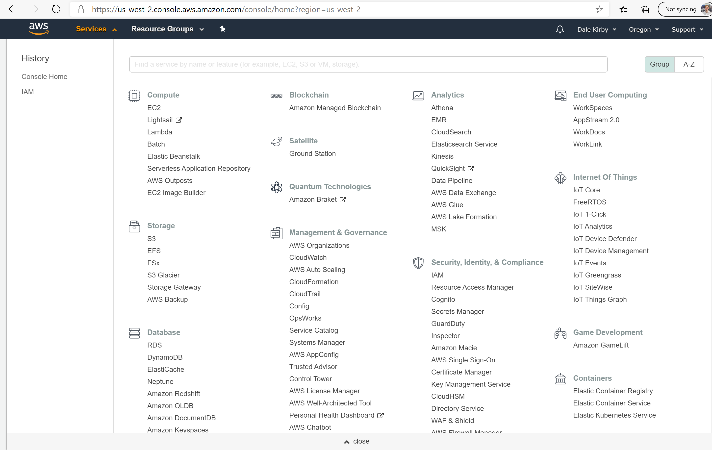
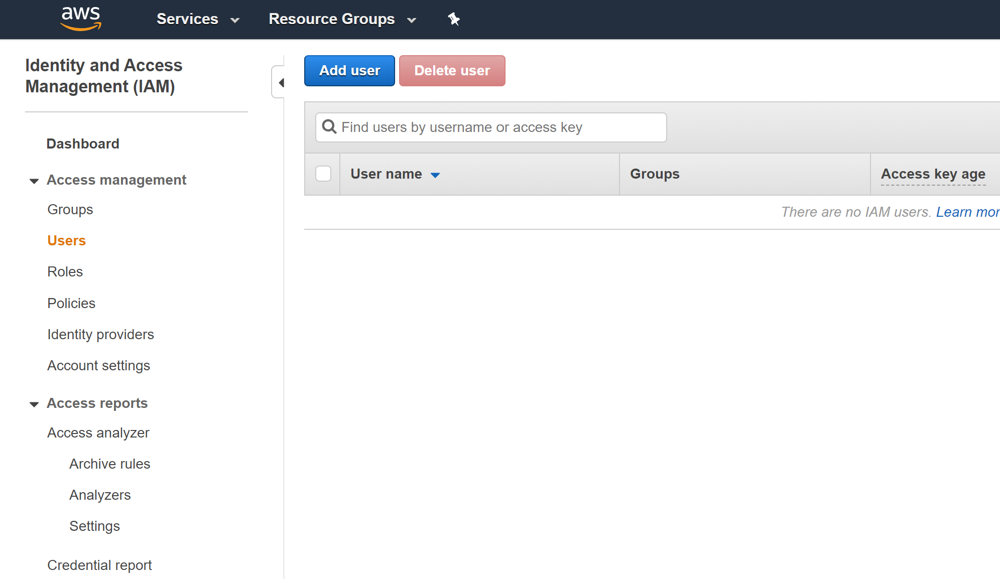
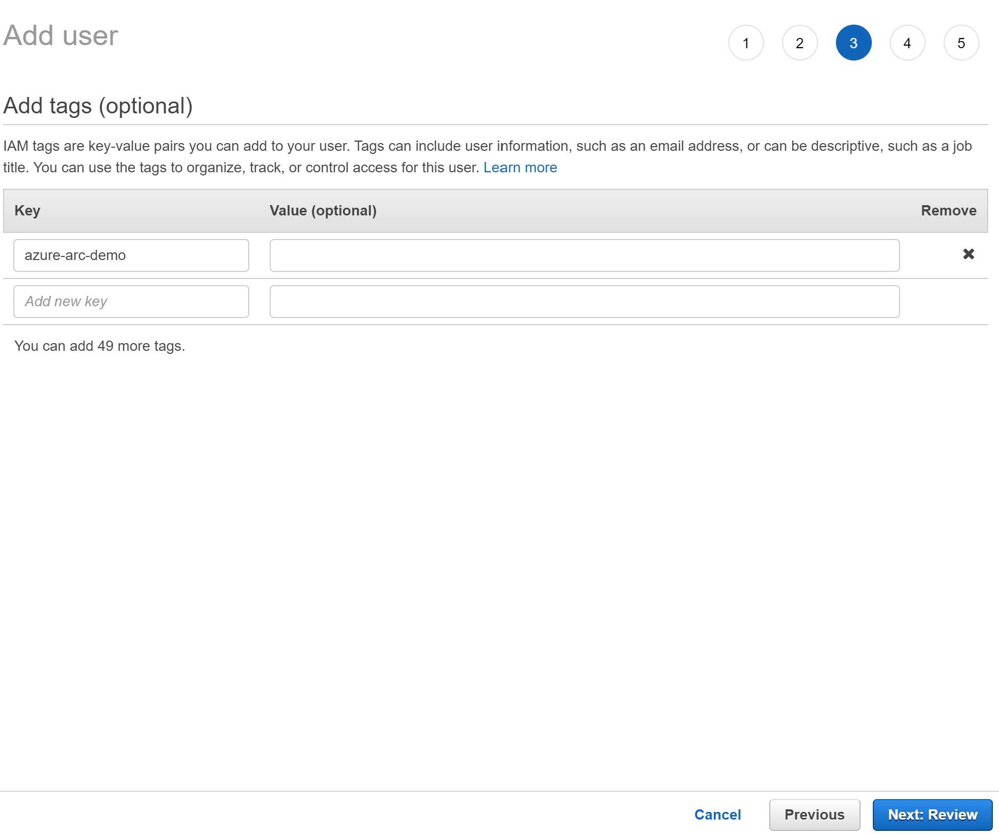
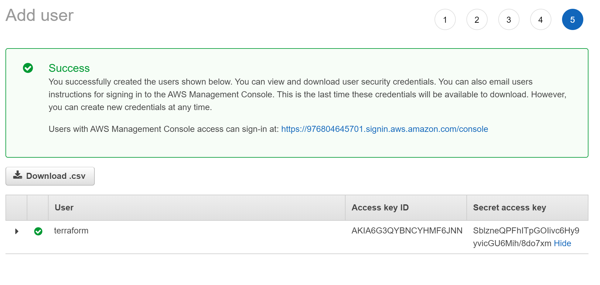
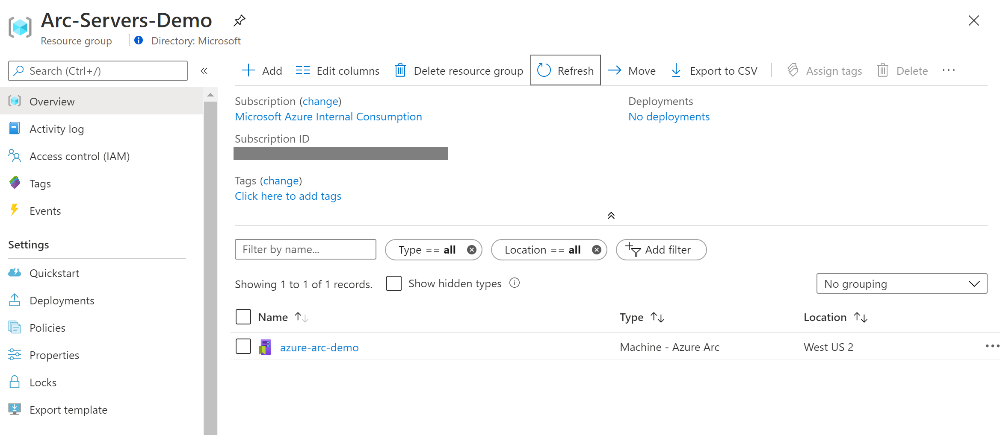
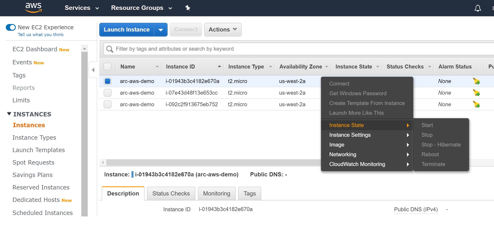

# Use a Terraform plan to deploy an Amazon Web Services Amazon Elastic Compute Cloud Linux 2 instance and connect it to Azure Arc

This article provides guidance for using the provided [Terraform](https://www.terraform.io/) plan to deploy an Amazon Web Services (AWS) Amazon Elastic Compute Cloud (Amazon EC2) Linux 2 instance and connect it as an Azure Arc enabled server resource.

## Prerequisites

- Clone the Azure Arc Jumpstart repository.

    ```console
    git clone https://github.com/microsoft/azure_arc.git
    ```

- [Install or update Azure CLI](/cli/azure/install-azure-cli). Azure CLI should be running version 2.7.0 or later. Use `az --version` to check your current installed version.

- [Generate SSH key](https://help.github.com/articles/generating-a-new-ssh-key-and-adding-it-to-the-ssh-agent/) (or use existing SSH key)

- [Create free AWS account](https://aws.amazon.com/premiumsupport/knowledge-center/create-and-activate-aws-account/)

- [Install Terraform >= 0.12](https://learn.hashicorp.com/terraform/getting-started/install.html)

- Create an Azure service principal.

    To connect the AWS virtual machine to Azure Arc, an Azure service principal assigned with the Contributor role is required. To create it, sign in to your Azure account and run the following commands:

    ```console
    az login
    az ad sp create-for-rbac -n "http://AzureArcAWS" --role contributor
    ```

    Output should look similar to this:

    ```json
    {
    "appId": "XXXXXXXXXXXXXXXXXXXXXXXX",
    "displayName": "AzureArcAWS",
    "name": "http://AzureArcAWS",
    "password": "XXXXXXXXXXXXXXXXXXXXXXXX",
    "tenant": "XXXXXXXXXXXXXXXXXXXXXXXX"
    }
    ```

    > [!NOTE]
    > We highly recommend that you scope the service principal to a specific [Azure subscription and resource group](/cli/azure/ad/sp).

## Create an AWS identity

In order for Terraform to create resources in AWS, we will need to create a new AWS IAM role with appropriate permissions and configure Terraform to use it.

- Login to the [AWS management console](https://console.aws.amazon.com/console/home)

- After logging in, select the **Services** dropdown in the top left. Under **Security, Identity, and Compliance**, select **IAM** to access the [identity and access management page](https://console.aws.amazon.com/iam/home)

    

    

- Click on **Users** from the left menu, and then select **Add user** to create a new IAM user.

    

- On the **Add User** page, name the user `Terraform` and select the **Programmatic Access** check box, and then select **Next**

    

- On the **Set Permissions** page, select **Attach existing policies directly** and then check the box next to **AmazonEC2FullAccess** as seen in the screenshot, and then select **Next**

    

- On the **Tags** page, assign a tag with a key of `azure-arc-demo`, then select **Next** to proceed to the review page.

    

- Verify that everything is correct, then select **Create user**.

    

- After the user is created, you will see the user's access key ID and secret access key. Copy these values down before selecting **Close**. On the next page, you can see an example of what this should look like. Once you have these keys, you will be able to use them with Terraform to create AWS resources.

    

## Configure Terraform

Before executing the Terraform plan, you must export the environment variables which will be used by the plan. These variables are based on your Azure subscription and tenant, the Azure service principal, and the AWS IAM user and keys you just created.

- Retrieve your Azure subscription ID and tenant ID using the `az account list` command.

- The Terraform plan creates resources in both Microsoft Azure and AWS. It then executes a script on an AWS EC2 virtual machine to install the Azure Arc agent and all necessary artifacts. This script requires certain information about your AWS and Azure environments. Edit [`scripts/vars.sh`](https://github.com/microsoft/azure_arc/blob/main/azure_arc_servers_jumpstart/aws/AL2/terraform/scripts/vars.sh) and update each of the variables with the appropriate values.

  - `TF-VAR-subscription-id`= your Azure subscription ID
  - `TF-VAR-client-id`= your Azure service principal application ID
  - `TF-VAR-client-secret` = your Azure service principal password
  - `TF-VAR-tenant-id`= your Azure tenant ID
  - `AWS-ACCESS-KEY-ID` = AWS access key
  - `AWS-SECRET-ACCESS-KEY` = AWS secret key

- From the Azure CLI, navigate to the `azure_arc_servers_jumpstart/aws/al2/terraform` directory of the cloned repo.

- Export the environment variables you edited by running [`scripts/vars.sh`](https://github.com/microsoft/azure_arc/blob/main/azure_arc_servers_jumpstart/aws/AL2/terraform/scripts/vars.sh) with the source command as shown below. Terraform requires these to be set for the plan to execute properly. Note that this script will also be automatically executed remotely on the AWS virtual machine as part of the Terraform deployment.

    ```console
    source ./scripts/vars.sh
    ```

- Make sure your SSH keys are available in `~/.ssh` and named `id-rsa.pub` and `id-rsa`. If you followed the ssh-keygen guide above to create your key then this should already be setup correctly. If not, you may need to modify [`main.tf`](https://github.com/microsoft/azure_arc/blob/main/azure_arc_servers_jumpstart/aws/AL2/terraform/main.tf) to use a key with a different path.

- Run the `terraform init` command which will download the Terraform AzureRM provider.

    

## Deployment

- Run the `terraform apply --auto-approve` command and wait for the plan to finish. Upon completion, you will have an AWS Amazon Linux 2 EC2 instance deployed and connected as a new Azure Arc enabled server inside a new resource group.

- Open the Azure portal and navigate to the `arc-servers-demo` resource group. The virtual machine created in AWS will be visible as a resource.

    

## Semi-automated deployment (optional)

As you may have noticed, the last step of the run is to register the VM as a new Azure Arc enabled server resource.

  

If you want to demo/control the actual registration process, do the following:

- In the [`install_arc_agent.sh.tmpl`](https://github.com/microsoft/azure_arc/blob/main/azure_arc_servers_jumpstart/aws/AL2/terraform/scripts/install_arc_agent.sh.tmpl) script template, comment out the `run connect command` section and save the file.

    

- Get the public IP of the AWS VM by running `terraform output`.

    

- SSH the VM using the `ssh ec2-user@xx.xx.xx.xx` where `xx.xx.xx.xx` is the host IP.

    

- Export all the environment variables in [`vars.sh`](https://github.com/microsoft/azure_arc/blob/main/azure_arc_servers_jumpstart/aws/AL2/terraform/scripts/vars.sh)

    

- Run the following command:

    ```console
    azcmagent connect --service-principal-id $TF-VAR-client-id --service-principal-secret $TF-VAR-client-secret --resource-group "Arc-Servers-Demo" --tenant-id $TF-VAR-tenant-id --location "westus2" --subscription-id $TF-VAR-subscription-id
    ```

    

- When complete, your VM will be registered with Azure Arc and visible in the resource group via the Azure portal.

## Delete the deployment

To delete all the resources you created as part of this demo use the `terraform destroy --auto-approve` command as shown below.
    

Alternatively, you can delete the AWS EC2 instance directly by terminating it from the [AWS console](https://console.aws.amazon.com/ec2/v2/home).
    
