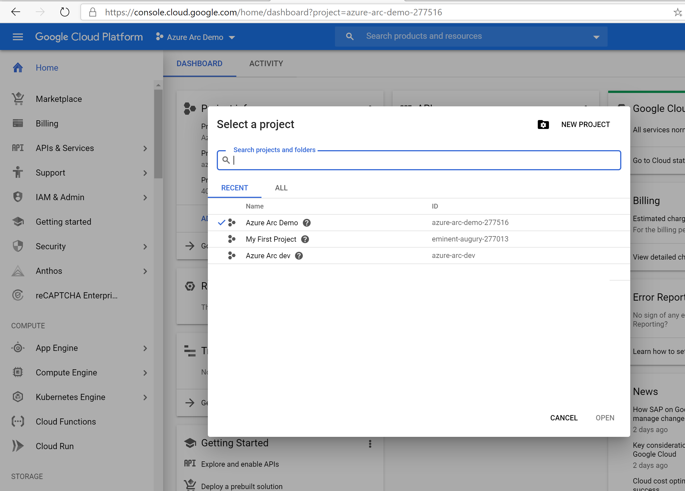
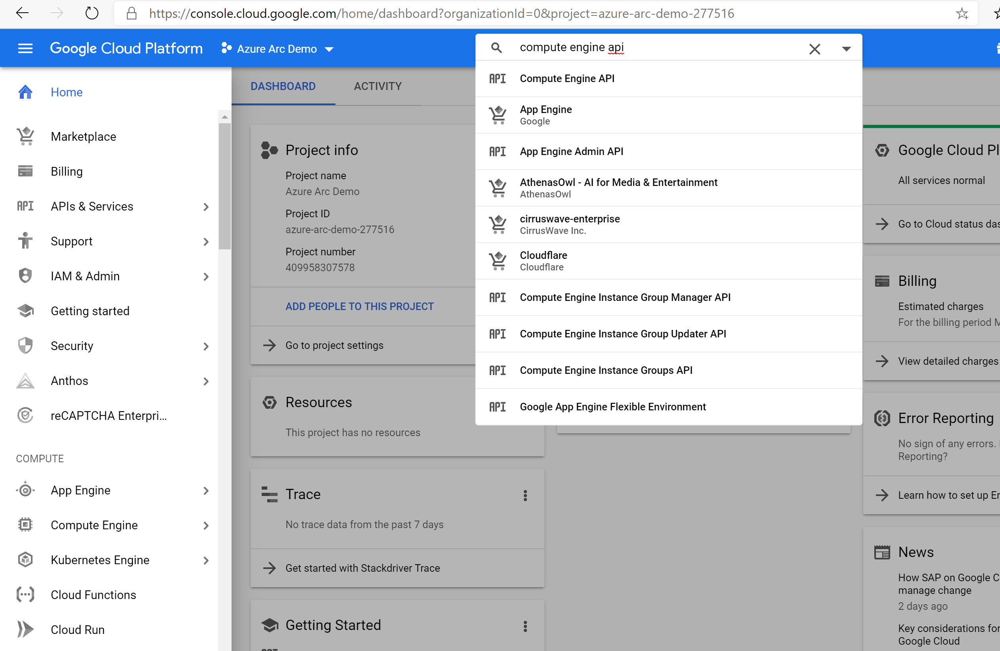
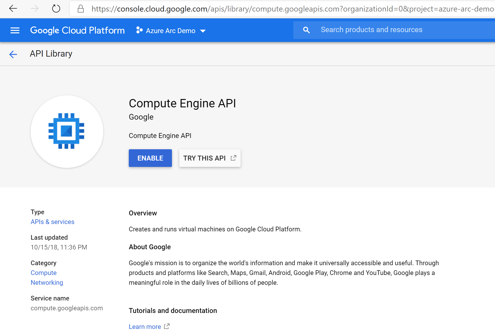
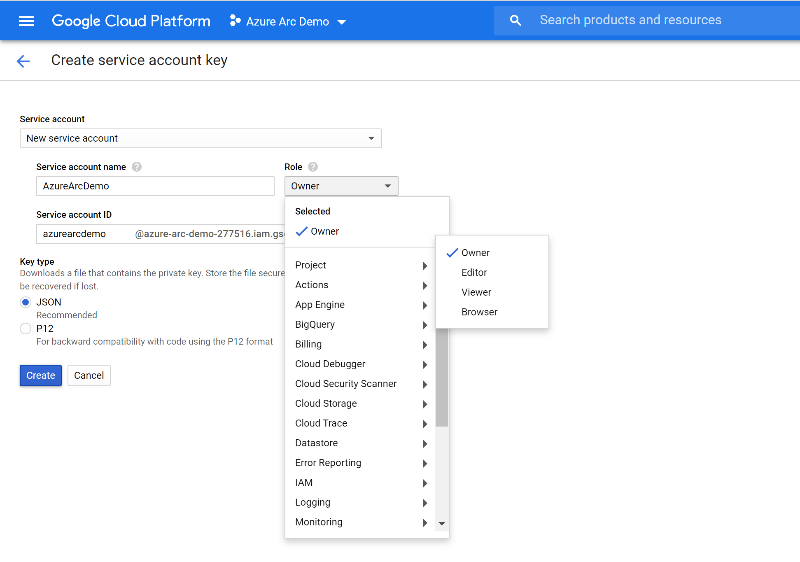
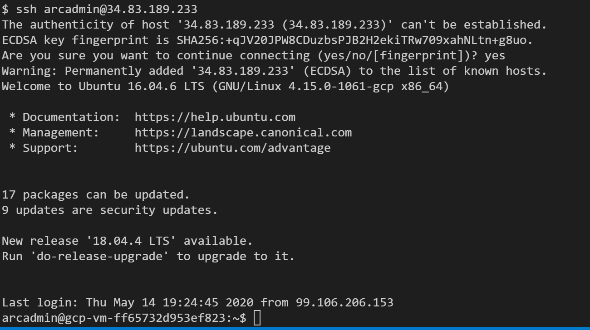

# Use a Terraform plan to deploy a Google Cloud Platform Ubuntu instance and connect it to Azure Arc

This article provides guidance for using the provided [Terraform](https://www.terraform.io/) plan to deploy Google Cloud Platform (GCP) instance and connect it as an Azure Arc enabled server resource.

## Prerequisites

- Clone the Azure Arc Jumpstart repository.

    ```console
    git clone https://github.com/microsoft/azure_arc.git
    ```

- [Install or update Azure CLI to version 2.7 and above](/cli/azure/install-azure-cli). Use the following command to check your current installed version.

  ```console
  az --version
  ```

- [Generate SSH key](https://help.github.com/articles/generating-a-new-ssh-key-and-adding-it-to-the-ssh-agent/) (or use existing SSH key)

- [Create free Google Cloud Platform account](https://cloud.google.com/free)

- [Install Terraform  >= 0.12](https://learn.hashicorp.com/tutorials/terraform/install-cli)

- Create an Azure service principal.

    To connect the GCP virtual machine to Azure Arc, an Azure service principal assigned with the Contributor role is required. To create it, sign in to your Azure account and run the following command. You can also run this command in [Azure Cloud Shell](https://shell.azure.com/).

    ```console
    az login
    az ad sp create-for-rbac -n "<Unique SP Name>" --role contributor
    ```

    For example:

    ```console
    az ad sp create-for-rbac -n "http://AzureArcGCP" --role contributor
    ```

    Output should look like this:

    ```json
    {
    "appId": "XXXXXXXXXXXXXXXXXXXXXXXXXXXX",
    "displayName": "AzureArcGCP",
    "name": "http://AzureArcGCP",
    "password": "XXXXXXXXXXXXXXXXXXXXXXXXXXXX",
    "tenant": "XXXXXXXXXXXXXXXXXXXXXXXXXXXX"
    }
    ```

    > [!NOTE]
    > We highly recommend that you scope the service principal to a specific [Azure subscription and resource group](/cli/azure/ad/sp).

<!-- docutune:casing "Compute Engine API" -->

## Create a new GCP project

- Browse to the [Google API console](https://console.developers.google.com) and sign-in with your Google account. Once logged in, [create a new project](https://cloud.google.com/resource-manager/docs/creating-managing-projects) named `Azure Arc demo`. After creating it, be sure to copy down the project ID since it's usually different then the project name.

    

    

- Once the new project is created and selected in the dropdown at the top of the page, you must enable Compute Engine API access for the project. Click on **+ Enable APIs and Services** and search for *compute engine*. Then select **Enable** to enable API access.

    

    

- Next, set up a service account key, which Terraform will use to create and manage resources in your GCP project. Go to the [create service account key page](https://console.cloud.google.com/apis/credentials/serviceaccountkey). Select **New Service Account** from the dropdown, give it a name, select project then owner as the role, JSON as the key type, and select **Create**. This downloads a JSON file with all the credentials that will be needed for Terraform to manage the resources. Copy the downloaded JSON file to the [`azure-arc-servers-jumpstart/gcp/ubuntu/terraform`](https://github.com/microsoft/azure_arc/tree/main/azure-arc-servers-jumpstart/gcp/ubuntu/terraform) directory.

    

- Finally, make sure your SSH keys are available in `~/.ssh` and named `id-rsa.pub` and `id-rsa`. If you followed the ssh-keygen guide above to create your key then this should already be setup correctly. If not, you may need to modify [`main.tf`](https://github.com/microsoft/azure_arc/blob/main/azure_arc_servers_jumpstart/gcp/ubuntu/terraform/main.tf) to use a key with a different path.

## Deployment

Before executing the Terraform plan, you must export the environment variables which will be used by the plan. These variables are based on the Azure service principal you've just created, your Azure subscription and tenant, and the GCP project name.

- Retrieve your Azure subscription ID and tenant ID using the `az account list` command.

- The Terraform plan creates resources in both Microsoft Azure and Google Cloud Platform. It then executes a script on a GCP virtual machine to install the Azure Arc agent and all necessary artifacts. This script requires certain information about your GCP and Azure environments. Edit [`scripts/vars.sh`](https://github.com/microsoft/azure_arc/blob/main/azure_arc_servers_jumpstart/gcp/ubuntu/terraform/scripts/vars.sh) and update each of the variables with the appropriate values.

  - `TF-VAR-subscription-id`= your Azure subscription ID
  - `TF-VAR-client-id` = your Azure service principal application ID
  - `TF-VAR-client-secret` = your Azure service principal password
  - `TF-VAR-tenant-id` = your Azure tenant ID
  - `TF-VAR-gcp-project-id` = GCP project ID
  - `TF-VAR-gcp-credentials-filename` = GCP credentials JSON filename

- From CLI, navigate to the `azure_arc_servers_jumpstart/gcp/ubuntu/terraform` directory of the cloned repo.

- Export the environment variables you edited by running [`scripts/vars.sh`](https://github.com/microsoft/azure_arc/blob/main/azure_arc_servers_jumpstart/gcp/ubuntu/terraform/scripts/vars.sh) with the source command as shown below. Terraform requires these to be set for the plan to execute properly. Note that this script will also be automatically executed remotely on the GCP virtual machine as part of the Terraform deployment.

    ```console
    source ./scripts/vars.sh
    ```

- Run the `terraform init` command which will download the Terraform AzureRM provider.

    

- Next, run the `terraform apply --auto-approve` command and wait for the plan to finish. Upon completion, you will have a GCP Ubuntu VM deployed and connected as a new Azure Arc enabled server inside a new resource group.

- Open the Azure portal and navigate to the `arc-gcp-demo` resource group. The virtual machine created in GCP will be visible as a resource.

    

## Semi-automated deployment (optional)

As you may have noticed, the last step of the run is to register the VM as a new Azure Arc enabled server resource.
    

If you want to demo/control the actual registration process, do the following:

- In the [`install_arc_agent.sh.tmpl`](https://github.com/microsoft/azure_arc/blob/main/azure_arc_servers_jumpstart/gcp/ubuntu/terraform/scripts/install_arc_agent.sh.tmpl) script template, comment out the `run connect command` section and save the file.

    

- Get the public IP of the GCP VM by running `terraform output`.

    

- SSH the VM using the `ssh arcadmin@xx.xx.xx.xx` where `xx.xx.xx.xx` is the host IP.

    

- Export all the environment variables in [`vars.sh`](https://github.com/microsoft/azure_arc/blob/main/azure_arc_servers_jumpstart/gcp/ubuntu/terraform/scripts/vars.sh)

    

- Run the following command:

    ```console azcmagent connect --service-principal-ID $tf-VAR-client-ID --service-principal-secret $tf-VAR-client-secret --resource-group "Azure Arc gcp-demo" --tenant-ID $tf-VAR-tenant-ID --location "westus2" --subscription-ID $tf-VAR-subscription-ID
    ```

    

- When complete, your VM will be registered with Azure Arc and visible in the resource group via the Azure portal.

## Delete the deployment

To delete all the resources you created as part of this demo use the `terraform destroy --auto-approve` command as shown below.


Alternatively, you can delete the GCP VM directly from [GCP console](https://console.cloud.google.com/compute/instances).


