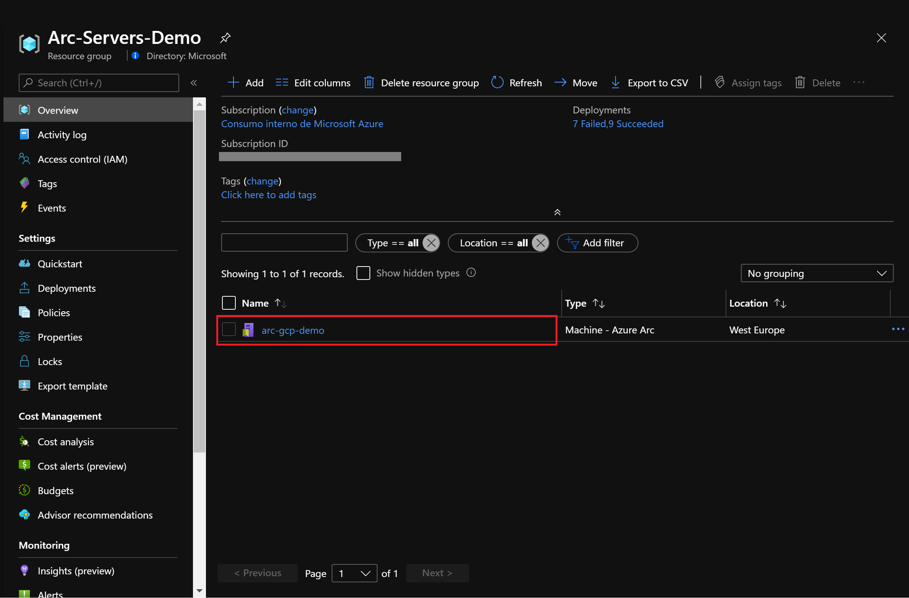
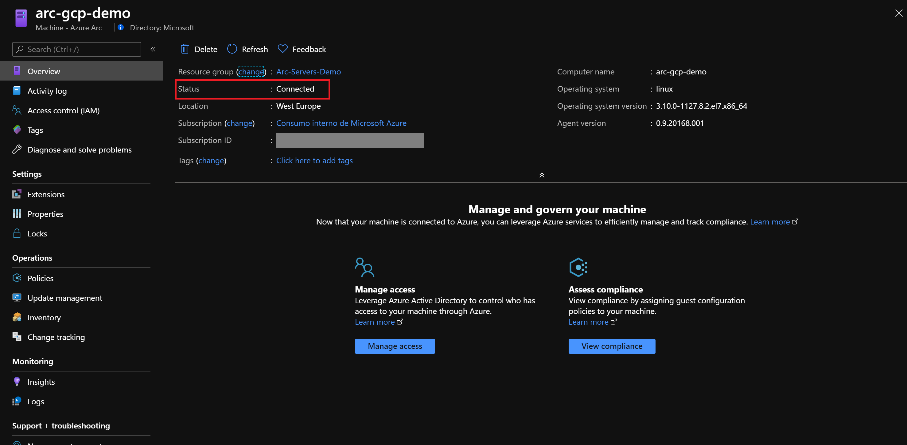
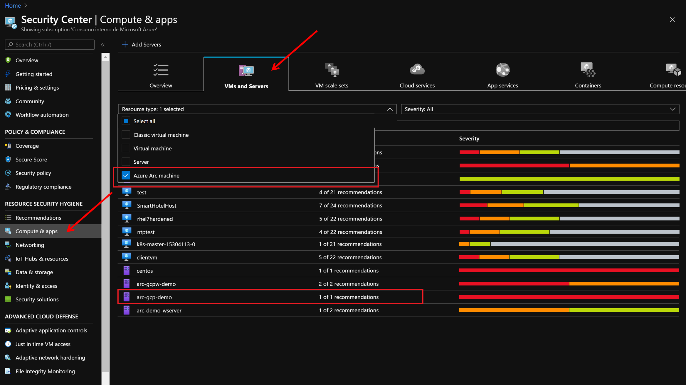
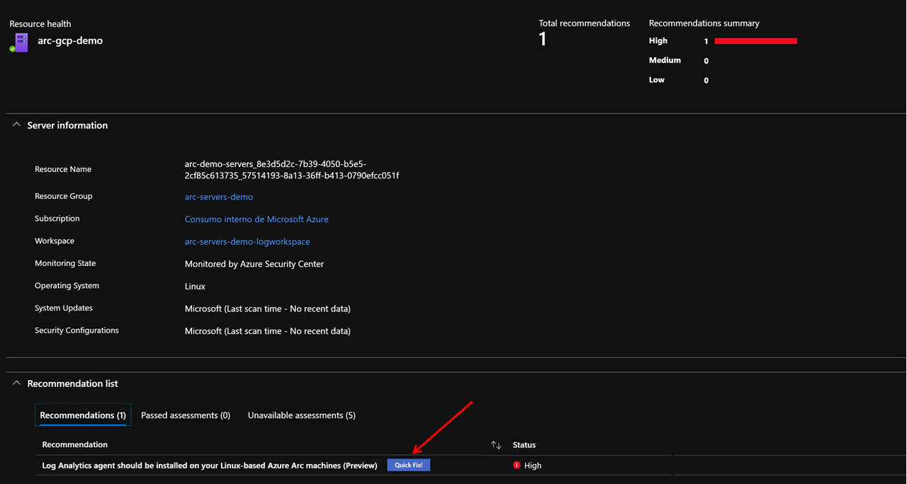
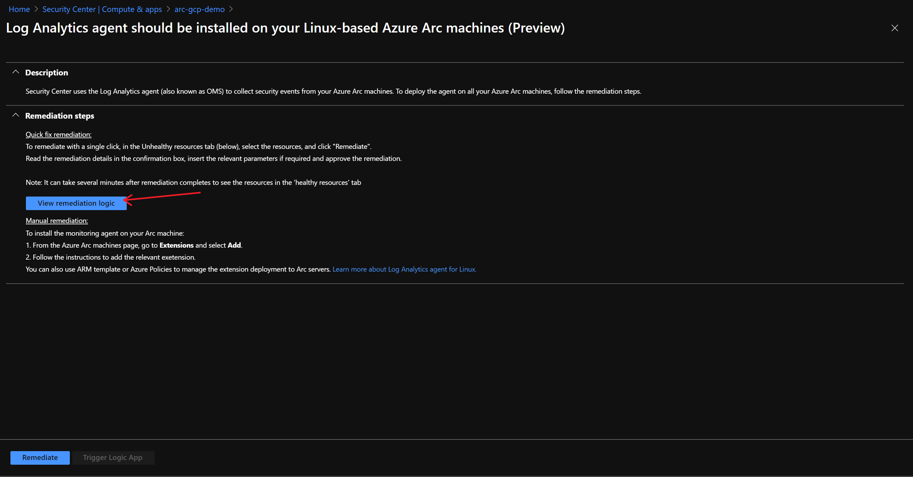
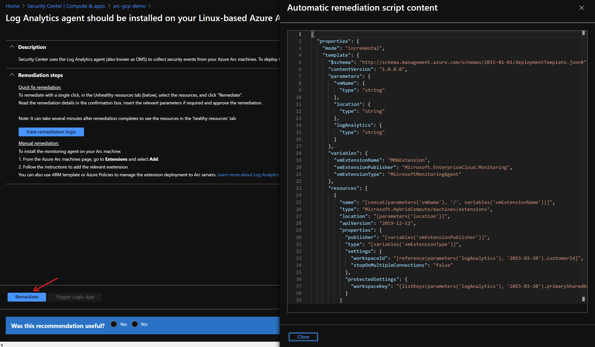
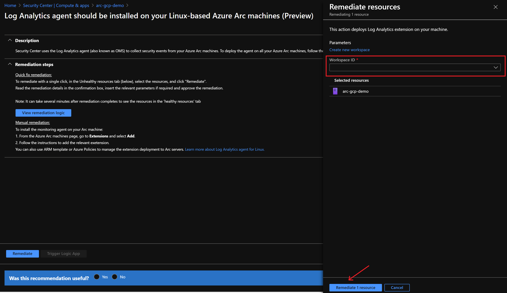
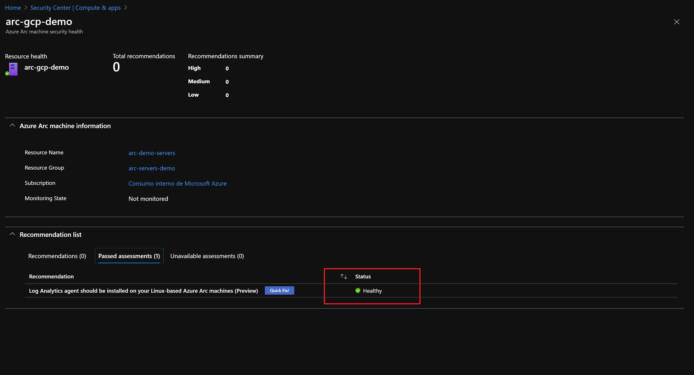

# Connect Azure Arc enabled servers to Azure Security Center

This article provides guidance on how to onboard an Azure Arc enabled server to [Azure Security Center (Azure Security Center)](/azure/security-center/). This helps you start collecting security-related configurations and event logs so you can recommend actions and improve your overall Azure security posture.

In the following procedures, you enable and configure Azure Security Center Standard tier on your Azure subscription. This provides advanced threat protection (ATP) and detection capabilities. The process includes:

- Setup a Log Analytics workspace where logs and events are aggregated for analysis.
- Assign Security Center's default security policies.
- Review Azure Security Center's recommendations.
- Apply recommended configurations on Azure Arc enabled servers using the **Quick Fix** remediations.

> [!IMPORTANT]
> The procedures in this article assumes you've already deployed VMs, or servers that are running on-premises or on other clouds, and you have connected them to Azure Arc. If you haven't, the following information can help you automate this.

- [GCP Ubuntu instance](./gcp-terraform-ubuntu.md)
- [GCP Windows instance](./gcp-terraform-windows.md)
- [AWS Ubuntu EC2 instance](./aws-terraform-ubuntu.md)
- [AWS Amazon Linux 2 EC2 instance](./aws-terraform-al2.md)
- [VMware vSphere Ubuntu VM](./vmware-terraform-ubuntu.md)
- [VMware vSphere Windows Server VM](./vmware-terraform-winsrv.md)
- [Vagrant Ubuntu box](./local-vagrant-ubuntu.md)
- [Vagrant Windows box](./local-vagrant-windows.md)

## Prerequisites

1. Clone the Azure Arc Jumpstart repository.

    ```console
    git clone https://github.com/microsoft/azure_arc
    ```

2. As mentioned, this guide starts at the point where you already deployed and connected VMs or bare-metal servers to Azure Arc. For this scenario, we use a Google Cloud Platform (GCP) instance that has been already connected to Azure Arc and is visible as a resource in Azure. As shown in the following screenshots:

    

    

3. [Install or update Azure CLI](/cli/azure/install-azure-cli). Azure CLI should be running version 2.7 or later. Use `az --version` to check your current installed version.

4. Create an Azure service principal.

    To connect a VM or bare-metal server to Azure Arc, Azure service principal assigned with the Contributor role is required. To create it, sign in to your Azure account and run the following command. You can also run this command in [Azure Cloud Shell](https://shell.azure.com/).

    ```console
    az login
    az ad sp create-for-rbac -n "<Unique SP Name>" --role contributor
    ```

    For example:

    ```console
    az ad sp create-for-rbac -n "http://AzureArcServers" --role contributor
    ```

    Output should look like this:

    ```json
    {
    "appId": "XXXXXXXXXXXXXXXXXXXXXXXXXXXX",
    "displayName": "AzureArcServers",
    "name": "http://AzureArcServers",
    "password": "XXXXXXXXXXXXXXXXXXXXXXXXXXXX",
    "tenant": "XXXXXXXXXXXXXXXXXXXXXXXXXXXX"
    }
    ```

> [!NOTE]
> We highly recommend that you scope the service principal to a specific [Azure subscription and resource group](/cli/azure/ad/sp).

## Onboard Azure Security Center

1. Data collected by Azure Security Center is stored in a Log Analytics workspace. You can either use the default one created by Azure Security Center or a custom one created by you. If you want to create a dedicated workspace, you can automate the deployment by editing the Azure Resource Manager template (ARM template) [parameters file](https://github.com/microsoft/azure_arc/blob/main/azure_arc_servers_jumpstart/securitycenter/arm/log_analytics-template.parameters.json), provide a name and location for your workspace:

   

2. To deploy the ARM template, navigate to the [deployment folder](https://github.com/microsoft/azure_arc/tree/main/azure_arc_servers_jumpstart/securitycenter/arm) and run the following command:

   ```console
   az deployment group create --resource-group <Name of the Azure resource group> \
   --template-file <The `log_analytics-template.json` template file location> \
   --parameters <The `log_analytics-template.parameters.json` template file location>
   ```

3. If you are going for an user-defined workspace, you should instruct Security Center to use it instead of the default one, use the following command:

   ```console
   az security workspace-setting create --name default \
   --target-workspace '/subscriptions/<Your subscription ID>/resourceGroups/<Name of the Azure resource group>/providers/Microsoft.OperationalInsights/workspaces/<Name of the Log Analytics Workspace>'
   ```

4. Select the Azure Security Center tier. The Free tier is enabled on all your Azure subscriptions by default and will provide continuous security assessment and actionable security recommendations. In this guide, you use the Standard tier for Azure Virtual Machines that extends these capabilities providing unified security management and threat protection across your hybrid cloud workloads. To enable the Standard tier of Azure Security Center for VMs, run the following command:

    ```console
    az security pricing create -n VirtualMachines --tier 'standard'
    ```

5. Assign the default Security Center policy initiative. Azure Security Center makes its security recommendations based on policies. There is an specific initiative that groups Security Center policies with the definition ID `1f3afdf9-d0c9-4c3d-847f-89da613e70a8`. The following command will assign the Azure Security Center initiative to your subscription.

    ```console
    az policy assignment create --name 'Azure Security Center Default <Your subscription ID>' \
    --scope '/subscriptions/<Your subscription ID>' \
    --policy-set-definition '1f3afdf9-d0c9-4c3d-847f-89da613e70a8'
    ```

## Azure Arc and Azure Security Center integration

After you successfully onboard Azure Security Center, you'll get recommendations to help you protect your resources, including your Azure Arc enabled servers. Azure Security Center will periodically analyze the security state of your Azure resources to identify potential security vulnerabilities.

In the **Compute & Apps** section under **VM & Servers**, Azure Security Center provides an overview of all the discovered security recommendations for your VMs and computers, including Azure VMs, Azure classic VMs, servers, and Azure Arc machines.



On the Azure Arc enabled servers, Azure Security Center recommends installing the Log Analytics agent. Each recommendation also includes:

- A short description of the recommendation.
- A secure score impact, in this case, with a status of **High**.
- The remediation steps to carry out in order to implement the recommendation.

For specific recommendations, like in the following screenshot, you will also get a **Quick Fix** that enables you to quickly remediate a recommendation on multiple resources.

  

  

The following remediation **Quick Fix** is using an ARM template to deploy the Microsoft Monitoring Agent extension on the Azure Arc machine.

  

You can trigger the remediation with the ARM template from the Azure Security Center dashboard, by selecting the Log Analytics workspace used for Azure Security Center and then choosing **Remediate 1 resource**.

  

After you apply the recommendation on the Azure Arc enabled server, the resource will be marked as healthy.

  

## Clean up your environment

Complete the following steps to clean up your environment.

1. Remove the virtual machines from each environment by following the teardown instructions from each guide.

    - [GCP Ubuntu instance](./gcp-terraform-ubuntu.md) and [GCP Windows instance](./gcp-terraform-windows.md)
    - [AWS Ubuntu EC2 instance](./aws-terraform-ubuntu.md)
    - [VMware vSphere Ubuntu VM](./vmware-terraform-ubuntu.md) / [VMware vSphere Windows Server VM](./vmware-terraform-winsrv.md)
    - [Vagrant Ubuntu box](./local-vagrant-ubuntu.md) / [Vagrant Windows box](./local-vagrant-windows.md)

2. Remove the Log Analytics workspace by executing the following script in Azure CLI. Provide the workspace name you used when creating the Log Analytics workspace.

  ```console
  az monitor log-analytics workspace delete --resource-group <Name of the Azure resource group> --workspace-name <Log Analytics Workspace Name> --yes
  ```
