# Use Update Management in Azure Automation to manage operating system updates for Azure-Arc-enabled servers

This article provides guidance on how to onboard Azure-Arc-enabled servers to [Update Management in Azure Automation](https://docs.microsoft.com/azure/automation/update-management/overview), so that you can manage operating system updates for your Azure-Arc-enabled servers running Windows or Linux.

In the following procedures you create and configure an Azure Automation account and Log Analytics workspace to support Update Management for Azure-Arc-enabled servers by doing the following:

- Setting up a new Log Analytics Workspace and Azure Automation account.
- Enabling Update Management on Azure-Arc-enabled servers.

> [!IMPORTANT]
> The procedures in this article assumes you've already deployed VMs, or servers that are running on-premises or on other clouds, and you have connected them to Azure Arc. If you haven't, the following information can help you automate this.

- [GCP Ubuntu instance](./gcp-terraform-ubuntu.md)
- [GCP Windows instance](./gcp-terraform-windows.md)
- [AWS Ubuntu EC2 instance](./aws-terraform-ubuntu.md)
- [AWS Amazon Linux 2 EC2 instance](./aws-terraform-al2.md)
- [VMware vSphere Ubuntu VM](./vmware-terraform-ubuntu.md)
- [VMware vSphere Windows Server VM](./vmware-terraform-winsrv.md)
- [Vagrant Ubuntu box](./local-vagrant-ubuntu.md)
- [Vagrant Windows box](./local-vagrant-windows.md)

## Prerequisites

1. Clone the Azure Arc Jumpstart repository.

    ```console
    git clone https://github.com/microsoft/azure_arc
    ```

2. As mentioned, this guide starts at the point where you already deployed and connected VMs or bare-metal servers to Azure Arc. For this scenario, we use an Amazon Web Services (AWS) EC2 instance that is already connected to Azure Arc and is visible as a resource in Azure.

    

    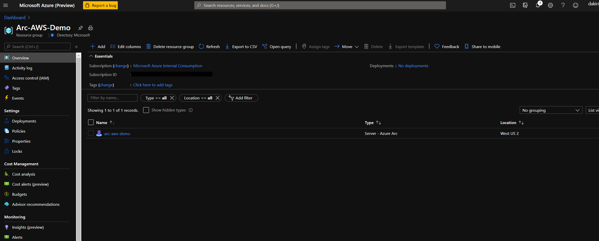

3. [Install or update Azure CLI](https://docs.microsoft.com/cli/azure/install-azure-cli). Azure CLI should be running version 2.14 or later. Use ```az --version``` to check your current installed version.

## Configure Update Management

Update Management uses the Log Analytics agent to collect Windows and Linux server log files and the data collected is stored in a Log Analytics workspace.

1. Create a Log Analytics workspace using this [Azure Resource Manage template (ARM template)](https://github.com/microsoft/azure-arc/blob/main/azure-arc-servers-jumpstart/updateManagement/law-template.json). This creates a new Log Analytics Workspace, defines the Update Management solution, and enables it for the workspace.

2. Create a new resource group for the Log Analytics workspace by running the below command, replacing the values in brackets with your own.

    ```console
    az group create --name <Name for your resource group> \
    --location <Location for your resources> \
    --tags "Project=jumpstart-azure-arc-servers"
    ```

    

3. Edit the ARM template [parameters file](https://github.com/microsoft/azure-arc/blob/main/azure-arc-servers-jumpstart/updateManagement/law-template.parameters.json), providing a name for your Log Analytics workspace, a location, and a name for your Azure Automation account. You also need to supply the name of your Azure-Arc-enabled server, and the name of the resource group that contains the Arc enabled server as shown in the example below:

    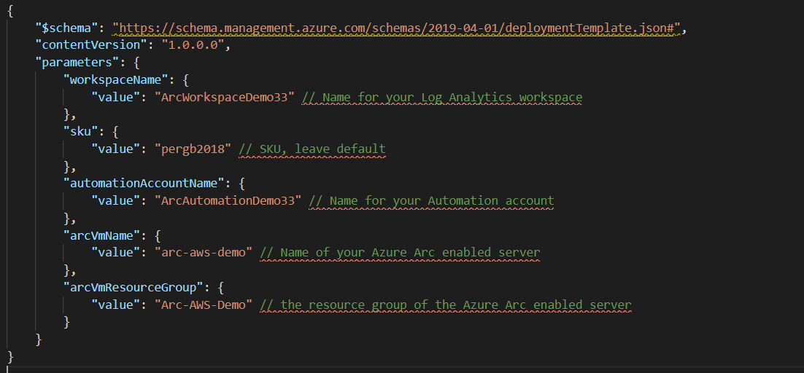

4. Deploy the ARM template. Go to the [deployment folder](https://github.com/microsoft/azure-arc/tree/main/azure-arc-servers-jumpstart/updateManagement) and run the following command:

    ```console
    az deployment group create --resource-group <Name of the Azure resource group you created> \
        --template-file law-template.json \
        --parameters law-template.parameters.json
    ```

   

5. When the deployment is complete, you should see the resource group with your Log Analytics workspace, automation account and Update Management solution from the Azure portal. If you drill in to the Log Analytics workspace Solutions tab, you should see the Update Management solution.

    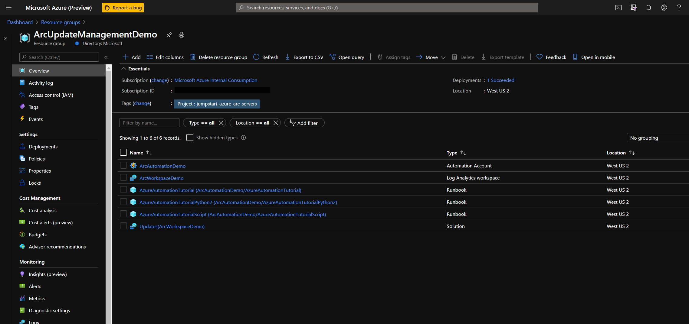

## Confirm that the Update Management solution is deployed on your Azure-Arc-enabled server

1. Click on the Solutions tab of the Log Analytics workspace, and then click the Updates solution from the list to check the progress of the Update Management assessment.

    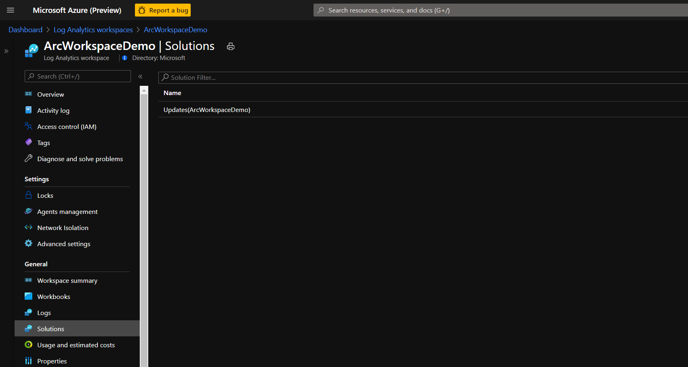

It may take several hours for Update Management to collect enough data to show an assessment for your VM. In the screen below we can see the assessment is being performed.

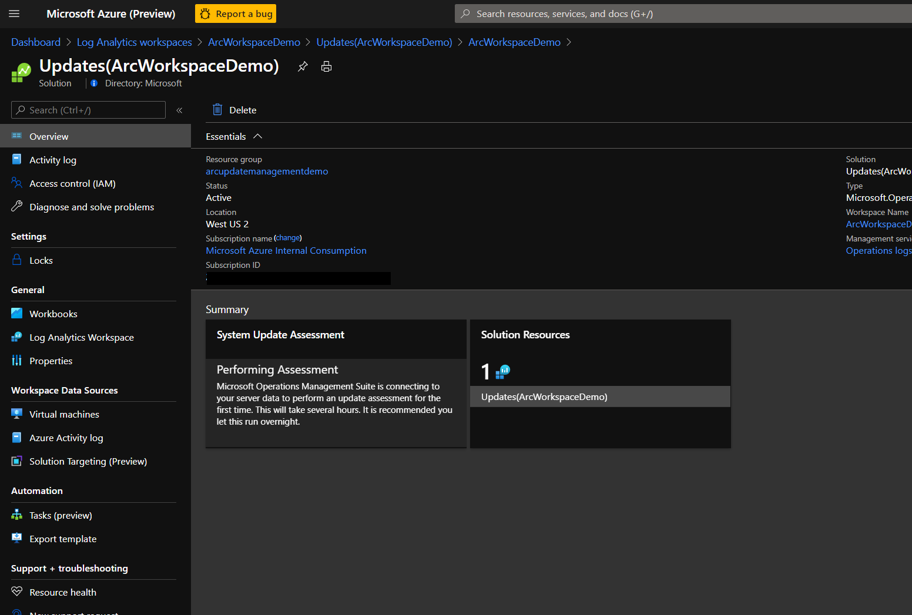

When the assessment is complete, you'll see an option to "View summary" on the Update Management tab.

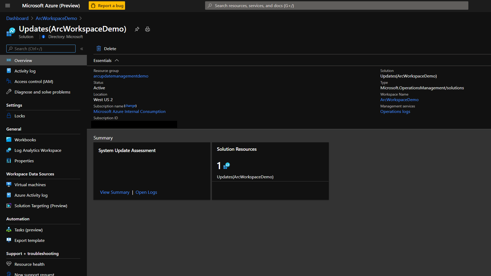

2. Click View Summary and then click again to drill into the Update Management assessment. In the following example we can see there are updates missing on our Azure-Arc-enabled server.

    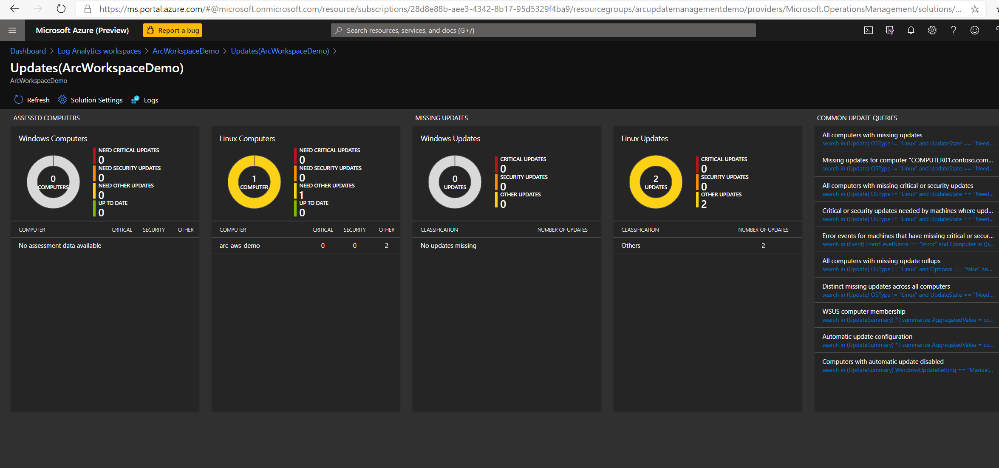

## Schedule an update

Now that we have configured the Update Management solution, you can deploy updates on a set schedule for our Azure-Arc-enabled server.

1. Navigate to the Automation Account we created previously, and click on the Update Management tab as shown in the screenshot below. You should see your Azure-Arc-enabled server listed.

    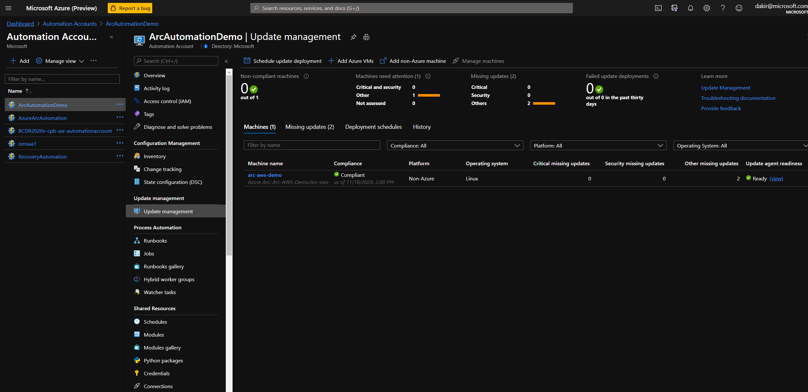

2. From the above screen, click **Schedule update deployment**. On the next screen, select the Operating System that your Azure-Arc-enabled server is using, and then select **Machines to update** as shown in the following screenshot.

    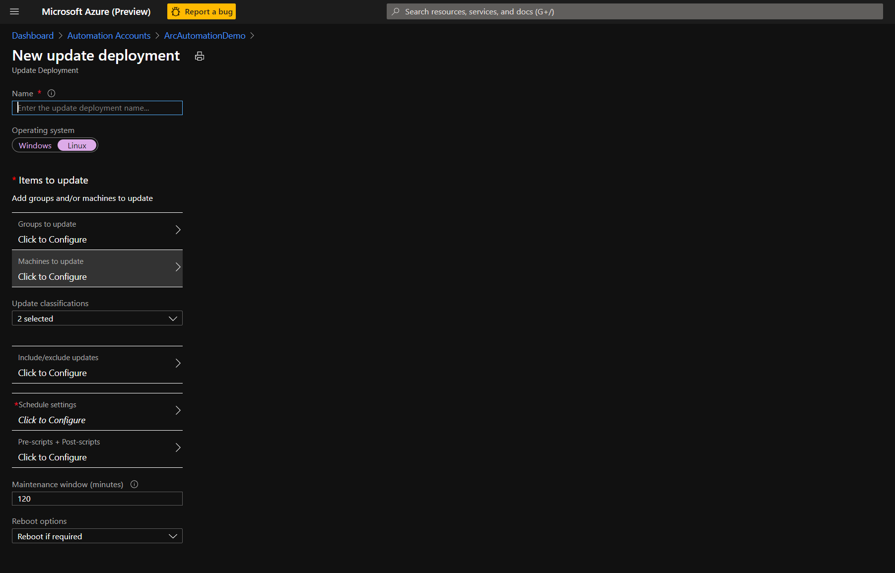

3. From the **Type** dropdown, select **Machines**, and then select your server and click **Ok**.

    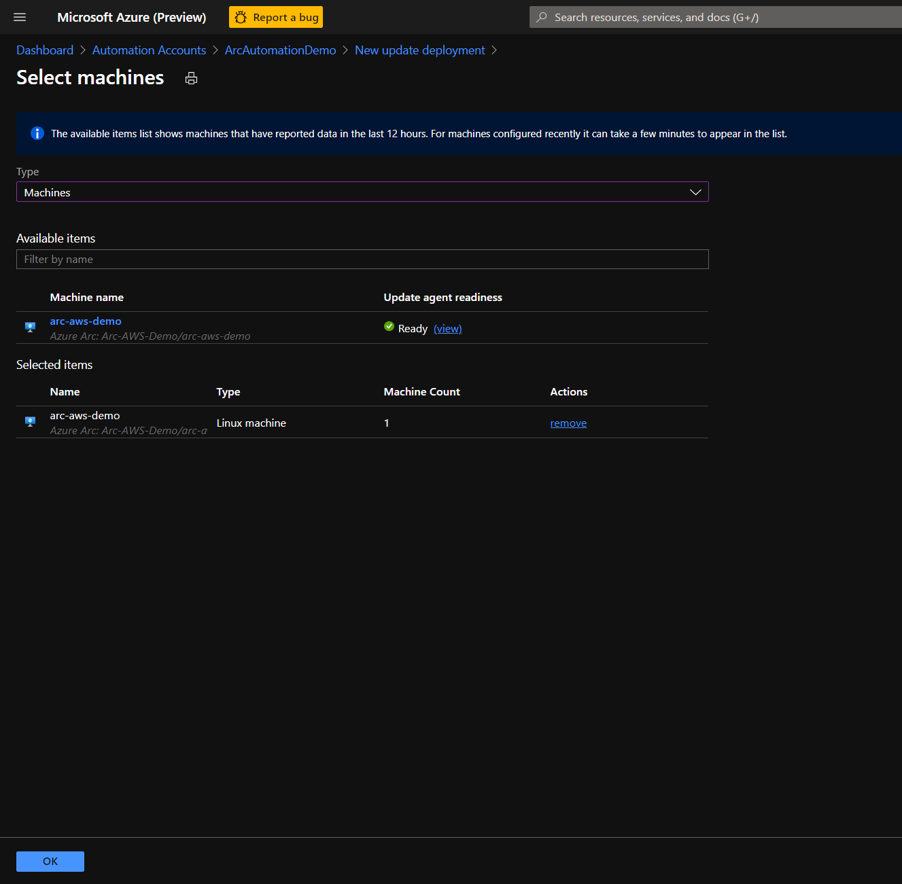

4. Click **Schedule Settings** and then provide a desired schedule.

    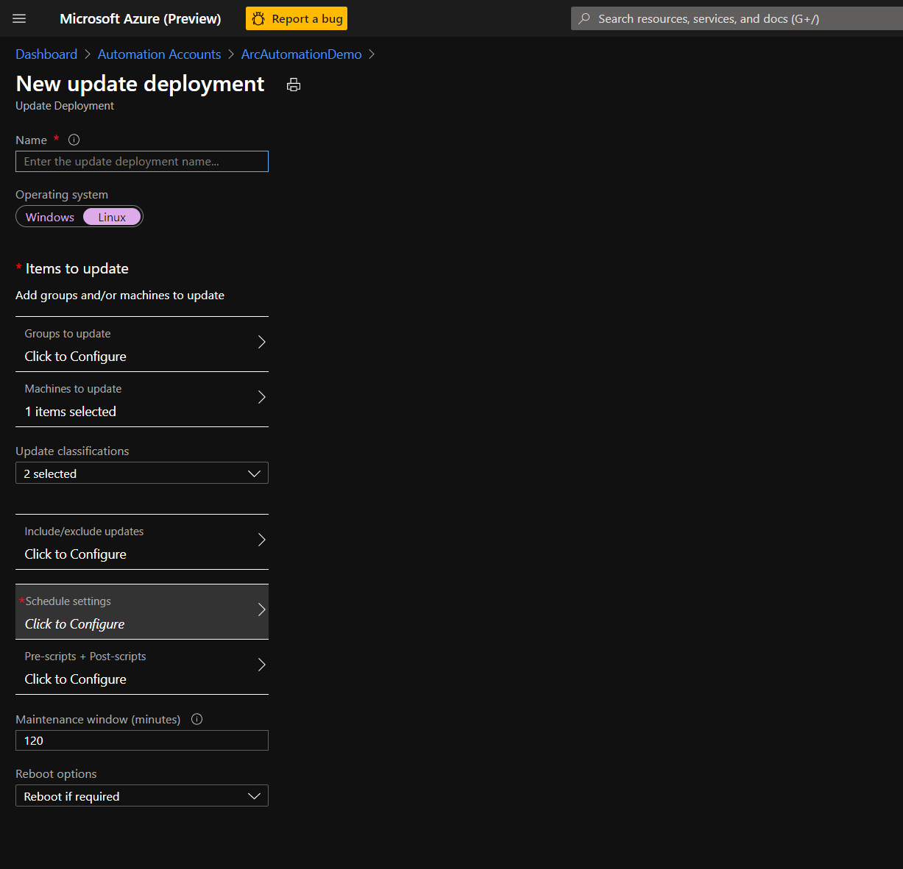

    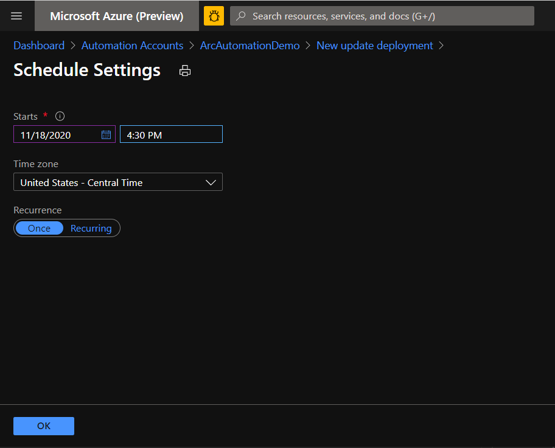

5. Finally, provide a name for your Update deployment, and then click **Create**.

    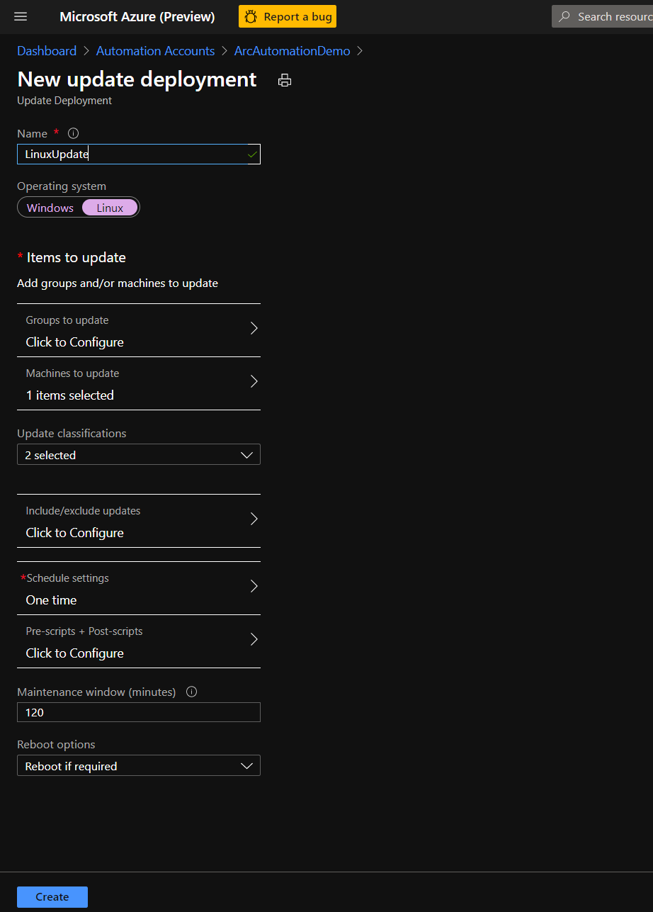

6. From the Automation Account Update Management tab, you should be able to see your scheduled Update deployment from the Deployment Schedules tab.
    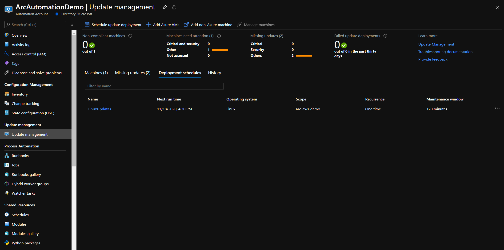

This Update Management solution will update your Azure-Arc-enabled servers in the deployment window based on the schedule you defined. There's a lot more you can do with [Update Management](https://docs.microsoft.com/azure/automation/update-management/overview) that is outside the scope of this scenario. Review the [documentation](https://docs.microsoft.com/azure/automation/update-management/overview) for more information.

## Clean up your environment

Complete the following steps to clean up your environment.

1. Remove the virtual machines from each environment by following the teardown instructions from each guide.

    - [GCP Ubuntu instance](./gcp-terraform-ubuntu.md) and [GCP Windows instance](./gcp-terraform-windows.md)
    - [AWS Ubuntu EC2 instance](./aws-terraform-ubuntu.md)
    - [VMware vSphere Ubuntu VM](./vmware-terraform-ubuntu.md) and [VMware vSphere Windows Server VM](./vmware-terraform-winsrv.md)
    - [Vagrant Ubuntu box](./local-vagrant-ubuntu.md) and [Vagrant Windows box](./local-vagrant-windows.md)

2. Delete the resource group.

    ```console
    az group delete --name <Name of your resource group>
    ```

    
