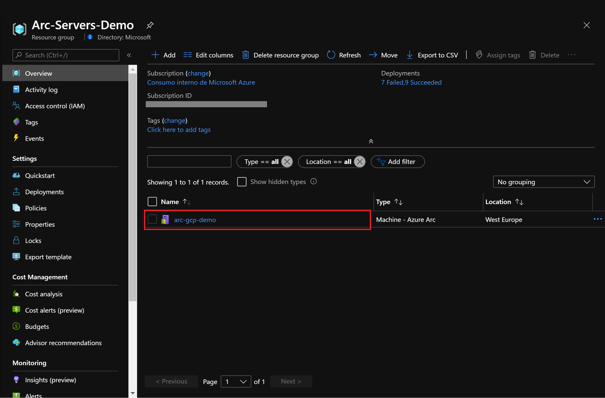
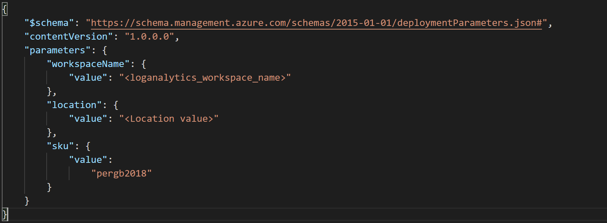
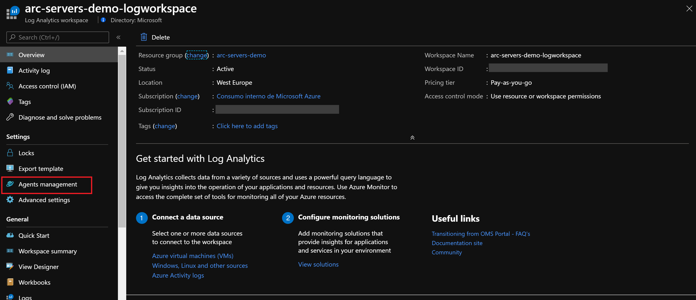
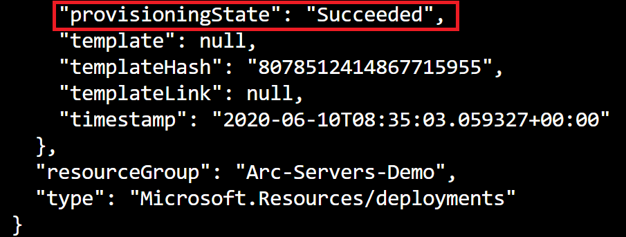
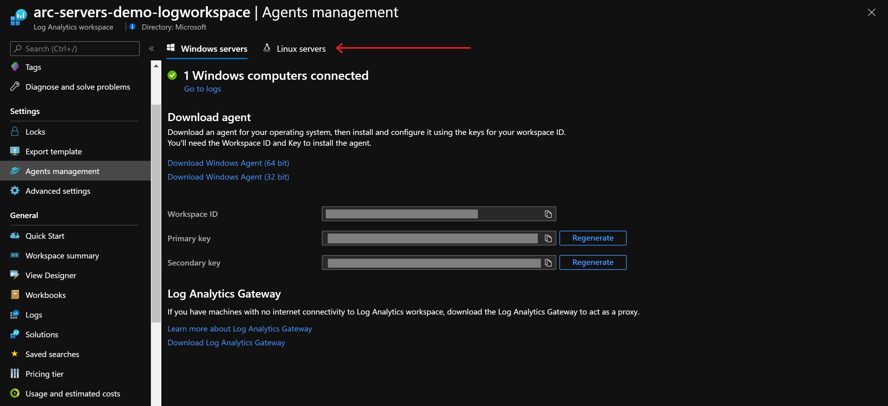

# Manage extensions and use an Azure Resource Manager template to deploy Microsoft Monitoring Agent to Azure Arc Linux and Windows servers

This article provides guidance on how to manage extensions to Azure Arc enabled servers. Virtual machine extensions are small applications that provide post-deployment configuration and automation tasks such as software installation, anti-virus protection, or a mechanism to run a custom script.

Azure Arc enabled servers, enables you to deploy Azure VM extensions to non-Azure Windows and Linux VMs, giving you a hybrid or multicloud management experience that levels to Azure VMs.

You can use the Azure portal, Azure CLI, an Azure Resource Manager template (ARM template), PowerShell script or Azure policies to manage the extension deployment to Azure Arc enabled servers, both Linux and Windows. In the following procedures, you'll use an ARM template to deploy the Microsoft Monitoring Agent (MMA) to your servers. This onboards them in Azure services that use this agent: Azure Monitor, Azure Security Center, Azure Sentinel, and so on.

> [!IMPORTANT]
> The procedures in this article assumes you've already deployed VMs, or servers that are running on-premises or on other clouds, and you have connected them to Azure Arc. If you haven't, the following information can help you automate this.

- [GCP Ubuntu instance](./gcp-terraform-ubuntu.md)
- [GCP Windows instance](./gcp-terraform-windows.md)
- [AWS Ubuntu EC2 instance](./aws-terraform-ubuntu.md)
- [AWS Amazon Linux 2 EC2 instance](./aws-terraform-al2.md)
- [VMware vSphere Ubuntu VM](./vmware-terraform-ubuntu.md)
- [VMware vSphere Windows Server VM](./vmware-terraform-winsrv.md)
- [Vagrant Ubuntu box](./local-vagrant-ubuntu.md)
- [Vagrant Windows box](./local-vagrant-windows.md)

Please review the [Azure Monitor supported OS documentation](/azure/azure-monitor/insights/vminsights-enable-overview#supported-operating-systems) and ensure that the VMs you will use for this exercise are supported. For Linux VMs, check both the Linux distribution and kernel to ensure you are using a supported configuration.

## Prerequisites

1. Clone the Azure Arc Jumpstart repository.

    ```console
    git clone https://github.com/microsoft/azure_arc.git
    ```

2. As mentioned, this guide starts at the point where you already deployed and connected VMs or bare-metal servers to Azure Arc. For this scenario, we use a Google Cloud Platform (GCP) instance that has been already connected to Azure Arc and is visible as a resource in Azure. As shown in the following screenshots:

    

    

3. [Install or update Azure CLI](/cli/azure/install-azure-cli). Azure CLI should be running version 2.7 or later. Use `az --version` to check your current installed version.

4. Create an Azure service principal.

    To connect a VM or bare-metal server to Azure Arc, Azure service principal assigned with the Contributor role is required. To create it, sign in to your Azure account, and run the following command. You can also run this command in [Azure Cloud Shell](https://shell.azure.com/).

    ```console
    az login
    az ad sp create-for-rbac -n "<Unique SP Name>" --role contributor
    ```

    For example:

    ```console
    az ad sp create-for-rbac -n "http://AzureArcServers" --role contributor
    ```

    Output should look like this:

    ```json
    {
    "appId": "XXXXXXXXXXXXXXXXXXXXXXXXXXXX",
    "displayName": "AzureArcServers",
    "name": "http://AzureArcServers",
    "password": "XXXXXXXXXXXXXXXXXXXXXXXXXXXX",
    "tenant": "XXXXXXXXXXXXXXXXXXXXXXXXXXXX"
    }
    ```

    > [!NOTE]
    > We highly recommend that you scope the service principal to a specific [Azure subscription and resource group](/cli/azure/ad/sp).

5. You will also need to have a Log Analytics workspace deployed. You can automate the deployment by editing the ARM template [parameters file](https://github.com/microsoft/azure_arc/blob/main/azure_arc_servers_jumpstart/extensions/arm/log_analytics-template.parameters.json), and providing a name and location for your workspace.

    

6. To deploy the ARM template, navigate to the `../extensions/arm` deployment folder and run the following command:

      ```console
      az deployment group create --resource-group <Name of the Azure resource group> \
      --template-file <The `log_analytics-template.json` template file location> \
      --parameters <The `log_analytics-template.parameters.json` template file location>
      ```

## Azure Arc enabled servers Microsoft Monitoring Agent extension deployment

1. Edit the [extensions parameters file](https://github.com/microsoft/azure_arc/blob/main/azure_arc_servers_jumpstart/extensions/arm/mma-template.parameters.json)

    

    To match your configuration you will need to provide:
    - The VM name as it is registered in Azure Arc.

    

    - The location of the resource group where you registered the Azure Arc enabled server.

    

    - Information about the Log Analytics workspace you previously created (workspace ID and key). These parameters are used to configure the MMA agent. You can find this information by going to your Log Analytics workspace and under **Settings**, select **Agents management**.

    

    

2. Choose the ARM template that matches your operating system, either [Windows](https://github.com/microsoft/azure_arc/blob/main/azure_arc_servers_jumpstart/extensions/arm/mma-template-windows.json) or [Linux](https://github.com/microsoft/azure_arc/blob/main/azure_arc_servers_jumpstart/extensions/arm/mma-template-linux.json), deploy the template by running the following command:

    ```console
    az deployment group create --resource-group <Name of the Azure resource group> \
    --template-file <The `mma-template.json` template file location> \
    --parameters <The `mma-template.parameters.json` template file location>
    ```

3. After the template has completed its run, you should see an output similar to the following:

    

4. You will have the Microsoft Monitoring Agent deployed on your Windows or Linux system and reporting to the Log Analytics workspace that you have selected. You can verify by going back to **Agents Management** in your workspace and choosing either **Windows** or **Linux**. You should see an additional connected VM.

    

    

## Clean up your environment

Complete the following steps to clean up your environment.

1. Remove the virtual machines from each environment by following the teardown instructions from each guide.

    - [GCP Ubuntu instance](./gcp-terraform-ubuntu.md) and [GCP Windows instance](./gcp-terraform-windows.md)
    - [AWS Ubuntu EC2 instance](./aws-terraform-ubuntu.md)
    - [VMware vSphere Ubuntu VM](./vmware-terraform-ubuntu.md) and [VMware vSphere Windows Server VM](./vmware-terraform-winsrv.md)
    - [Vagrant Ubuntu box](./local-vagrant-ubuntu.md) and [Vagrant Windows box](./local-vagrant-windows.md)

2. Remove the Log Analytics workspace by executing the following command in Azure CLI. Provide the workspace name you used when creating the Log Analytics workspace.

    ```console
    az monitor log-analytics workspace delete --resource-group <Name of the Azure resource group> --workspace-name <Log Analytics Workspace Name> --yes
    ```
