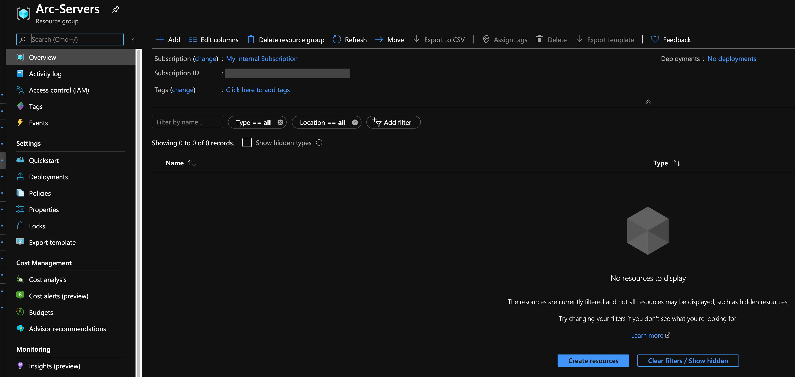

# Connect an existing Linux server to Azure Arc

The following README will guide you on how to connect a Linux server to Azure Arc using a simple shell script.

## Prerequisites

- [Install or update Azure CLI to version 2.7 and above](/cli/azure/install-azure-cli). Use the following command to check your current installed version.

  ```console
  az --version
  ```

- Create an Azure service principal.

    To connect a server to Azure Arc, an Azure service principal assigned with the Contributor role is required. To create it, sign in to your Azure account and run the following command. You can also run this command in [Azure Cloud Shell](https://shell.azure.com/).

    ```console
    az login
    az ad sp create-for-rbac -n "<Unique SP Name>" --role contributor
    ```

    For example:

    ```console
    az ad sp create-for-rbac -n "http://AzureArcServers" --role contributor
    ```

    Output should look like this:

    ```json
    {
    "appId": "XXXXXXXXXXXXXXXXXXXXXXXXXXXX",
    "displayName": "AzureArcServers",
    "name": "http://AzureArcServers",
    "password": "XXXXXXXXXXXXXXXXXXXXXXXXXXXX",
    "tenant": "XXXXXXXXXXXXXXXXXXXXXXXXXXXX"
    }
    ```

    > [!NOTE]
    > We highly recommend that you scope the service principal to a specific [Azure subscription and resource group](/cli/azure/ad/sp).

- Create a new Azure resource group for your servers.

    

- Download the [`az-connect-linux`](https://github.com/microsoft/azure-arc/blob/main/azure-arc-servers-jumpstart/scripts/az-connect-linux.sh) shell script.

- Change the environment variables according to your environment.

    

- Copy the script to the designated server using your preferred tool of choice (or copy/paste the script to a new file inside the server). The following example shows how to copy the script from macOS to the server using `scp`.

    

## Deployment

Run the script using the `. ./az-connect-linux.sh` command.

> [!NOTE]
> The extra dot is because the script has an *export* function and needs to have the vars exported in the same shell session as the rest of the commands.

Upon successful completion, you will have your Linux server, connected as a new Azure Arc resource inside your resource group.


## Delete the deployment

To delete the server, select the server and delete it from the Azure portal.


To delete the entire deployment, delete the Azure resource group from the Azure portal.


