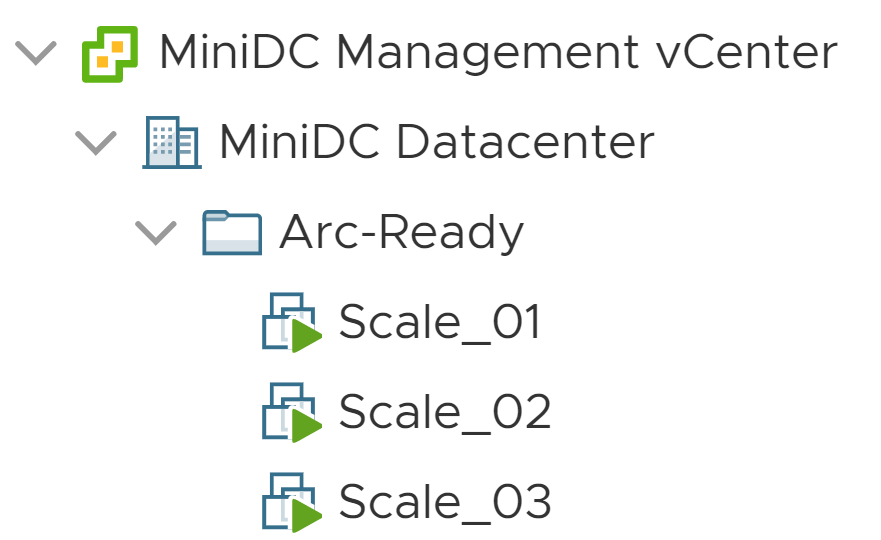
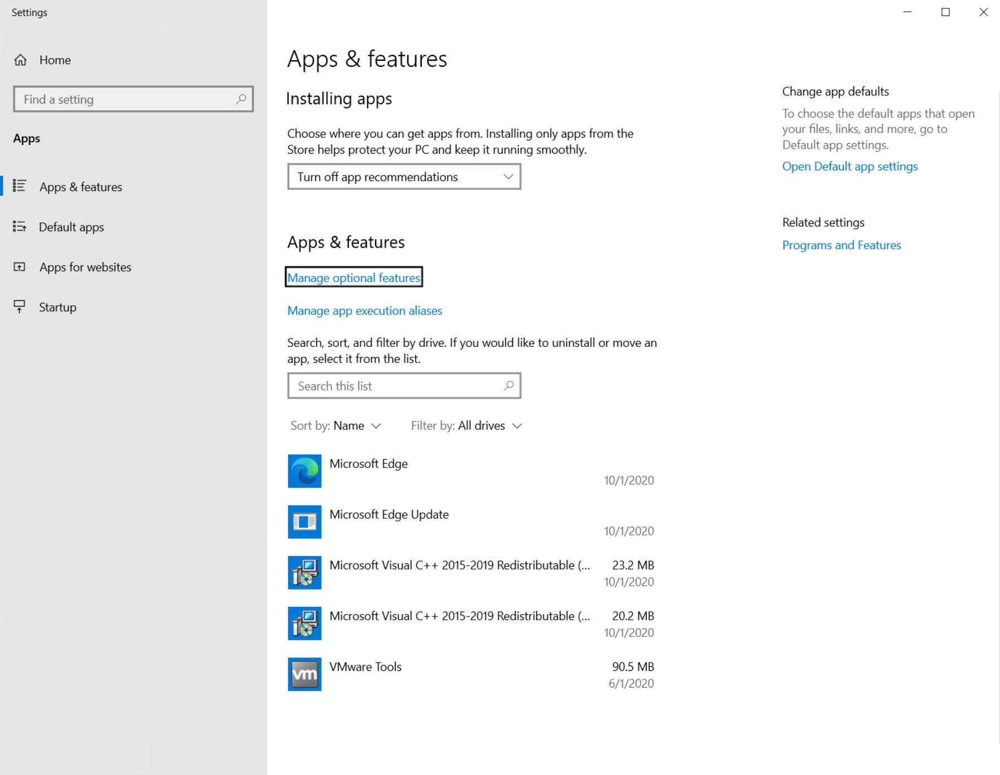
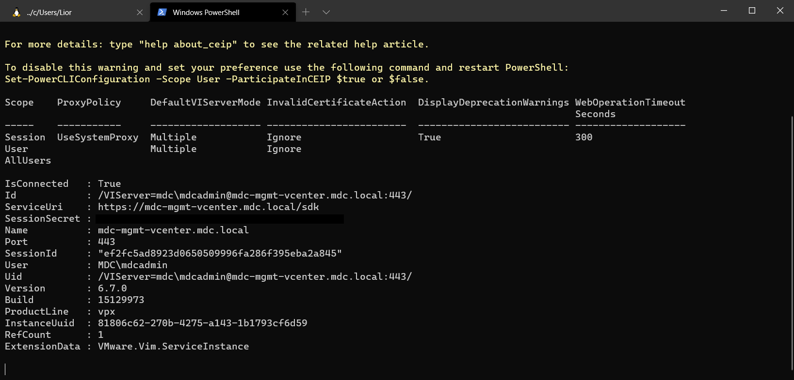
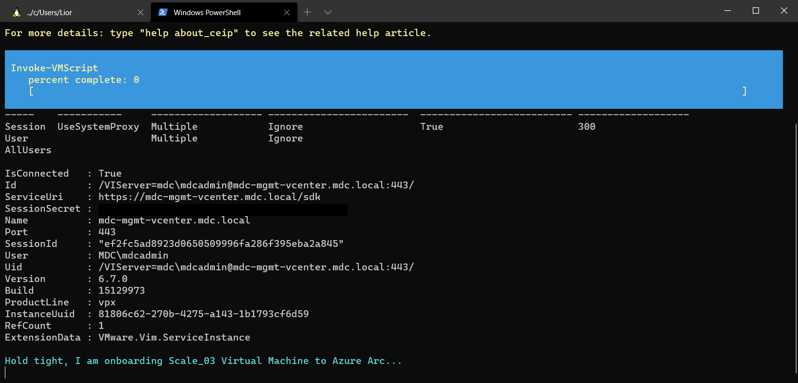
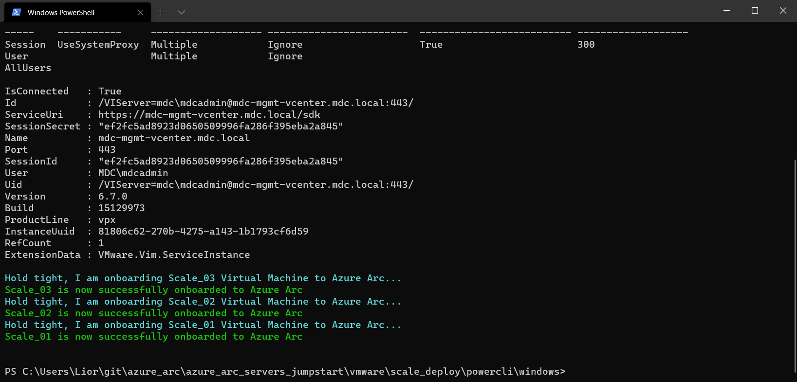
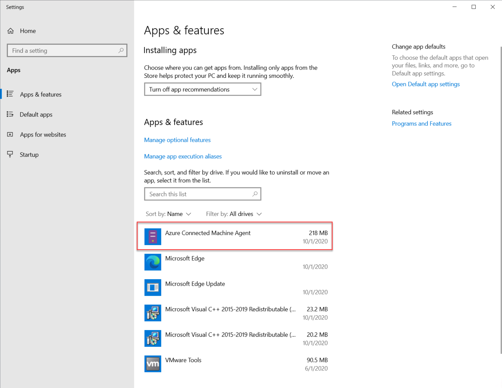

# Use VMware PowerCLI to scale onboarding VMware vSphere Windows Server virtual machines to Azure Arc

The following README will guide you on how to use the provided [VMware PowerCLI](https://code.vmware.com/web/dp/tool/vmware-powercli/) script so you can perform an automated scaled deployment of the Azure Arc connected machine agent in multiple VMware vSphere virtual machines and as a result, onboarding these VMs as an Azure Arc enabled servers.

This guide assumes you already have an exiting inventory of VMware virtual machines and will use the PowerCLI PowerShell module to automate the onboarding process of the VMs to Azure Arc.

## Prerequisites

- Clone the Azure Arc Jumpstart repository.

    ```console
    git clone https://github.com/microsoft/azure_arc.git
    ```

- [Install or update Azure CLI to version 2.7 and above.](/cli/azure/install-azure-cli). Use the following command to check your current installed version.

  ```console
  az --version
  ```

- Install VMware PowerCLI

  > [!NOTE]
  > This guide was tested with the latest version of PowerCLI as of date (12.0.0) but earlier versions are expected to work as well

  - **Supported PowerShell versions:** VMware PowerCLI 12.0.0 is compatible with the following PowerShell versions:
    - Windows PowerShell 5.1
    - PowerShell 7
    - Detailed installation instructions can be found [here](https://docs.vmware.com/en/VMware-vSphere/7.0/com.vmware.esxi.install.doc/GUID-F02D0C2D-B226-4908-9E5C-2E783D41FE2D.html) but the easiest way is to use the VMware.PowerCLI module from the PowerShell gallery using the following command.

    ```powershell
    Install-Module -Name VMware.PowerCLI
    ```

- To be able to read the VM inventory from vCenter as well as invoke a script on the VM OS-level, the following permissions are needed:

  - [`VirtualMachine.GuestOperations`](https://docs.vmware.com/en/VMware-vSphere/7.0/com.vmware.vsphere.security.doc/GUID-6A952214-0E5E-4CCF-9D2A-90948FF643EC.html) user account

  - VMware vCenter Server user assigned with a [Read-only role](https://docs.vmware.com/en/VMware-vSphere/6.7/com.vmware.vsphere.security.doc/GUID-93B962A7-93FA-4E96-B68F-AE66D3D6C663.html)

- Create an Azure service principal.

    To connect the VMware vSphere virtual machine to Azure Arc, an Azure service principal assigned with the Contributor role is required. To create it, sign in to your Azure account and run the following command. You can also run this command in [Azure Cloud Shell](https://shell.azure.com/).

    ```console
    az login
    az ad sp create-for-rbac -n "<Unique SP Name>" --role contributor
    ```

    For example:

    ```console
    az ad sp create-for-rbac -n "http://AzureArcServers" --role contributor
    ```

    Output should look like this:

    ```json
    {
    "appId": "XXXXXXXXXXXXXXXXXXXXXXXXXXXX",
    "displayName": "AzureArcServers",
    "name": "http://AzureArcServers",
    "password": "XXXXXXXXXXXXXXXXXXXXXXXXXXXX",
    "tenant": "XXXXXXXXXXXXXXXXXXXXXXXXXXXX"
    }
    ```

    > [!NOTE]
    > We highly recommend that you scope the service principal to a specific [Azure subscription and resource group](/cli/azure/ad/sp).

## Automation flow

Below you can find the automation flow for this scenario:

1. User edit the `vars.ps1` PowerCLI script.

2. The `scale_deploy.ps1` script execution will initiate authentication against vCenter and will scan the targeted VM folder where Azure Arc candidate VMs are located and will copy both the `vars.ps1` and the `install-azure-arc-agent.ps1` PowerCLI scripts to VM Windows OS located in [this folder](https://github.com/microsoft/azure_arc/tree/main/azure_arc_servers_jumpstart/vmware/scaled_deployment/powercli/windows) to each VM in that VM folder.

3. The `install-azure-arc-agent.ps1` PowerCLI script will run on the VM guest OS and will install the Azure Arc connected machine agent in order to onboard the VM to Azure Arc

## Pre-Deployment

To demonstrate the before and after for this scenario, the below screenshots shows a dedicated, empty Azure resource group, a vCenter VM folder with candidate VMs and the **Apps & features** view in Windows showing no agent is installed.






## Deployment

Before running the PowerCLI script, you must set the [environment variables](https://github.com/microsoft/azure_arc/blob/main/azure_arc_servers_jumpstart/vmware/scaled_deployment/powercli/windows/vars.ps1) which will be used by the *install-azure-arc-agent.ps1* script. These variables are based on the Azure service principal you've just created, your Azure subscription and tenant, and your VMware vSphere credentials and data.

- Retrieve your Azure subscription ID and tenant ID using the `az account list` command

- Use the Azure service principal ID and password created in the prerequisites section


- From the [`azure_arc_servers_jumpstart\vmware\scaled-deploy\powercli\windows`](https://github.com/microsoft/azure_arc/tree/main/azure_arc_servers_jumpstart/vmware/scaled_deployment/powercli/windows) folder, open PowerShell session as an administrator and run the [`scale-deploy.ps1`](https://github.com/microsoft/azure_arc/blob/main/azure_arc_servers_jumpstart/vmware/scaled_deployment/powercli/windows/scale_deploy.ps1) script.

    

    

    

- Upon completion, the VM will have the Azure Arc connected machine agent installed as well as the Azure resource group populated with the new Azure Arc enabled servers.

    

    

    
