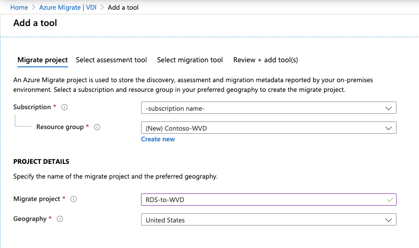
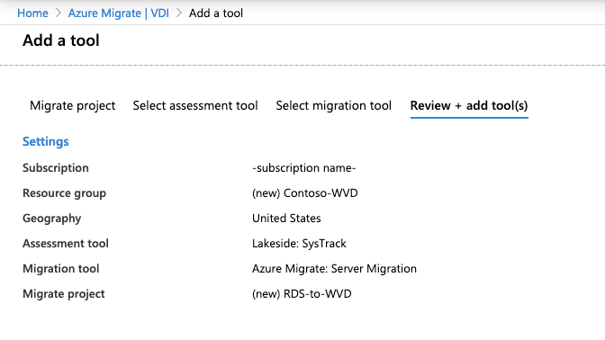
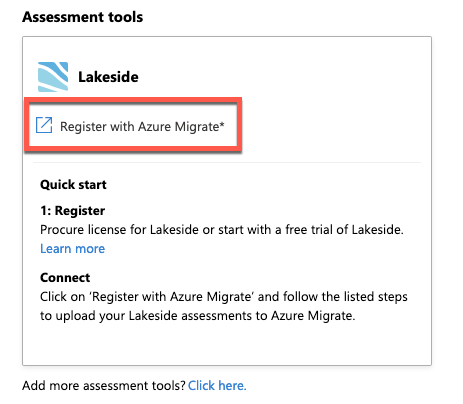
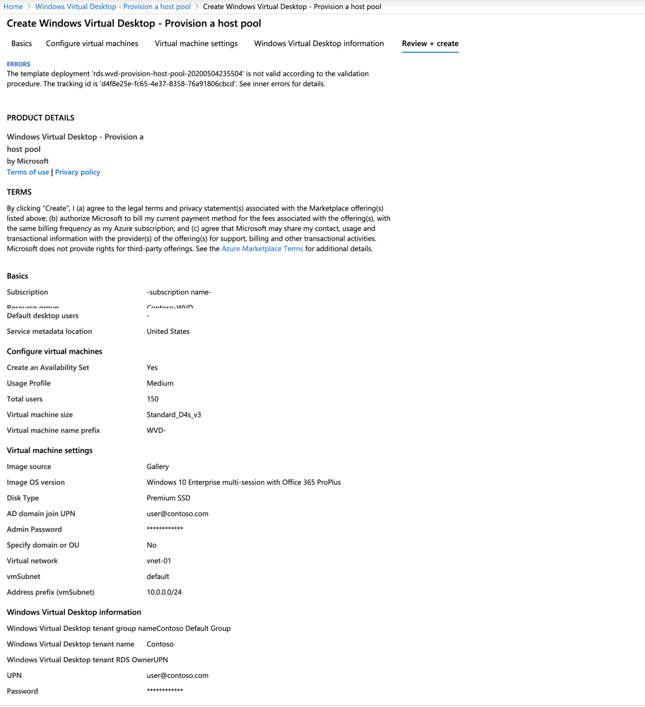

<!-- cSpell:ignore msiexec Logix Lakeside SysTrack Robocopy UPD UPDs -->

# Move on-premises Remote Desktop Services to Azure Windows Virtual Desktop scenario

Windows Virtual Desktop is a comprehensive desktop and application virtualization service running in the cloud. It's the only virtual desktop infrastructure (VDI) that delivers simplified management, Windows 10 Enterprise multi-session optimizations for Microsoft 365 Apps for enterprise, and support for Remote Desktop Services (RDS) environments. Deploy and scale Windows desktops and applications on Azure in minutes, and get built-in security and compliance features.

| Migration options | Outcome |
|--- | --- |
| [Azure Migrate](/azure/migrate/migrate-services-overview) | Assess and migrate on-premises RDS environments. <br><br> Run workloads by using Azure Windows Virtual Desktop. <br><br> Manage Windows Virtual Desktop with [Windows Virtual Desktop management UX](https://github.com/Azure/RDS-Templates/tree/master/wvd-templates/wvd-management-ux). |

> [!NOTE]
> This article focuses on using Windows Virtual Desktop in Azure to move an on-premises RDS environment to Azure.

## Business drivers

Working closely with business partners, the Contoso IT team will define the business drivers for a VDI migration to Azure. These drivers might include:

- **Current environment end-of-life:** A datacenter is out of capacity when it reaches the end of a lease or is closing down. Migrating to the cloud provides virtually unlimited capacity. Current software might also be reaching its end of life where it has become necessary to upgrade the software running Contoso's current VDI solution.
- **Multi-session Windows 10 VDI:** Provide Contoso users with the only multi-session Windows 10 desktop virtualized in the cloud that's highly scalable, up to date, and available on any device.
- **Optimize for Microsoft 365 Apps for enterprise:** Deliver the best Microsoft 365 Apps for enterprise experience, with multi-session virtual desktop scenarios providing the most productive virtualized experience for Contoso's users.
- **Deploy and scale in minutes:** Quickly virtualize and deploy modern and legacy desktop applications to the cloud in minutes with unified management in the Azure portal.
- **Secure and productive on Azure and Microsoft 365:** Deploy a complete, intelligent solution that enhances creativity and collaboration for everyone. Shift to Microsoft 365 and get Office 365, Windows 10, and Enterprise Mobility + Security.

## RDS on-premises to Windows Virtual Desktop in the cloud goals

With the business drivers in mind, Contoso has pinned down goals for this migration:

- Modernize the virtual desktop environment for the cloud.
- Take advantage of existing Microsoft 365 licenses.
- Improve security of corporate data when users work remotely.
- Optimize the new environment for cost and growth.

These goals support the decision to use Windows Virtual Desktop and validate it as the best migration method for Contoso.

## Benefits of running Windows Virtual Desktop in Azure

Using Windows Virtual Desktop in Azure, Contoso can now seamlessly run, manage, and scale its VDI solution quickly and easily. The company also can provide an optimized multi-session Windows 10 environment to its users.

Contoso will capitalize on existing Microsoft 365 licenses while using the scale, performance, security, and innovation of Azure.

Additional benefits might include:

- Access to Windows Virtual Desktop from anywhere.
- Optimized Microsoft 365 Apps for enterprise environment.
- Windows Virtual Desktop for dev/test environments.

## Solutions design

After pinning down goals and requirements, Contoso designs and reviews a deployment solution and identifies the migration process.

### Current architecture

RDS is deployed to an on-premises datacenter. Microsoft 365 is licensed and in use by the organization.

### Proposed architecture

- Sync Active Directory or Azure Active Directory Domain Services.
- Deploy Windows Virtual Desktop to Azure.
- Migrate on-premises RDS servers to Azure.
- Convert user profile disks (UPDs) to FSLogix profile containers.

  
  _Figure 1: Proposed architecture._

## Solution review

Contoso evaluates the proposed design by putting together a list of pros and cons.

| Consideration | Details |
| --- | --- |
| **Pros** | Windows 10 Enterprise multi-session environment. <br><br> Cloud-based, allowing access from anywhere. <br><br> Take advantage of other Azure services like Azure Files within the Windows Virtual Desktop environment. <br><br> Optimized for the Microsoft modern desktop. |
| **Cons** | To fully optimize for Azure, Contoso will have to rebuild Windows 10 images optimized for multiuser sessions. <br><br> Windows Virtual Desktop doesn't support user profile disks, so UPDs must be migrated to FSLogix profile containers. |

## Migration process

Contoso will move VMs to Windows Virtual Desktop in Azure by using the Lakeside assessment tool and Azure Migrate. Contoso will need to:

- Run the assessment tool against its on-premises RDS infrastructure to establish the scale of the Windows Virtual Desktop deployment in Azure.
- Migrate to Windows Virtual Desktop via either Windows 10 Enterprise multi-session or persistent virtual machines.
- Optimize the Windows Virtual Desktop multi-session by scaling up and down as needed to manage costs.
- Virtualize applications and assign users as needed to continue to secure and manage the Windows Virtual Desktop environment.

  
  _Figure 2: The migration process._

## Scenario steps

1. Assess the current RDS environment.
2. Create the VDI and new images in Azure and migrate and persist VMs to Azure.
3. Convert UPDs to FSLogix profile containers.
4. Replicate any persistent VMs to Azure.

## Step 1: Assess the current on-premises environment

Contoso will provision the Windows Virtual Desktop service in the `East US 2` Azure region. With Windows Virtual Desktop, Contoso can provision virtual machines, host pools, and create application groups. Windows Virtual Desktop also configures an availability set for all the servers in the Windows Virtual Desktop solution. Windows Virtual Desktop allows Contoso to create a high-available VDI environment and to scale up and down quickly as needed.

> [!NOTE]
> Contoso reviewed two scenarios during the assessment: multi-session (shared) instances of RDS and persistent (or user-dedicated) virtual machines.

1. Make sure that domain services, either Active Directory or Azure Active Directory Domain Services, are synchronized with Azure Active Directory (Azure AD). Ensure the domain service is accessible from the Azure subscription and virtual network to be connected where Windows Virtual Desktop will be deployed.

    > [!NOTE]
    > Learn more about [Azure AD Connect](/azure/active-directory/hybrid/how-to-connect-install-express) for synchronizing Active Directory on-premises with Azure AD.

    <!-- -->

    > [!NOTE]
    > Learn about provisioning [Azure Active Directory Domain Services](/azure/active-directory-domain-services/tutorial-create-instance) and synchronizing Azure AD to it.

1. Create a new Azure Migrate project.

   
   _Figure 3: Creating a new Azure Migrate project._

1. Select the option to assess and migrate servers, select **VDI**, and add a tool.

   

   _Figure 4: Target Azure Migrate goals._

1. Set the subscription, resource group, project name, and geography for the migrate job data.

   
   _Figure 5: Adding job data to the migration._

    > [!IMPORTANT]
    > This location isn't where the new Windows Virtual Desktop environment will be deployed. Only the data related to the Azure Migrate project will be stored here.

1. Select **Lakeside: SysTrack** as the assessment tool.

1. Select **Azure Migrate: Server Migration** as the migration tool.

1. Add the tools to the migration project.

   
   _Figure 6: Adding tools to the migration._

1. Start the assessment of the current environment by selecting **Register with Azure Migrate** in the Lakeside tool.

   

   _Figure 7: Assessing the current environment._

1. Contoso connects Azure Migrate and Lakeside, and accepts any requested permissions.

   
   _Figure 8: Connecting Azure to lakeside._

1. Contoso continues with the Lakeside tool to create a new tenant and start assessing the current on-premises RDS environment. From the dashboard, Contoso can access the deployment guide, download the assessment client to deploy to the current environment, and review the data collected from these agents.

   
   _Figure 9: The Lakeside dashboard._
1. After an adequate amount of data is captured, Contoso reviews the assessment data to determine the best migration path. This assessment data includes the raw assessment data from the desktops data and the data broken into different user personas. This information includes the:

- Number of users in each persona.
- Applications in use by users.
- Resource consumption by user.
- Resource utilization averages by user persona.
- VDI server performance data.
- Concurrent user reports.
- Top software packages in use.

    
    _Figure 10: Lakeside dashboard reports._

The data is analyzed by Contoso to determine the most cost-effective use of both pooled Windows Virtual Desktop resources and personal Windows Virtual Desktop resources.

> [!NOTE]
> Contoso will also need to migrate application servers to Azure to get the company closer to the Windows Virtual Desktop environment and reduce network latency for its users.

## Step 2: Create the Windows Virtual Desktop environment for pooled desktops

Using the Azure portal, Contoso will create a Windows Virtual Desktop environment to use for pooled resources. Later, it will go through the migration steps to attach personal desktops to the same environment.

1. Contoso selects the correct subscription, and creates a new Windows Virtual Desktop host pool.

   
  _Figure 11: A new Windows Virtual Desktop host pool._

1. Specify the subscription, resource group, and region. Then select the name for the host pool, desktop type, and default desktop users. Desktop type is set to **Pooled** because Contoso is starting with a new shared environment for some of its users. Default desktop users can be left blank. Move on to configure the virtual machines.

   
   _Figure 12: Prerequisites for configuring virtual machines._

   - Contoso configures the VM and chooses a custom size by selecting **Change size** or using the default.
   - Windows Virtual Desktop is chosen as the VM name prefix for these pooled desktops.
   - Because Contoso is creating the pooled servers to use the new Windows 10 multi-session functionality for the virtual machine settings, leave the image source set to **Gallery**. This option enables Contoso to select the Windows 10 Enterprise multi-session image for the VMs.
   - Based on the personas of the users from the Lakeside assessment, Contoso sets the total users to **150**.
   - Other settings include the disk type, an AD domain join UPN field, an admin password, an optional OU path to which machines are added, the virtual network, and a subnet for adding servers.

   
   _Figure 13: Configuring virtual machines._

    > [!NOTE]
    > Contoso can't create a new virtual network at this step. Before reaching this step, Contoso should have already created a virtual network that has access to Active Directory.

   <!-- -->

    > [!NOTE]
    > Contoso can't use a user account that requires multifactor authentication in this step. If Contoso plans to use multifactor authentication for its users, it will need to create a service principal for this purpose.

1. Contoso performs one more validation of the Windows Virtual Desktop settings, and creates the new environment of pooled Windows Virtual Desktop virtual machines.

   
   _Figure 14: Reviewing and creating virtual machines._

## Step 3: Convert the UPDs to FSLogix profile containers

Because Windows Virtual Desktop doesn't support user profile disks (UPDs), Contoso needs to convert all the UPDs to FSLogix via the [FSLogixMigration PowerShell module](https://aka.ms/FSLogixMigrationPreviewModule).

<!-- docsTest:casing FSLogixMigration -->

After Contoso imports the FSLogixMigration module, it runs the following PowerShell cmdlets to migrate from UPDs to FSLogix.

> [!IMPORTANT]
> The PowerShell modules for Hyper-V, Active Directory, and Pester are prerequisites to running the cmdlets to convert UPDs to FSLogix.

A UDP conversion:

```powershell
Convert-RoamingProfile -ParentPath "C:\Users\" -Target "\\Server\FSLogixProfiles$" -MaxVHDSize 20 -VHDLogicalSectorSize 512
```

A roaming profile conversion:

```powershell
Convert-RoamingProfile -ProfilePath "C:\Users\User1" -Target "\\Server\FSLogixProfiles$" -MaxVHDSize 20 -VHDLogicalSectorSize 512 -VHD -IncludeRobocopyDetails -LogPath C:\temp\Log.txt
```

At this point, the migration has enabled using pooled resources with Windows 10 Enterprise multi-session. Contoso can begin to deploy the necessary applications to the users who will use Windows 10 Enterprise multi-session.

But now Contoso must migrate the persistent virtual machines to Azure.

## Step 4: Replicate and persist VMs to Windows Virtual Desktop

The next step in the migration process for Contoso is to migrate its persistent virtual machines to Windows Virtual Desktop. To do this, Contoso goes back to the Azure Migrate: Server Migration job it created at the beginning of the process.

1. Contoso starts by selecting **Discover** in the Azure Migrate: Server Migration tools.

   
   _Figure 15: Discovering a server migration._

1. Contoso converts an appliance in its environment that's going to manage the replication of the machines to Windows Virtual Desktop. Ensure that the target region is set to `East US 2`, where the Windows Virtual Desktop environment was created.

   
   _Figure 16: Converting an appliance._

1. The replication provider is downloaded, installed, and registered to the Azure Migrate project to start the replication to Azure.

   
   _Figure 17: Prerequisites for replicating to Azure._

1. The replication of the hosts into Azure Blob storage is now started. Contoso can continue to let the replication occur until it's ready to test the VMs and then migrate them into production.
   - As machines start running in Azure, Contoso makes sure to install the [Windows Virtual Desktop VM agent](https://aka.ms/WVDVMAgent) on each machine.
   - As a part of the installation, enter the registration token for the Windows Virtual Desktop environment to associate the server with the correct environment.

1. The registration token can be obtained by using the following commands:

    ```powershell
    Export-RDSRegistrationInfo -TenantName "Contoso" -HostPoolName "ContosoWVD" | Select-Object -ExpandProperty Token > .\registration-token.txt
    ```

    > [!NOTE]
    > Contoso can also automate this process by using `msiexec` commands and passing in the registration token as a variable.

1. As the last step before the final migration, Contoso selects the **Users** item in the Azure Windows Virtual Desktop settings to map the servers to their respective users and groups.

   
   _Figure 18: The last step prior to the final migration._

After host pools are assigned to users, Contoso finalizes the migration of those machines and continues to gradually migrate the rest of the on-premises VDI hosts to Azure.

## Review the deployment

With the virtual desktops and application servers now running in Azure, Contoso now needs to fully operationalize and secure the deployment.

### Security

The Contoso security team reviews the Azure VMs to determine any security issues. To control access, the team reviews the network security groups (NSGs) for the VMs. NSGs are used to ensure that only traffic allowed to the application can reach it. The team also considers securing the data on the disk by using Azure Disk Encryption and Azure Key Vault.

For more information, see [Security best practices for IaaS workloads in Azure](/azure/security/fundamentals/iaas).

## Business continuity and disaster recovery

For business continuity and disaster recovery (BCDR), Contoso backs up the data on the VMs by using Azure Backup to keep data safe. For more information, see [An overview of Azure VM backup](/azure/backup/backup-azure-vms-introduction).

### Licensing and cost optimization

- [Microsoft 365 licenses](https://azure.microsoft.com/pricing/details/virtual-desktop/) are used for the desktop deployments.
- Contoso will enable [Azure Cost Management and Billing](/azure/cost-management-billing/cost-management-billing-overview) to help monitor and manage the Azure resources.
- Contoso has existing licensing for its VMs and will take advantage of the Azure Hybrid Benefit for application servers. Contoso will convert the existing Azure VMs to take advantage of this pricing.

## Conclusion

In this article, Contoso moved its RDS deployment to Windows Virtual Desktop hosted in Azure.
