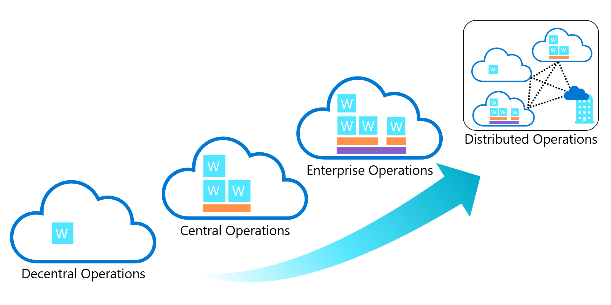

# Common cloud operating models

Operating models are unique and personal to the business they support, based on their current requirements and constraints. But, this uniqueness shouldn't suggest that operating models are "snowflakes". There are a few common patterns among customer operating models. This article outlines the four most common patterns.

## Operating model complexity

This article maps common operating models based on the range of complexity from least complex (decentralized) to most complex (global operations), as seen in the image below.

## Decentralized operations

Operations is always complex. But, by limiting the scope of operations to one workload or a small collections of workloads, that complexity can be controlled. As such, decentralized operations is the least complex of the common operating models. In this form of operations, all workloads are operated independently by dedicated workload teams.

**Advantages:**

- Cost of operations can be easily mapped to the a single business unit.
- Decisions that impact operations are only concerned with the needs of that workload.
- Many in the devops community would argue that this is the purest form of operations because of the tighter operational scope.
- Typically, this form of operations is highly dependent on automation to minimize overhead. This allows for faster deployments and shorter feedback cycles during development.
- Since there are no dependencies on other workloads or central operations, this operating model could reduce barriers to innovation.

**Disadvantages:**

- Lack of centralized supporting teams means that the workload team is entirely responsible for governance, security, operations, and change management.
- Since the workload team is less likely to have specialized teams dedicated to central IT functions, this operating model is viewed as a high risk option by some organizations, especially companies which are required to follow 3rd party compliance requirements.
- At scale, it can also be a costly model, since each workload would likely have duplication in deployed assets and staffing assignments.

**Guidance:** Decentralized operations are limited to workload level decisions. The Microsoft Azure Well-Architected Framework is designed to support the decisions made within that scope. The processes and guidance within the Cloud Adoption Framework are likely to add overhead that are not required by decentralized operations.

## Centralized operations

TODO Summary, Pros, Cons, Guidance

**Advantages:**

- 

**Disadvantages:**

- 

**Guidance:** 

## Portfolio operations

TODO Summary, Pros, Cons, Guidance

**Advantages:**

- 

**Disadvantages:**

- 

**Guidance:** 

## Global operations

TODO Summary, Pros, Cons, Guidance

**Advantages:**

- 

**Disadvantages:**

- 

**Guidance:** 

## Next steps

TODO: Next Steps