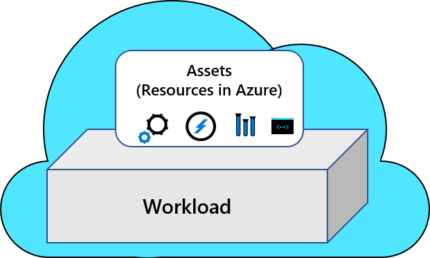

# Common cloud operating models

Operating models are unique and personal to the business they support, based on their current requirements and constraints. But, this uniqueness shouldn't suggest that operating models are "snowflakes". There are a few common patterns among customer operating models. This article outlines the four most common patterns.

## Operating model comparison

The following image maps common operating models based on the range of complexity from least complex (decentralized) to most complex (global operations). The tables below compares the same operating models based on relative value of a few other attributes.

### Priorities or Scope

Cloud operating model is primarily driven by two factors: Strategic priorities (or motivations) and the scope of the portfolio to be managed.

Strategic priorities or motivations: Each operating model is capable of delivering the typical [strategic motivations for cloud adoption](../strategy/motivations.md). However, some operating models tend to make it a little easier to realize some specific motivations.

[Portfolio Scope](../reference/fundamental-concepts/hosting-hierarchy.md): The portfolio scope row below identifies the largest scope that a specific operating model is designed to support. Example: Centralized operations is designed for a small number of landing zones. But that operating model decision could inject operational risks for an organization which is attempting to manage a large, complex portfolio which could require a large number of landing zones or variable complexity in landing sone design.

||Decentralized  |Centralized  |Enterprise          |Complex|
|---------              |---------      |---------    |---------          |---------|
|Strategic priority|Innovation|Control|Democratization|Integration|
|Portfolio scope|Workload|Landing zone |Cloud Platform|Full Portfolio|
|Workload environment|High complexity|Low complexity|Medium complexity|Medium or variable complexity|
|Landing zone|N/A|High complexity|Medium to Low complexity|Low complexity|
|Foundation utilities|N/A|N/A or Low support|Centralized & more support|Most support|
|Cloud foundation|N/A|N/A|Hybrid, provider specific, or regional foundations|Distributed and synchronized|

### Accountability alignment

Many teams and individuals will be responsible for supporting different functions. But each of the common operating models focuses final accountability for decisions and their outcomes on one team or one individual. This impacts how the operating model is funded & what level of support is provided for each function.

||Decentralized  |Centralized  |Enterprise          |Complex|
|---------              |---------      |---------    |---------          |---------|
|Business alignment|[Workload team](../organize/cloud-adoption.md)|[Central Cloud strategy](../organize/cloud-strategy.md)|[CCoE](../organize/cloud-center-of-excellence.md)|Variable - [Form a broad cloud strategy team?](../get-started/team/cloud-strategy.md)|
|[Cloud operations](../organize/cloud-operations.md)|[Workload team](../organize/cloud-adoption.md)|[Central IT](../organize/central-it.md)|[CCoE](../organize/cloud-center-of-excellence.md)|Based on portfolio analysis - See [Business Alignment](../manage/considerations/business-alignment.md) and [Business commitments](../manage/considerations/commitment.md)|
|[Cloud governance](../organize/cloud-governance.md)|[Workload team](../organize/cloud-adoption.md)|[Central IT](../organize/central-it.md)|[CCoE](../organize/cloud-center-of-excellence.md)|[Multiple layers of governance](../govern/guides/complex/multiple-layers-of-governance.md)|
|[Cloud security](../organize/cloud-security.md)|[Workload team](../organize/cloud-adoption.md)|[Security Operations Center (SOC)](../organize/cloud-security-operations-center.md)|[CCoE](../organize/cloud-center-of-excellence.md) + [SOC](../organize/cloud-security-operations-center.md)|Mixed - See [Define a security strategy](../strategy/define-security-strategy.md)|
|[Cloud automation & devops](../organize/cloud-automation.md)|[Workload team](../organize/cloud-adoption.md)|[Central IT](../organize/central-it.md) or N/A|[CCoE](../organize/cloud-center-of-excellence.md)|Based on portfolio analysis - See [Business Alignment](../manage/considerations/business-alignment.md) and [Business commitments](../manage/considerations/commitment.md)|

### Accelerate operating model implementation in Azure

As described in the prior article in this series, [Defining your operating model](./methodologies.md), each methodology in the cloud adoption framework provides a structured path to iteratively developing each aspect of your operating model. Following the most relevant methodology will help you overcome blockers to adoption that stem from gaps in the cloud operating model.

But there are ways to accelerate your operating model implementation, as outlined in the table below.

||Decentralized  |Centralized  |Enterprise          |Complex|
|---------              |---------      |---------    |---------          |---------|
|Starting point|[Well-Architected Framework (WAF)](/azure/architecture/framework/)|Azure landing zones: [Start Small options](../ready/landing-zone/implementation-options.md)|Azure landing zones: [CAF enterprise-scale](../ready/enterprise-scale/implementation.md)|[Business Alignment](../manage/considerations/business-alignment.md)|
|Iterations|A focus on workloads will allow the team to iterate within WAF|The start small option will require additional iteration on each methodology, but that can be done as cloud adoption efforts mature.|As illustrated by the reference implementations, future iterations will typical focus on minor configuration additions|After a portfolio review consider following the paths for centralized operations or enterprise operations, based on the most common needs across the portfolio.|

> [!WARNING]
> Below is a potential TODO. First, we will solicit feedback on the operating model comparison tables above to see if that is sufficient

## Decentralized operations

Operations is always complex. But, by limiting the scope of operations to one workload or a small collections of workloads, that complexity can be controlled. As such, decentralized operations is the least complex of the common operating models. In this form of operations, all workloads are operated independently by dedicated workload teams.

**Advantages:**

- Cost of operations can be easily mapped to the a single business unit.
- Decisions that impact operations are only concerned with the needs of that workload.
- Many in the devops community would argue that this is the purest form of operations because of the tighter operational scope.
- Typically, this form of operations is highly dependent on automation to minimize overhead. This allows for faster deployments and shorter feedback cycles during development.
- Since there are no dependencies on other workloads or central operations, this operating model could reduce barriers to innovation.

**Disadvantages:**

- Lack of centralized supporting teams means that the workload team is entirely responsible for governance, security, operations, and change management.
- Since the workload team is less likely to have specialized teams dedicated to central IT functions, this operating model is viewed as a high risk option by some organizations, especially companies which are required to follow 3rd party compliance requirements.
- At scale, it can also be a costly model, since each workload would likely have duplication in deployed assets and staffing assignments.

**Guidance:** Decentralized operations are limited to workload level decisions. The Microsoft Azure Well-Architected Framework is designed to support the decisions made within that scope. The processes and guidance within the Cloud Adoption Framework are likely to add overhead that are not required by decentralized operations.

## Centralized operations

TODO Summary, Pros, Cons, Guidance

**Advantages:**

- 

**Disadvantages:**

- 

**Guidance:** 

## Enterprise operations

TODO Summary, Pros, Cons, Guidance

**Advantages:**

- 

**Disadvantages:**

- 

**Guidance:** 

## Distributed operations

TODO Summary, Pros, Cons, Guidance

**Advantages:**

- 

**Disadvantages:**

- 

**Guidance:** 

## Next steps

TODO: Next Steps