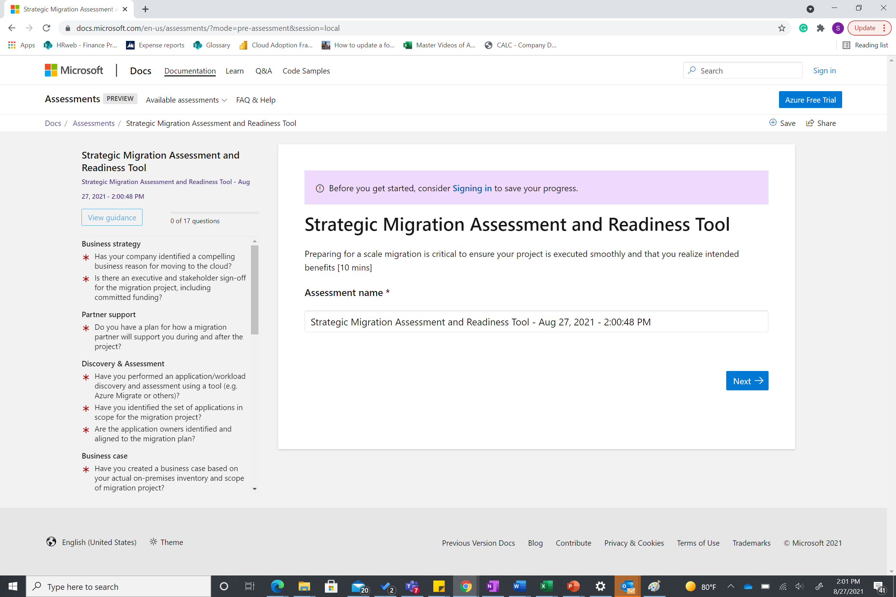
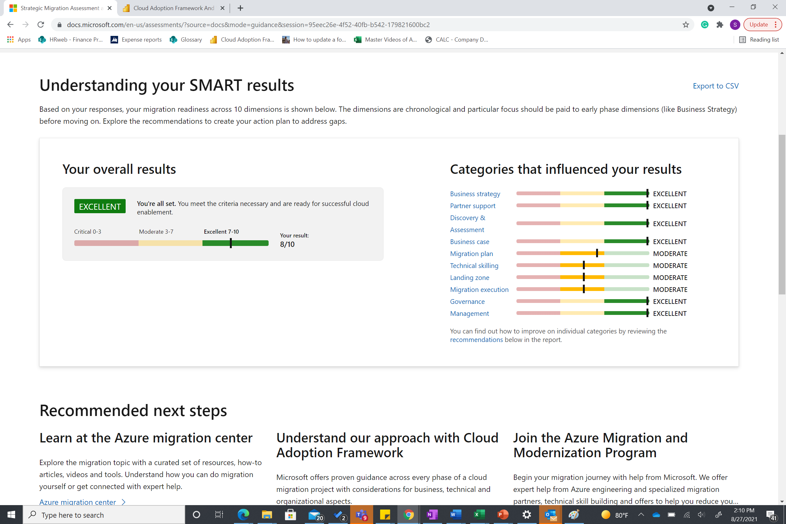

# Strategic migration and readiness tool (SMART) assessment

From business planning to training to security and governance, find out what you need to do to prepare for your Microsoft Azure migration with the strategic migration assessment and readiness tool (SMART).
## 1. Accessing the assessment
You can initiate the assessment by visiting [aka.ms/SMARTTool](/assessments/?id=strategic-migration-assessment)

The skills necessary to fill the gaps in your organization's digital transformation are typically not confined to a single role or even a single department. Skills will have relationships and dependencies that can span a single role or multiple roles. Those roles might exist in several departments. For example, a workload owner might require someone in an IT role to provision core resources like subscriptions and resource groups. 

Thus, to ensure quality results, there are two routes we suggest taking when considering how to approach the 17 questions to ensure a smooth experience. The first is with a Microsoft Account Member. The second is to set aside about 30 minutes with experts in each respective category and take it yourself.	

## 2. Results
After completing SMART, a results page will generate that offers tailored recommendations and next steps you can take to improve your score in each respective category. There is a tool to export the results to CSV that allows one to see scores offline.	

There's a matrix that shows your areas of strength and opportunities for growth across the spectrum along the recommended actions based on how you scored in each area.	
We grade you across all 10 dimensions, so you have a better understanding of what to do next, so here's three recommended steps and now we have individual recommendations within each respective category.	

If you want to go and revisit some of your answers to figure out why exactly you're getting these recommendations or what contributed to those individuals scores, just go over to answer summary and we have all of the Answers right there.	

## 3. Assessment Milestones

The milestone feature in SMART allows you to measure your growth and improvement as you take the assessment multiple times. By clicking new milestone you have the opportunity to look at how you improved individually in each area.		

You can compare across all 10 dimensions and it gives you a better idea of what were some of the resources that really helped and contributed to that evolution.	

----------------------------------------------------------------------------------------
For more information on the tool, you can take a look at it using any of the onscreen resources.	
Thank you all so much for your time and super excited for the next demo.	

## Sub heading

Break your article into logical chunks.

## Next steps

Add a link at the end of the article to the logical next steps.
