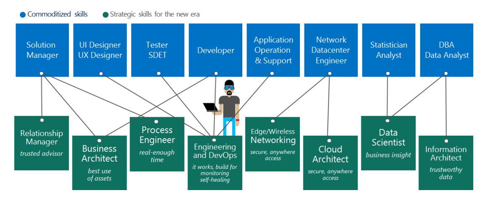

# Get started on a skills readiness path

IT staff members might feel anxious about their roles and positions as they realize a different set of skills is needed to support cloud solutions. Agile employees who explore and learn new cloud technologies don't need to have that fear. They can lead the adoption of cloud services by helping the organization understand and embrace the associated changes.

_Figure 1: Mapping of skills to IT roles in a cloud-hosted environment._

The Cloud Adoption Framework guides readers through the full adoption lifecycle. Throughout this framework, readers are provided opportunities to build necessary skills. To help you get started on this journey, skills-readiness articles are included in the following outline for easier access. Each of the following links maps to the skills required to be successful in each of those adoption phases.

- **[Strategy](../strategy/suggested-skills.md):** Develop the skills needed to prepare an actionable migration plan. This includes business justification and other required business-planning skills.
- **[Plan](./suggested-skills.md):** Develop the skills needed to prepare an actionable migration plan. This includes business justification and other required business-planning skills.
- **[Ready](../ready/suggested-skills.md):** Develop the skills needed to prepare the business, culture, people, and environment for coming changes.

- **Adopt:** Adoption skills are aligned to various technical efforts:
  - **[Migrate](../migrate/suggested-skills.md):** Gain the skills required to implement the cloud migration plan.
  - **Innovate:** Gain the skills needed to deliver innovative new solutions.

- **Operate:** Skills related to the operating model for cloud adoption are aligned to various opportunities to gain skills:
  - **Govern:** Gain the skills needed to govern the cloud environment.
  - **Manage:** Gain the skills needed to manage a cloud environment.
  - **[Monitor](../manage/monitor/suggested-skills.md):** Gain the skills needed to monitor a cloud environment.

Each of the previous learning paths shares opportunities across multiple media types to maximize knowledge acquisition.

## Microsoft Learn

Microsoft Learn is a new approach to learning. Readiness for the new skills and responsibilities that come with cloud adoption doesn't come easily. Microsoft Learn provides a more rewarding approach to hands-on learning that helps you achieve your goals faster. Earn points and levels, and achieve more!
Here are a couple examples of tailored learning paths on Microsoft Learn which align to the Plan methodology of the Cloud Adoption Framework:

<!-- docsTest:ignore "on premises" -->

[Evolve your DevOps practices](https://docs.microsoft.com/learn/paths/evolve-your-devops-practices): DevOps is the union of people, process, and products to enable continuous delivery of value to your end users. Azure DevOps is a set of services that gives you the tools you need to do just that. With Azure DevOps, you can build, test, and deploy any application, either in the cloud or on premises.

[Azure for the data engineer](https://docs.microsoft.com/learn/paths/azure-for-the-data-engineer): Explore how the world of data has evolved and how the advent of cloud technologies is providing new opportunities for business to explore. You will learn the various data platform technologies that are available, and how a data engineer can take advantage of this technology to an organization's benefit.

## Learn more

To discover additional learning paths, browse the [Microsoft Learn catalog](https://docs.microsoft.com/learn/browse). Use the roles filter to align learning paths with your role.
