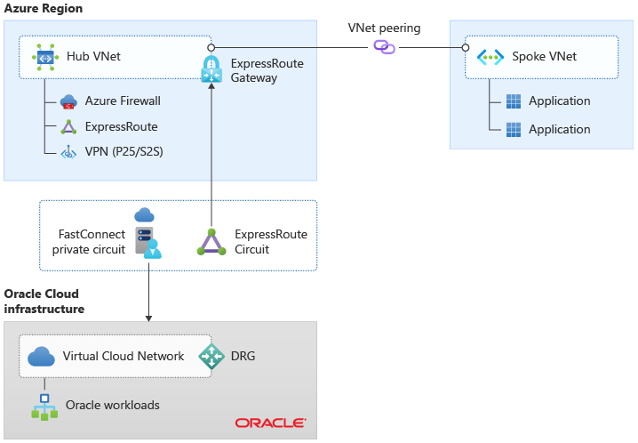
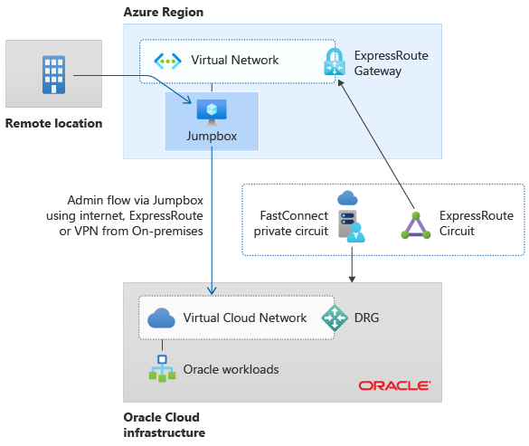

# Connectivity to other cloud providers

Examine key design considerations and recommendations surrounding different connectivity approaches to integrate an Azure enterprise-scale landing zone architecture into other cloud providers.

## Oracle Cloud Infrastructure (OCI)

This section provides different connectivity approaches to integrate an Azure enterprise-scale landing zone architecture to Oracle Cloud Infrastructure (OCI).

**Design considerations:**

- Using ExpressRoute and FastConnect, customers can connect a virtual network in Azure with a virtual cloud network in OCI, if the private IP address space does not overlap. Once this connectivity is established, resources in the Azure virtual network can communicate with resources in the OCI virtual cloud network as if they were both in the same network.

- Azure ExpressRoute [FastPath](/azure/expressroute/about-fastpath) is designed to improve the data path performance between two networks (on-premises and Azure), and for this scenario, between OCI and Azure. When enabled, FastPath sends network traffic directly to virtual machines in the virtual network, bypassing the ExpressRoute gateway.

  - FastPath is available on all ExpressRoute circuits.

  - FastPath still requires a virtual network gateway to be created for route exchange purposes. The virtual network gateway must be the Ultra Performance or ErGw3AZ SKUs ExpressRoute Gateway for route management. The virtual network gateway must be either Ultra Performance or ErGw3AZ.
  
- There are features that are currently [not supported](/azure/expressroute/about-fastpath#supported-features) in ExpressRoute FastPath, such as Azure Virtual WAN hubs or VNet Peering.

- While you can use [ExpressRoute Global Reach](/azure/expressroute/expressroute-global-reach) to enable communication from on-premises to OCI via ExpressRoute circuits, this may incur additional bandwidth costs that can be calculated by using the [Azure Pricing Calculator](https://azure.microsoft.com/pricing/calculator/). This is a particularly important consideration when you migrate large amounts of data from on-premises to Oracle by using ExpressRoute circuits.

- In Azure regions that support [Availability Zones (AZ)](/azure/availability-zones/az-overview#availability-zones), placing your Azure workloads in one zone or the other can have a small impact on latency. Design your application to balance availability and performances requirements.

- Interconnectivity between Azure and OCI is only available in [specific regions](/azure/virtual-machines/workloads/oracle/oracle-oci-overview#region-availability).

- For more in-depth documentation about interconnectivity between Azure and OCI, refer to [Oracle Application solutions integrating Microsoft Azure and Oracle Cloud Infrastructure](/azure/virtual-machines/workloads/oracle/oracle-oci-overview) or refer to the [Oracle documentation](https://docs.cloud.oracle.com/iaas/Content/Network/Concepts/azure.htm).

**Design recommendations:**

- Create the ExpressRoute circuit(s) that will be used to interconnect Azure with OCI in the **connectivity** subscription.

- You can interconnect an Azure network architecture based on the traditional hub and spoke architecture or Azure Virtual WAN-based network topologies by connecting the ExpressRoute circuit that will be used to interconnect Azure to OCI to the hub VNet or Virtual WAN hub as depicted in the following figure.

  

  _Figure 8: Interconnectivity between Azure and OCI via ExpressRoute._

- If your application requires the lowest possible latency between Azure and OCI, consider deploying your application in a single VNet with an ExpressRoute Gateway and FastPath enabled.

  

  _Figure 9: Interconnectivity between Azure and OCI with a single VNet._

- When deploying your Azure resources across Availability Zones (AZs), perform latency tests from Azure VMs located in different AZs to OCI resources to understand which of the three AZs provides the lowest latency to the OCI resources.

- To operate Oracle resources hosted in OCI by using Azure resources and technologies, you could:

   - From Azure: Deploy a jumpbox in a spoke VNet. The jumpbox provides access to the Virtual Cloud Network in OCI as depicted in the picture below:
    
  

  _Figure 10: Managing OCI resources from Azure via a jumpbox._

   - From on-premises: Use ExpressRoute Global Reach to bind existing ExpressRoute circuit (that connects on-premises to Azure) to OCI ExpressRoute circuit (that interconnects Azure to OCI). In this way, the Microsoft Enterprise Edge Router (MSEE) becomes the central routing point between both ExpressRoute circuits.

  

  _Figure 11: Managing OCI resources from on-premises via ExpressRoute Global Reach._