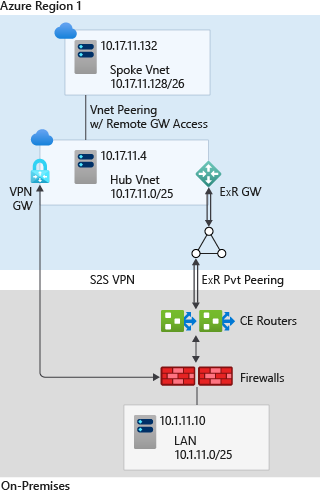

# Connectivity to Azure

This section expands on the network topology to consider recommended models for connecting on-premises locations to Azure.

**Design considerations:**

- Azure [ExpressRoute](https://docs.microsoft.com/azure/expressroute/expressroute-introduction) provides dedicated private connectivity to Azure Infrastructure-as-a-Service (IaaS) and Platform-as-a-Service (PaaS) functionality from on-premises locations.

- [Azure VPN (S2S) gateway](https://docs.microsoft.com/azure/vpn-gateway/vpn-gateway-about-vpngateways) provides Site-to-Site shared connectivity over the public Internet to Azure Infrastructure-as-a-Service (IaaS) virtual networks from on-premises locations.

- [Azure ExpressRoute](https://docs.microsoft.com/azure/expressroute/expressroute-introduction) and [Azure VPN (S2S)](https://docs.microsoft.com/azure/vpn-gateway/vpn-gateway-about-vpngateways) have different capabilities, costs and performance, a [table](https://docs.microsoft.com/azure/vpn-gateway/vpn-gateway-about-vpngateways#planningtable) is available for comparison.

- You can use [Private Links](https://docs.microsoft.com/azure/private-link/private-link-overview) to establish connectivity to PaaS services, over ExpressRoute with private peering or VPN S2S from on-premises connected locations.

- When multiple virtual networks are connected to the same ExpressRoute circuit, they'll become part of the same [routing domain](https://docs.microsoft.com/azure/expressroute/expressroute-circuit-peerings), and all virtual networks will share the bandwidth.

- You can use ExpressRoute [Global Reach](https://docs.microsoft.com/azure/expressroute/expressroute-global-reach), where available, to connect on-premises locations together through ExpressRoute circuits to transit traffic over the Microsoft backbone network.

- ExpressRoute [Global Reach](https://docs.microsoft.com/azure/expressroute/expressroute-global-reach) is available in many [ExpressRoute peering locations](/azure/expressroute/expressroute-global-reach#availability).

- ExpressRoute [Direct](https://docs.microsoft.com/azure/expressroute/expressroute-erdirect-about) allows creation of multiple ExpressRoute circuits at no additional cost, up to the ExpressRoute Direct port capacity (10 Gbps or 100 Gbps). It also allows you to connect directly to Microsoft's ExpressRoute routers. For the 100-Gbps SKU, the minimum circuit bandwidth is 5 Gbps. For the 10-Gbps SKU, the minimum circuit bandwidth is 1 Gbps.

- When enabled on an ExpressRoute circuit, [FastPath](https://docs.microsoft.com/azure/expressroute/about-fastpath) sends network traffic directly to virtual machines in the virtual network, bypassing the gateway. FastPath is designed to improve the data path performance between your on-premises network and your virtual network without having a bottleneck on the gateway.

**Design recommendations:**

- Use ExpressRoute as the primary connectivity channel for connecting an on-premises network to Azure. You can use [VPNs as a source of backup connectivity](https://docs.microsoft.com/azure/expressroute/use-s2s-vpn-as-backup-for-expressroute-privatepeering) to enhance connectivity resiliency.

  

- Use dual ExpressRoute circuits from different peering locations when you're connecting an on-premises location to virtual networks in Azure. This setup will ensure redundant paths to Azure by removing single points of failure between on-premises and Azure.

- When you use multiple ExpressRoute circuits, [optimize ExpressRoute routing via BGP local preference and AS PATH prepending](/azure/expressroute/expressroute-optimize-routing#solution-use-as-path-prepending).

- Ensure that you're using the [right SKU](https://docs.microsoft.com/azure/expressroute/expressroute-about-virtual-network-gateways#gwsku) for the ExpressRoute/VPN gateways based on bandwidth and performance requirements.

- Deploy a [zone-redundant ExpressRoute gateway](https://docs.microsoft.com/azure/expressroute/designing-for-high-availability-with-expressroute#availability-zone-aware-expressroute-virtual-network-gateways) in the supported Azure regions.

- For scenarios that require bandwidth higher than 10 Gbps or dedicated 10/100-Gbps ports, use ExpressRoute [Direct](https://docs.microsoft.com/azure/expressroute/expressroute-erdirect-about).

- When low latency is required, or throughput from on-premises to Azure must be greater than 10 Gbps, enable [FastPath](https://docs.microsoft.com/azure/expressroute/about-fastpath) to bypass the ExpressRoute gateway from the data path.

- Use VPN gateways to connect branches or remote locations to Azure. For higher resilience, deploy [zone-redundant gateways](https://docs.microsoft.com/azure/vpn-gateway/about-zone-redundant-vnet-gateways) (where available).

- Use ExpressRoute [Global Reach](https://docs.microsoft.com/azure/expressroute/expressroute-global-reach) to connect large offices, regional headquarters, or datacenters connected to Azure via ExpressRoute.

- When traffic isolation or dedicated bandwidth is required, such as for separating production and nonproduction environments, use different ExpressRoute circuits. It will help you ensure isolated routing domains and alleviate noisy-neighbor risks.

- Use ExpressRoute [Network Insights](https://docs.microsoft.com/azure/expressroute/monitor-expressroute) to monitor your Express Route components (peerings, connections, gateways). ExpressRoute uses Network Insights to provide a detailed topology mapping of all ExpressRoute components (peerings, connections, gateways) and has preloaded metrics dashboard for availability, throughput, packet drops, and gateway metrics.
  - Use [Connection Monitor for ExpressRoute](https://docs.microsoft.com/azure/expressroute/how-to-configure-connection-monitor) to monitor connectivity between Azure cloud deployments and on-premises locations (Branch offices, etc.), detect network issues, identify and eliminate connectivity problems.

- Don't explicitly use ExpressRoute circuits from a single peering location. This creates a single point of failure and makes your organization susceptible to peering location outages.
