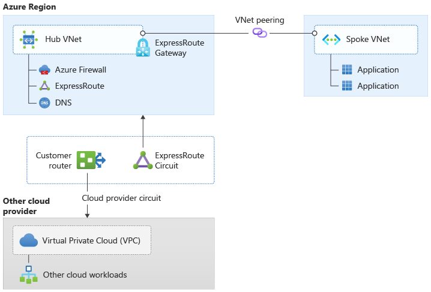
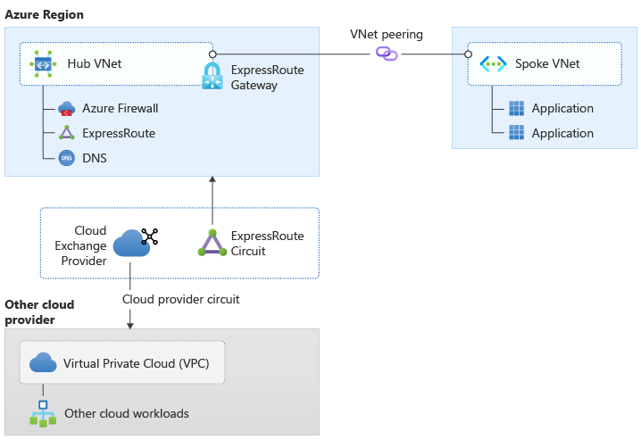
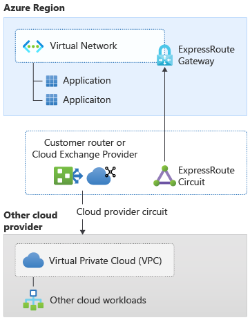
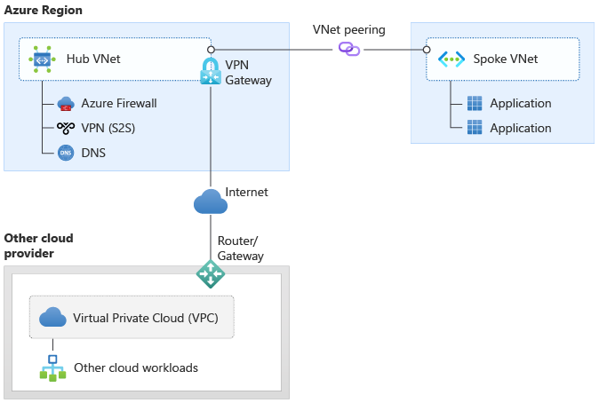

# Connectivity to other cloud providers

This article discusses ways to connect an Azure enterprise-scale landing zone architecture to other cloud providers, such as Amazon Web Services (AWS) and Google Cloud Platform (GCP).

The various options differ in speed, latency, reliability, service level agreements (SLAs), complexity, and costs. This article considers  options and makes recommendations.

> [!Note]
> Microsoft and Oracle partnered to provide high-throughput, low-latency connections between Azure and Oracle Cloud Infrastructure (OCI). This is discussed in [Connectivity to Oracle Cloud Infrastructure](connectivity-to-other-providers-oci.md).

## Design considerations

- We consider the following options for connecting Azure to another cloud:
  - **Option 1** - Connect Azure ExpressRoute and the other cloud provider's equivalent private connection. The customer manages routing.
  - **Option 2** - Connect ExpressRoute and the other cloud provider's equivalent private connection. A cloud exchange provider handles routing.
  - **Option 3** - Use site-to-site VPN over the Internet. For more information, see [Connect on-premises networks to Azure by using site-to-site VPN gateways (Learn)](/learn/modules/connect-on-premises-network-with-vpn-gateway/2-connect-on-premises-networks-to-azure-using-site-to-site-vpn-gateways).

   You can use the following cross-cloud connectivity flow chart as an aid to choosing an option:

    
    *Figure 1: Cross-cloud connectivity flow chart*

- You can only connect an Azure virtual network to another cloud provider's virtual private cloud (VPC) if the private IP address spaces don't overlap.
- Option 3 (VPN) may have lower throughput and higher latency than the ExpressRoute options.
- In Option 1, customer-managed routing can be very complex. The cloud exchange provider of Option 2 is simpler.
- You may need to provide DNS resolution between Azure and the other cloud provider, and that can increase costs.
- The FastPath feature of ExpressRoute improves data path performance between Azure and on-premises networks, and between Azure and other cloud providers. When enabled, FastPath sends network traffic directly to virtual machines in the virtual network, bypassing the ExpressRoute gateway. For more information, see [About ExpressRoute FastPath](/azure/expressroute/about-fastpath).
- FastPath is available on all ExpressRoute circuits.
- Even though FastPath bypasses the ExpressRoute gateway for network traffic, it still requires the gateway for exchanging routes. The gateway must use either the UltraPerformance SKU or the ErGw3AZ SKU.
- There are configurations that FastPath doesn't support, such as virtual network peering. For details, see [Limitations](/azure/expressroute/about-fastpath#limitations) in About ExpressRoute FastPath.

## Design recommendations

- Use Option 1 or Option 2 to avoid use of the Internet, or to predictably handle heavy data traffic. Consider whether to use customer-managed routing (Option 1) or a cloud exchange provider (Option 2), if ExpressRoute isn't already implemented.
- Create the ExpressRoute circuits for Option 1 and Option 2 in the connectivity subscription.
- Use the ExpressRoute circuit of Option 1 or Option 2 to connect to the hub of a hub-and-spoke architecture, or to the hub virtual network or virtual WAN hub of an Azure virtual WAN-based network. Figure 2 and Figure 3 shows these cases. Figure 2 is for Option 1 (customer routing), and Figure 3 is for Option 2 (cloud exchange provider).

    
    *Figure 2: Cross-cloud connectivity with customer-managed routing (Option 1)*

    
    *Figure 3: Cross-cloud connectivity with a cloud exchange provider (Option 2)*

- If you need to minimize latency between Azure and another cloud provider, consider deploying your application in a single virtual network with an ExpressRoute gateway, and enable FastPath.

    )

    *Figure 4: Cross-cloud connectivity with FastPath enabled*

- If ExpressRoute is not required or not available, you can use site-to-site VPN over the internet to connect between Azure and another cloud provider.

    

    *Figure 5: Cross-cloud connectivity using site-to-site VPN over the Internet*
