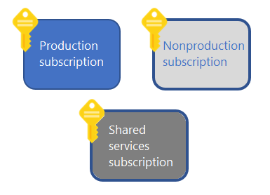

# Create your initial Azure subscriptions

To start your Azure adoption, you can create a set of subscriptions based on your initial requirements.

> [!NOTE]
>
> It is recommended that organizations consider the Azure landing zone guidance for [resource organization](../landing-zone/design-area/resource-org.md) as a first step to plan subscriptions within an Azure environment for environment scaling.

## Create subscriptions

Start by creating two subscriptions:

- Create one Azure subscription to contain your production workloads.
- Create a second subscription to serve as your non-production environment, using an [Azure Dev/Test offer](https://azure.microsoft.com/pricing/dev-test/) for lower pricing.

The image below show initial subscription model with keys next to boxes labeled *production* and *non-production*.

The initial subscription model has the following benefits:

- Using different subscriptions for your production and non-production environments create a boundary for simple and safe resource management.
- Azure Dev/Test subscription offerings are available for non-production workloads. These offerings provide discounted rates on Azure services and software licensing.
- Your production and non-production environments can contain different sets of Azure policies. At the subscription level, it is simple to use different subscriptions for distinct policies.
- In your non-production subscription, you can have several test Azure resources. You can enable the resource providers for these test resources in your non-production subscription without exposing them to the production environment.
- You can use Azure dev/test subscriptions as isolated sandbox environments. These sandboxes allow administrators and developers to create and delete entire sets of Azure resources that help with data protection and security concerns.
- The acceptable cost thresholds vary between production and non-production environments.

## Sandbox subscriptions

If innovation goals are part of your cloud adoption strategy, it is recommended to create one or more sandbox subscriptions. You can apply security policies to keep the test subscriptions isolated from your production and non-production environments and experiment with Azure capabilities. Use an Azure Dev/Test offer to create these subscriptions.

The image below show the subscription model with *production*, *non-production*, and *sandbox* subscriptions.

## Shared services subscription

If you're planning to host **more than 1,000 VMs or compute instances in the cloud within 24 months**, create another Azure subscription to host shared services. This supports your end-state enterprise architecture.

The image below show the subscription model with *production*, *non-production* and *shared services* subscriptions.

## Next steps

[Create additional Azure subscriptions](./scale-subscriptions.md).

[Create additional subscriptions to scale your Azure environment](./scale-subscriptions.md)
