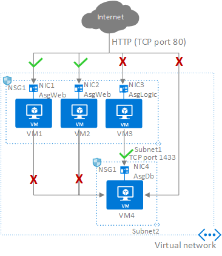

# Plan for landing zone network segmentation

This section explores key recommendations to deliver highly secure internal network segmentation within a landing zone to drive a network zero-trust implementation.

**Design considerations:**

- The [zero-trust model](/security/zero-trust/deploy/networks) assumes a breached state and verifies each request as though it originates from an uncontrolled network.

- An advanced zero-trust network implementation employs fully distributed ingress/egress cloud micro-perimeters and deeper micro-segmentation.

- Network security groups ([NSG](/azure/virtual-network/network-security-groups-overview)) can use Azure [service tags](/azure/virtual-network/service-tags-overview) to facilitate connectivity to Azure PaaS services.

- Application security groups ([ASG](/azure/virtual-network/application-security-groups)) don't span or provide protection across virtual networks.

- NSG [flow logs](/azure/network-watcher/network-watcher-nsg-flow-logging-overview) are used to inspect traffic flowing through a network point with an NSG attached.

- [Virtual network flow logs](/azure/network-watcher/vnet-flow-logs-overview) provides similar capabilities as NSG flow logs but cover a wider ranges of use cases and simplifies the scope of traffic monitoring because you can enable logging at the virtual network level.

**Design recommendations:**

- Delegate subnet creation to the landing zone owner. This will enable them to define how to segment workloads across subnets (for example, a single large subnet, multitier application, or network-injected application). The platform team can use Azure Policy to ensure that an NSG with specific rules (such as deny inbound SSH or RDP from internet, or allow/block traffic across landing zones) is always associated with subnets that have deny-only policies.

- Use NSGs to help protect traffic across subnets, as well as east/west traffic across the platform (traffic between landing zones).

- The application team should use application security groups at the subnet-level NSGs to help protect multitier VMs within the landing zone.

    

- Use NSGs and application security groups to micro-segment traffic within the landing zone and avoid using a central NVA to filter traffic flows.

- Enable [Virtual network flow logs](/azure/network-watcher/vnet-flow-logs-overview) and use [Traffic Analytics](/azure/network-watcher/traffic-analytics) to gain insights into ingress and egress traffic flows. Flow logs should be enabled on all critical virtual networks and subnets in your subscriptions, for example those containing Active Directory Domain Controllers or sensible data stores. Additionally, flow logs can be used to detect and investigate potential security incidents, compliance and monitoring, usage optimization.

- Use NSGs to selectively allow connectivity between landing zones.

- For Virtual WAN topologies, route traffic across landing zones via Azure Firewall if your organization requires filtering and logging capabilities for traffic flowing across landing zones.

- If your organization decides to implement forced tunneling (advertise default route) to on-premises, we recommend incorporating the following **outbound** NSG rules to deny egress traffic from VNets directly to the internet should the BGP session drop.

> [!NOTE]
> Rule priorities will need to be adjusted based on your existing NSG rule set.

  | Priority | Name | Source | Destination | Service | Action | Remark |
  | --- | --- | --- | --- | --- | --- | --- |
  | 100 | `AllowLocal` | `Any` | `VirtualNetwork` | `Any` | `Allow` | Allow traffic during normal operations. With forced tunneling enabled, `0.0.0.0/0` is considered part of the `VirtualNetwork` tag as long as BGP is advertising it to the ExpressRoute or VPN Gateway. |
  | 110 | `DenyInternet` | `Any` | `Internet` | `Any` | `Deny` | Deny traffic directly to the internet if the `0.0.0.0/0` route is withdrawn from the routes advertised (for example, due to an outage or misconfiguration). |

> [!CAUTION]
> Azure PaaS services that can be injected into a virtual network maybe not compatible with forced tunneling. Control plane operations may still require direct connectivity to specific public IP addresses for the service to operate correctly. It's recommended to check the specific service documentation for networking requirements and eventually exempt the service subnet from the default route propagation. [Service Tags in UDR](/azure/virtual-network/virtual-networks-udr-overview#service-tags-for-user-defined-routes) can be used to bypass default route and redirect control plane traffic only, if the specific service tag is available.
