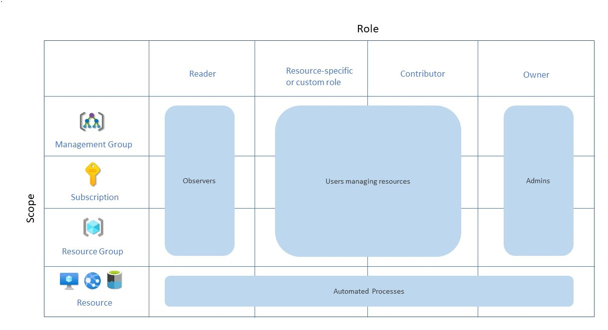

# Manage access to your Azure environment with Azure role-based access control

Managing who can access your Azure resources and subscriptions is an important part of your Azure governance strategy, and assigning group-based access rights and privileges is a good practice. Dealing with groups rather than individual users simplifies maintenance of access policies, provides consistent access management across teams, and reduces configuration errors. Azure role-based access control (Azure RBAC) is the primary method of managing access in Azure.

Azure RBAC provides detailed access management of resources in Azure. It helps you manage who has access to Azure resources, what they can do with those resources, and what scopes they can access.

When you plan your access control strategy, grant users the least privilege required to get their work done. The following image shows a suggested pattern for assigning Azure RBAC.

*Figure 1: Azure roles.*

When you plan your access control methodology, we recommend that you work with people in your organizations with the following roles: security and compliance, IT administration, and enterprise architect.

The Cloud Adoption Framework offers additional guidance on using [Azure role-based access control](../considerations/roles.md) in your cloud adoption efforts.

::: zone target="chromeless"

## Actions

**Grant resource group access:**

To grant a user access to a resource group:

1. Go to **Resource groups**.
1. Select a resource group.
1. Select **Access control (IAM)**.
1. Select **+ Add** > **Add role assignment**.
1. Select a role, and then assign access to a user, group, or service principal.

::: form action="OpenBlade[#blade/HubsExtension/Resources/resourceType/Microsoft.Resources%2FSubscriptions%2FResourceGroups]" submitText="Go to resource groups" ::: form-end

**Grant subscription access:**

To grant a user access to a subscription:

1. Go to **Subscriptions**.
1. Select a subscription.
1. Select **Access control (IAM)**.
1. Select **+ Add** > **Add role assignment**.
1. Select a role, and then assign access to a user, group, or service principal.

::: form action="OpenBlade[#blade/Microsoft_Azure_Billing/SubscriptionsBlade]" submitText="Go to subscriptions" ::: form-end

::: zone-end

::: zone target="docs"

## Grant resource group access

To grant a user access to a resource group:

1. Go to [Resource groups](https://portal.azure.com/#blade/HubsExtension/BrowseResourceGroups).
1. Select a resource group.
1. Select **Access control (IAM)**.
1. Select **+ Add** > **Add role assignment**.
1. Select a role, and then assign access to a user, group, or service principal.

## Grant subscription access

To grant a user access to a subscription:

1. Go to [Subscriptions](https://portal.azure.com/#blade/Microsoft_Azure_Billing/SubscriptionsBlade).
1. Select a subscription.
1. Select **Access control (IAM)**.
1. Select **+ Add** > **Add role assignment**.
1. Select a role, and then assign access to a user, group, or service principal.

## Learn more

To learn more, see:

- [What is Azure role-based access control (Azure RBAC)?](/azure/role-based-access-control/overview)
- [Cloud Adoption Framework: Use Azure role-based access control](../considerations/roles.md)

::: zone-end
