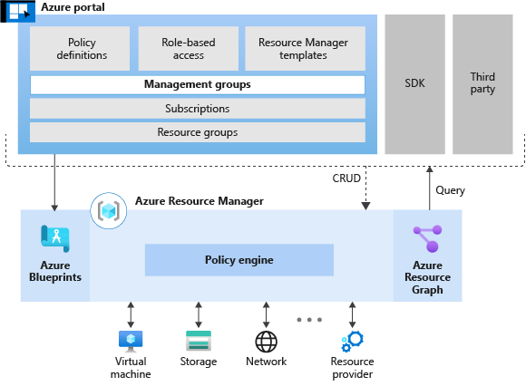

# Test-driven development for landing zones in Azure

As outlined in the previous article on [test-driven development (TDD) for landing zones](./test-driven-development.md), TDD cycles begin with a test that validates the acceptance criteria of a specific feature required to deliver the cloud adoption plan. Expanding or refactoring the landing zone can then be tested to validate that the acceptance criteria have been met. This article outlines a cloud-native toolchain in Azure to automate test-driven development cycles.

## Azure tools to support landing zone TDD cycles

_Figure 1: Test-driven development tools in Azure._

The toolchain of Azure-native governance products and services can be easily integrated into test-driven development for the creation of landing zones. Each of these tools serves a specific purpose, making it easier to develop, test, and deploy your landing zone in alignment with TDD cycles.

## Microsoft-provided test and deployment templates to accelerate TDD

The following examples are provided by Microsoft for governance purposes. Each can be used as a test or series of tests in a test-driven development cycle for landing zones. The following sections provide more information on each tool:

- Azure Blueprints provides various [blueprint samples](https://docs.microsoft.com/azure/governance/blueprints/samples), including policies for testing and templates for deployment. These blueprint samples can accelerate development, deployment, and testing efforts in TDD cycles.
- Azure Policy also includes [built-in policy initiatives](https://docs.microsoft.com/azure/governance/policy/samples/built-in-initiatives), which could be used to test and enforce the full definition of done for a landing zone. Azure Policy includes [built-in policy definitions](https://docs.microsoft.com/azure/governance/policy/samples/built-in-policies) that can meet individual acceptance criteria within the definition of done.
- Azure Graph includes advanced [query samples](https://docs.microsoft.com/azure/governance/resource-graph/samples/advanced), which can be used to understand how the workloads are deployed within a landing zone for advanced testing scenarios.
- [Azure quickstart templates](https://azure.microsoft.com/resources/templates) provides of source code templates to aid in accelerating landing zone and workload deployment.

The examples listed above can be used as tools for accelerating TDD cycles. They run on the governance tools in the following sections and allow cloud platform teams to create their own source code and tests.

## Azure governance tools that can accelerate TDD cycles

[Azure Policy](https://docs.microsoft.com/azure/governance/policy): When deployments or attempted deployments deviate from governance policies, Azure Policy can provide automated detection, protection, and resolution. But Azure Policy also provides the primary mechanism for testing acceptance criteria in your definition of done. In a TDD cycle, a policy definition can be created to test a single acceptance criteria. Likewise, all acceptance criteria can be added to a policy initiative assigned to the entire subscription. This approach provides a mechanism for red tests before modifying the landing zone. Once the landing zone meets the definition of done, it can be used to enforce the test criteria to avoid code changes that would cause the test to fail in future releases.

[Azure Blueprints](https://docs.microsoft.com/azure/governance/blueprints): Azure blueprint groups policies and other deployment tools into a repeatable package that can be assigned to multiple landing zones. Blueprints prove useful when multiple adoption efforts share common definitions of done, which you may want to update over time. It can also help with deployment during subsequent efforts to expand and refactor landing zones.

[Azure resource graph](https://docs.microsoft.com/azure/governance/resource-graph): Resource graph provides a query language for creating data-driven tests based on information about the assets deployed within a landing zone. Later in the adoption plan, this tool can also define complex tests based on the interactions between workload assets and the underlying cloud environment.

[Azure Resource Manager templates](https://docs.microsoft.com/azure/azure-resource-manager/templates/overview): These templates provide the primary source code for any environment deployed in Azure. When using third-party tools like Terraform to develop source code and which deploy a landing zone, the tools will generate their own templates. Those templates are then submitted to the Azure Resource Manager.

[Azure Resource Manager](https://docs.microsoft.com/azure/azure-resource-manager/management/overview): Resource Manager provides a consistent platform for build and deploy functions. This platform is what manages a landing zone's deployment from source code.

## Next steps

To begin refactoring your first landing zone, evaluate [basic landing zone considerations](./basic-considerations.md).

> [!div class="nextstepaction"]
> [Basic landing zone considerations](./basic-considerations.md)
