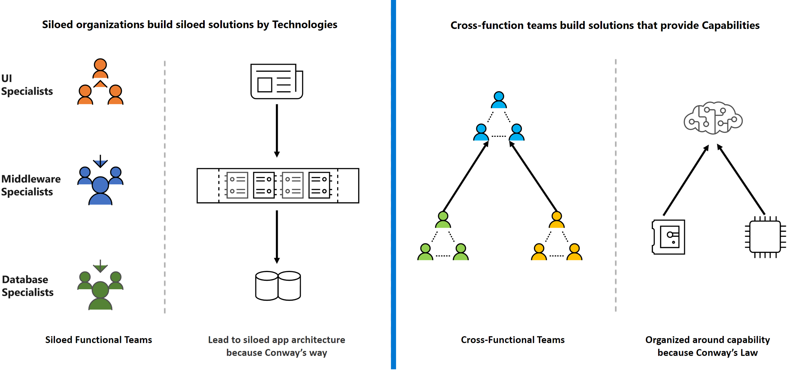
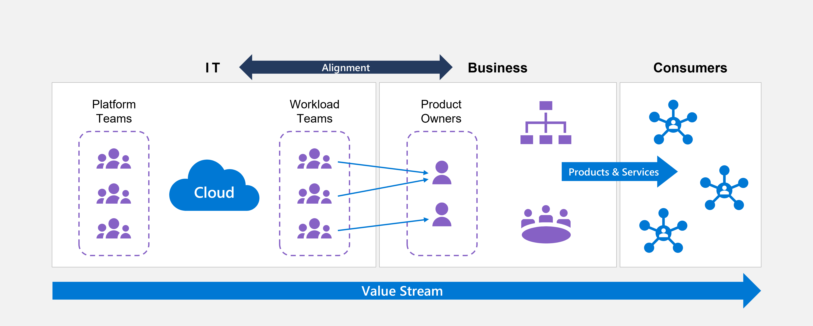

# DevOps teams topologies

## Team topologies

The distribution of roles, responsibilities, and trust between IT teams and applications teams is paramount to the operational transformation involved when adopting the cloud at scale.

IT teams strive to maintain control, while application owners seek to maximize agility. The balance between these goals can greatly influence the success of the cloud operating model.

According to Conway's law, teams will produce Architectures based on their communication structure, and this principle becomes relevant to achieving this balance between autonomy and control. Any organization that designs a system (defined broadly) will produce a design whose structure is a copy of the organization’s communication structure.

From a DevOps perspective, organizations must optimize for responding quickly to customer needs. Teams that own, design, and implement their applications and systems will find their highest level of autonomy in defining architectures that include the following characteristics:

- Evolutionary architecture that supports constant changes
- Deployability
- Testability

Conway’s solution to this is to outmaneuver Conway's Law – if organizations follow a particular structure to produce services & products and are looking to optimize, they need to rethink the structure of the organization. Organizations should evolve their team and organizational structure to achieve the desired architecture.

This principle leads us to intentionally design [team topologies](https://teamtopologies.com/) with teams responsible for the end-to-end of the applications, systems, or platforms they own in order to achieve the full discipline of DevOps. A simplified categorization of these teams is:

| Team type | Definition
| - | - |
| Application workload teams | These teams build applications that drive direct business outcomes for a segment of the business domain. In the context of Azure Landing Zones, these teams are the teams responsible for the end-to-end lifecycle of the application workloads
| Platform teams | These teams build compelling internal platforms to accelerate delivery and reduce the cognitive load of application workload teams. In the context of Azure Landing Zones, the team responsible for the end-to-end lifecycle of the Azure Landing Zone is a platform team
| Enabling teams | These teams help overcome the skills gap by assisting other teams with specialized capabilities, such as DevOps

## DevOps teams topologies design considerations

- Establish a cross-functional platform team to design, build, provision, manage and maintain your Azure Landing Zone lifecycle. This team might include members from your central IT team, security, compliance, and business units to ensure that a wide spectrum of your enterprise is represented. Avoid [antipattern: become a cloud provider](../../antipatterns/ready-antipatterns.md#antipattern-become-a-cloud-provider).

- Consider establishing an enabling team providing DevOps functions to support applications and platforms that don't have existing DevOps capabilities, or a business case to establish one (for example, legacy applications with minimal development capabilities).

- Don't restrict application workload teams to central artifacts as it might hinder their agility. You can enforce consistent baseline configurations through policy-driven governance and Azure RBAC. This ensures that application (business unit) teams are flexible enough to innovate, while still able to draw from a predefined set of templates.

- Don't force application teams to use a central process or provisioning pipeline for the instantiation or management of application resources. Existing teams that already rely on a DevOps pipeline for application delivery can still use their existing tools. Remember, you can still use Azure Policy to maintain guardrails independent of how resources are deployed in Azure, and you will address [security considerations](./security-considerations-overview.md) for your DevOps processes.

- The blanket application of a DevOps model won't instantly establish capable DevOps teams.

- Investing in engineering capabilities and resources is critical.

- For some legacy applications, the associated application team might not have engineering resources required to align with a DevOps strategy.

## Recommendations for DevOps teams topologies

### Align team topologies to your cloud operating model

The distribution of roles, responsibilities, and trust between central IT and applications teams is paramount to the operational transformation involved when adopting the cloud at scale.

Make sure that you align your team topologies to your desired [cloud operating model](../../get-started/org-alignment.md).

Establish a core process for [operational fitness review](../../manage/operational-fitness-review.md) to fully understand the problems that result from your teams structures.

### Define functions for the Platform team

The following list presents a recommended set of functions for the platform team responsible for Azure Landing Zones:

- Architecture governance
- Subscription provisioning and delegation of required network, identity and access management, policies
- Platform management and monitoring (holistic)
- Cost management (holistic)
- Platform-as-code (managing templates, scripts, and other assets)
- Overall operations on Microsoft Azure within the Azure Active Directory tenant (managing service principals, registering the Microsoft Graph API, and defining roles)
- Azure role-based access control (Azure RBAC) (holistic)
- Key management for central services (simple mail-transfer protocol, and domain controller)   Policy management and enforcement (holistic)   Security monitoring and audit (holistic)
- Network management (holistic)
- Policy management and enforcement (holistic)
- Security monitoring and audit (holistic)
- Cost management (holistic)

### Define functions for Application workload teams

The following list presents a recommended set of functions for an application team responsible for application workloads:

- Create and manage application resources through a DevOps model
- Database management
- Application migration or transformation
- Application management and monitoring (application resources)
- Azure RBAC (application resources)
- Security monitoring and audit (application resources)
- Secrets and Keys management (application keys) 
- Cost management (application resources)
- Network management (application resources)

### Define functions for Enabling teams

The following list presents a recommended set of functions for an enabling team responsible for XXXX:

- Define horizontal (cross-function) guidance and capabilities that can help acquire the right expertise across the organization, which ensures alignment with the overall target cloud operating model, such as DevOps.
- Support, train and coach other teams to acquire the right level of expertise.
- Establish a common set of reusable templates and libraries for application or platform teams, fostering InnerSourcing, such as [Common Azure Resource Modules Library](https://github.com/azure/resourcemodules).

### Define interaction modes between teams

The goal of the interactions between the teams must be:

- Achieve autonomy
- Unblock dependencies
- Minimize waste time
- Avoid bottlenecks

[Team Topologies](https://teamtopologies.com/) describes 3 team interaction modes:

| Interaction mode | Description |
| - | - |
| **Collaboration** | Teams work closely together. |
| **X-as-a-Service** | Teams consume or provide something to other teams with minimum collaboration, acting similar to third-party vendors. |
| **Facilitating** | Team help or are being helped by another team to clear away impediments. |
