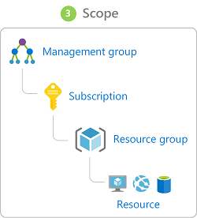
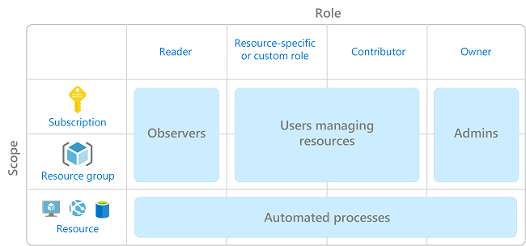

# Role-based access control

Group-based access rights and privileges are a good practice. Dealing with groups rather than individual users simplifies maintenance of access policies, provides consistent access management across teams, and reduces configuration errors. Assigning users to and removing users from appropriate groups helps keep current the privileges of a specific user. Azure [role-based access control (RBAC)](/azure/role-based-access-control/overview) offers fine-grained access management for resources organized around user roles.

For an overview of recommended RBAC practices as part of an identity and security strategy, see [Azure identity management and access control security best practices](/azure/security/fundamentals/identity-management-best-practices#use-role-based-access-control).

## Overview of role-based access control

By using [role-based access control](/azure/role-based-access-control/overview), you can separate duties within your team and grant only enough access for specific Azure Active Directory (Azure AD) users, groups, service principals, or managed identities to perform their jobs. Instead of giving everybody unrestricted access to your Azure subscription or resources, you can limit permissions for each set of resources.

[RBAC role definitions](/azure/role-based-access-control/role-definitions) list operations that are permitted or disallowed for users or groups assigned to that role. A role's [scope](/azure/role-based-access-control/overview#scope) specifies which resources these defined permissions apply to. Scopes can be specified at multiple levels: management group, subscription, resource group, or resource. Scopes are structured in a parent/child relationship.

For detailed instructions for assigning users and groups to specific roles and assigning roles to scopes, see [Manage access to Azure resources using RBAC](/azure/role-based-access-control/role-assignments-portal).

When planning your access control strategy, use a least-privilege access model that grants users only the permissions required to perform their work. The following diagram shows a suggested pattern for using RBAC through this approach.

> [!NOTE]
> The more specific or detailed permissions are that you define, the more likely it is that your access controls will become complex and difficult to manage. This is especially true as your cloud estate grows in size. Avoid resource-specific permissions. Instead, use [management groups](/azure/governance/management-groups) for enterprise-wide access control and [resource groups](/azure/azure-resource-manager/management/overview#resource-groups) for access control within subscriptions. Also avoid user-specific permissions. Instead, assign access to [groups in Azure AD](/azure/active-directory/fundamentals/active-directory-manage-groups).

## Use built-in RBAC roles

Azure provides a many built-in role definitions, with three core roles for providing access:

- The [Owner](/azure/role-based-access-control/built-in-roles#owner) role can manage everything, including access to resources.
- The [Contributor](/azure/role-based-access-control/built-in-roles#contributor) role can manage everything except access to resources.
- The [Reader](/azure/role-based-access-control/built-in-roles#reader) role can view everything but not make any changes.

Beginning from these core access levels, additional built-in roles provide more detailed controls for accessing specific resource types or Azure features. For example, you can manage access to virtual machines by using the following built-in roles:

- The [Virtual Machine Administrator Login role](/azure/role-based-access-control/built-in-roles#virtual-machine-administrator-login) can view virtual machines in the portal and sign in as `administrator`.
- The [Virtual Machine Contributor role](/azure/role-based-access-control/built-in-roles#virtual-machine-contributor) can manage virtual machines, but it can't access them or the virtual network or storage account they're connected to.
- The [Virtual Machine User Login role](/azure/role-based-access-control/built-in-roles#virtual-machine-user-login) can view virtual machines in the portal and sign in as a regular user.

For another example of using built-in roles to manage access to particular features, see the discussion on controlling access to cost-tracking features in [Track costs across business units, environments, or projects](../azure-best-practices/track-costs.md#provide-the-right-level-of-cost-access).

For a complete list of available built-in roles, see [Built-in roles for Azure resources](/azure/role-based-access-control/built-in-roles).

## Use custom roles

Although the roles built in to Azure support a wide variety of access control scenarios, they might not meet all the needs of your organization or team. For example, if you have a single group of users responsible for managing virtual machines and Azure SQL Database resources, you might want to create a custom role to optimize management of the required access controls.

The Azure RBAC documentation contains instructions on [creating custom roles](/azure/role-based-access-control/custom-roles), along with details on [how role definitions work](/azure/role-based-access-control/role-definitions).

## Separation of responsibilities and roles for large organizations

RBAC allows organizations to assign different teams to various management tasks within large cloud estates. It can allow Central IT teams to control core access and security features, while also giving software developers and other teams large amounts of control over specific workloads or groups of resources.

Most cloud environments can also benefit from an access-control strategy that uses multiple roles and emphasizes a separation of responsibilities between these roles. This approach requires that any significant change to resources or infrastructure involves multiple roles to complete, ensuring that more than one person must review and approve a change. This separation of responsibilities limits the ability of a single person to access sensitive data or introduce vulnerabilities without the knowledge of other team members.

The following table illustrates a common pattern for dividing IT responsibilities into separate custom roles:

| Group | Common role name | Responsibilities |
| --- | --- | --- |
| Security operations | SecOps | Provides general security oversight.   Establishes and enforces security policy such as encryption at rest.    Manages encryption keys.    Manages firewall rules. |
| Network operations | NetOps | Manages network configuration and operations within virtual networks, such as routes and peerings. |
| Systems operations | SysOps | Specifies compute and storage infrastructure options, and maintains resources that have been deployed. |
| Development, test, and operations | DevOps | Builds and deploys workload features and applications.    Operates features and applications to meet service-level agreements and other quality standards. |

The breakdown of actions and permissions in these standard roles are often the same across your applications, subscriptions, or entire cloud estate, even if these roles are performed by different people at different levels. Accordingly, you can create a common set of RBAC role definitions to apply across different scopes within your environment. Users and groups can then be assigned a common role, but only for the scope of resources, resource groups, subscriptions, or management groups that they're responsible for managing.

For example, in a [hub and spoke network topology](../azure-best-practices/hub-spoke-network-topology.md) with multiple subscriptions, you might have a common set of role definitions for the hub and all workload spokes. A hub subscription's NetOps role can be assigned to members of the organization's Central IT team, who are responsible for maintaining networking for shared services used by all workloads. A workload spoke subscription's NetOps role can then be assigned to members of that specific workload team, allowing them to configure networking within that subscription to best support their workload requirements. The same role definition is used for both, but scope-based assignments ensure that users have only the access that they need to perform their job.
