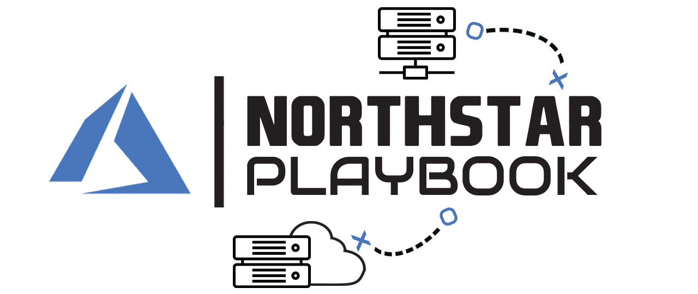

# North Star architecture guide

This guide expands the initial scope of the Cloud Adoption Framework's Ready methodology by exploring actionable architectural and implementation guidelines for large-scale enterprise Azure adoption, focusing on the platform “North Star” design that must occur prior to application deployments, to support cloud migrations and position customers on a strategic transformation path for cloud-native innovation.

In this regard, this guide is intended to support enterprise Azure adoption by leveraging learnings from previous engineering engagements to provide a common “North Star” design pattern, where the “North Star” represents a strategic and ever-evolving design path for the platform, that is fully aligned with growth and advancement of the Azure platform.

## Objective

The primary objective of this guide is to **help define a “North Star” architecture**, considering requisite design decisions across fundamental technical topics and “what-must-be-true” before organization wide Azure adoption can occur at large scale. This guide also outlines architectural guidance for large-scale Azure adoption to provide critical insights in support of enterprise-scale migration/transformation projects.

## Community

This guide is developed largely by **Microsoft Cloud Solutions Architects and the broader Cloud Solutions Unit technical community**. This community actively advances this guide to share lessons learned during enterprise-scale adoption efforts.

While this guide shares the same design principles as the standard Ready methodology, it expands upon those principles to integrate topics like governance and security, earlier in the planning process. This expansion of the standard process is necessary because of a few natural assumptions that can be made when an adoption effort requires large-scale enterprise change.

## Prerequisites

To fully leverage the guidance contained within this guide, readers must have a collaborative engagement with key customer stakeholders across critical technical domains, such as identity, security, and networking. Ultimately, the success of any large-scale migration hinges on cross-discipline cooperation within the customer organization, since key requisite ”North Star” design decisions are cross cutting, and to be authoritative must involve domain SMEs (Subject Matter Experts) and stakeholders within the customer.

It is also assumed that readers have a broad understanding of key Azure constructs and services in order to fully contextualize the prescriptive recommendations contained within this guide.

## Next steps

Review the [North Star architecture](./northstar-architecture.md)

> [!div class="nextstepaction"]
> [North Star architecture](./northstar-architecture.md)