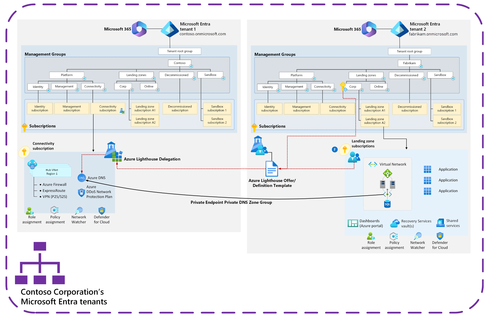

# Azure Lighthouse usage in Azure Landing Zones multi-tenant scenarios

[Azure Lighthouse](/azure/lighthouse/overview) enables multi-tenant management with scalability, higher automation, and enhanced governance across resources. Azure Lighthouse can be adopted in ALZ scenarios whether in single or multi-tenant architectures.

Review the below considerations, recommendations and common scenarios relating to Azure Lighthouse in ALZ deployments.

## Considerations

- Azure Lighthouse across Azure Clouds, for example Azure Public Cloud to Azure US Gov Cloud, isn't supported as documented [here](/azure/lighthouse/overview#cross-region-and-cloud-considerations)
- Azure Lighthouse only supports delegations of Subscriptions or Resource Groups, not Management Groups or tenants
  - However, there's a solution to onboarding multiple subscriptions within a Management Group as documented [here](/azure/lighthouse/how-to/onboard-management-group)
    - This policy follows the Azure landing zones design principle of [Policy-driven governance](/azure/cloud-adoption-framework/ready/landing-zone/design-principles#policy-driven-governance)
- Review the limitations on RBAC roles support with Azure Lighthouse in [Role support for Azure Lighthouse](/azure/lighthouse/concepts/tenants-users-roles#role-support-for-azure-lighthouse).

## Recommendations

- Review [Azure Lighthouse in enterprise scenarios](/azure/lighthouse/concepts/enterprise)
- If you're an ISV review [Azure Lighthouse in ISV scenarios](/azure/lighthouse/concepts/isv-scenarios)
- Use Azure Lighthouse in both directions between Azure Active Directory tenants to simplify management activities and reduce complex authentication and authorization scenarios
  - Removes reliance on Azure Active Directory B2B (Guest) accounts for user and workload identities or having separate accounts for some activities
- Utilize Azure Active Directory Privileged Identity Management (PIM) as part of your Azure Lighthouse delegations as documented [here](/azure/lighthouse/how-to/create-eligible-authorizations)
  - This feature requires Azure Active Directory Premium P2 licensing but only from the source/managing Azure Active Directory tenant

## Azure Landing Zones Specific Scenario - Azure Lighthouse + Private DNS at Scale

Below is an ALZ specific scenarios where Azure Lighthouse is used across multiple Azure Active Directory tenants to assist with Private Link and DNS integration.

Using Azure Lighthouse to allow Azure Policy for Private Endpoints Private DNS Zone automatic linking, as per [Private Link and DNS integration at scale](/azure/cloud-adoption-framework/ready/azure-best-practices/private-link-and-dns-integration-at-scale), in "spoke" Azure Active Directory tenants to the centralized Private DNS Zones in the "Hub" Azure Active Directory tenant.

This architecture also allows application landing zone owners to be granted access to make changes to Private DNS Zone via Azure Lighthouse delegation authorizations, if a different approach is being used to manage the Private Endpoints DNS configuration.

## Next steps

> [!div class="nextstepaction"]
> [Considerations & Recommendations for multi-tenant Azure Landing Zone scenarios](considerations-recommendations.md)
