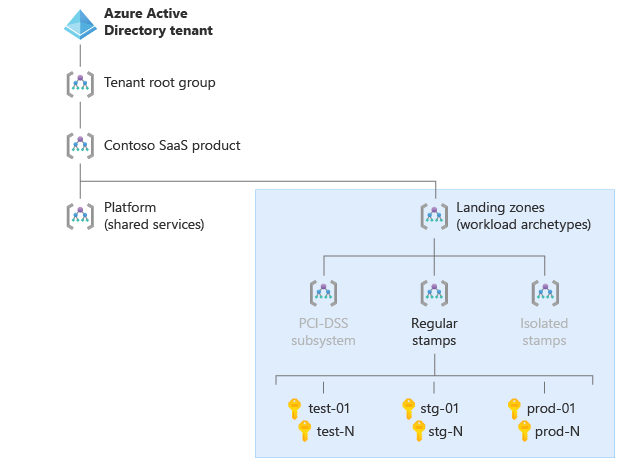
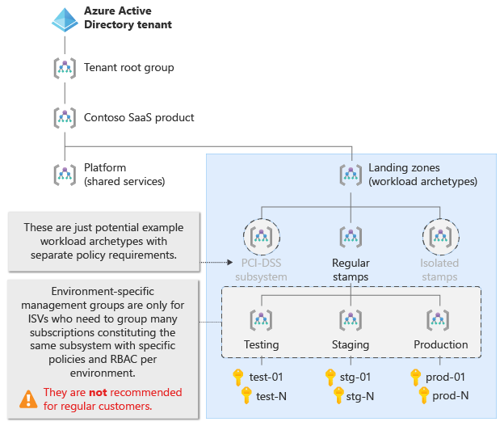
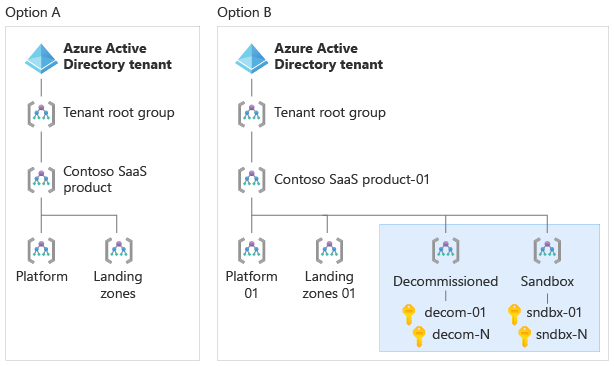
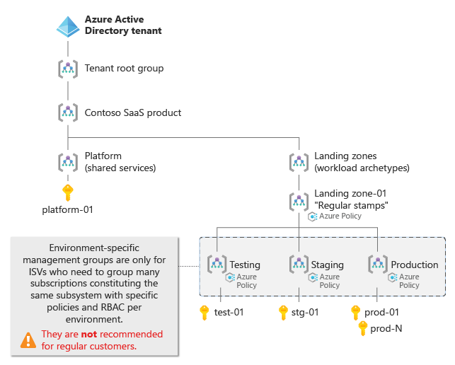
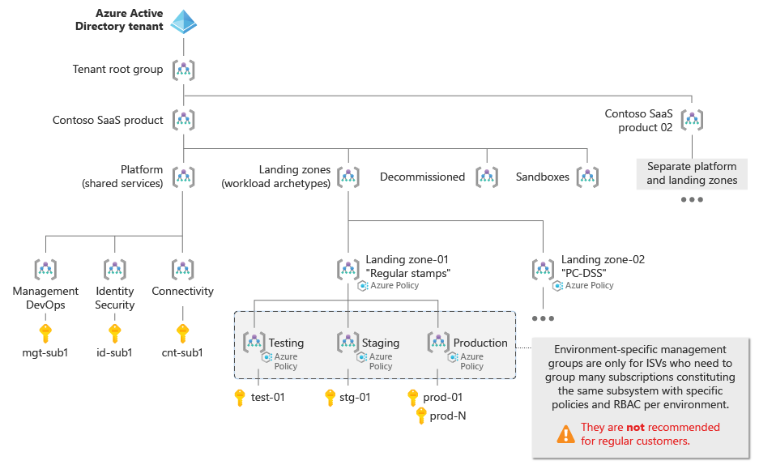

# Independent Software Vendor (ISV) considerations for Azure landing zones

> [!CAUTION]
> **Note to reviewers:** The diagrams on this article are in draft, and will be revised to the correct visual style before publication.

For many organizations, the [Azure landing zones](./index.md) conceptual architecture represents the destination in their cloud adoption journey. Landing zones describe how you can build an Azure environment with multiple subscriptions. A landing zone accounts for scale, security, governance, networking, and identity. It's based on feedback and lessons learned from many customers.

> [!TIP]
> It can be helpful to think about Azure landing zones as being like a city plan. The architectures of the specific workloads deployed into a landing zone are like the plans for buildings in the city.
>
> For example, water, gas, electricity, and transport links are all required before any buildings are constructed. The same applies for Azure. The components of Azure landing zones, including management groups, policies subscriptions, and role-based access control (RBAC), are all required before any production workloads can be deployed.

As an Independent Software Vendor (ISV) building and operating your solution on Azure, you should refer to the following resources:

* [Azure landing zones](index.md): This article provides guidance for your overall Azure environment.
* [Azure Well-Architected Framework](/azure/architecture/framework/): The Well-Architected Framework provides architectural guidance applicable to all workloads.
* [Architecting multitenant solutions on Azure](/azure/architecture/guide/multitenant/overview): If you build a **multitenant** solution on Azure, this series provides specific guidance to help you architect your solution for multitenancy.

The Azure landing zones conceptual architecture helps you to set a direction for your overall Azure environment. But as an ISV, SaaS provider, or startup, your specific implementation might vary from regular customer scenarios. Some example differences include:

* Your company's operating model might separate the role of the corporate IT team from the SaaS product teams. Your corporate IT team manages your organization's resources such as your Azure Active Directory (Azure AD) tenant, Microsoft Office 365, and Microsoft Teams. The SaaS product teams build and operate your SaaS product, including its central platform and identity components.
* You are a small ISV or startup and want to start with lowest possible cost and don't want to initially utilize some services like Azure Firewall.
* You are a large SaaS ISV planning to split your SaaS application across multiple subscriptions for scale. You want to group subscriptions to correspond to your development, test, staging, and production environments.
* You have your own *control plane*: automation scripts or software that deploys and configures the Azure resources for your SaaS solutions.
* You are building software that customers deploy into their own subscriptions.

> [!NOTE]
> Sometimes ISVs want to start with just one Azure subscription including both platform "shared services" aspects like the logging infrastructure and the actual workload resources. Although it is technically possible, challenges will surface later when you want central platform team to managed the shared components or want to partition the workload across subscriptions for growth, since you will need to move resources between subscriptions and not all [resource types can be moved](/azure/cloud-adoption-framework/ready/enterprise-scale/transition#moving-resources-in-azure). Review the [impact of design deviations](/azure/cloud-adoption-framework/ready/enterprise-scale/design-principles#impact-of-design-deviations).

ISV solutions often fit one of three deployment models: pure SaaS, customer-deployed, or dual deployment SaaS. In this article, we outline how each of these models requires different key considerations for Azure landing zones.

## ISV deployment models

### Pure SaaS

In the pure SaaS model, the ISV's software is deployed fully in the ISV's own Azure subscriptions. End customers consume the software without deploying it in their own Azure subscriptions. In the following diagram, a user is using a pure SaaS application provided by an ISV:

Examples of pure SaaS software include email-as-a-service, Kafka-as-a-service, cloud-data-warehouse-as-a-service, and many [SaaS listings in Azure Marketplace](https://azuremarketplace.microsoft.com/marketplace/apps?filters=saas).

If you're a small SaaS ISV, then at first you might not need to use multiple Azure subscriptions to deploy your resources. As you scale, Azure's subscription limits can affect your ability to scale within a single subscription. Review the [enterprise-scale landing zone design principles](../enterprise-scale/design-principles.md), such as subscription democratization, and familiarize yourself with the [architectural approaches for multitenancy](/azure/architecture/guide/multitenant/approaches/overview), to plan for future growth as required.

ISVs building pure SaaS solutions should consider the following questions:

* Will all of the Azure resources that make up the SaaS solution be in one Azure subscription, or will they be partitioned across multiple Azure subscriptions?
* Should each customer of an ISV's SaaS solution be hosted in a dedicated Azure subscription, or can resources be created in one or a few shared subscriptions?
* How should you apply the [Deployment Stamp (scale unit) pattern](/azure/architecture/guide/multitenant/approaches/overview) for all of the tiers of your solution?
* How should you think about [Azure resource organization in multitenant solutions](/azure/architecture/guide/multitenant/approaches/resource-organization) to avoid facing scale challenges and Azure subscription limits?

### Customer-deployed

In the customer-deployed model, end customers purchase software from the ISV and then deploy it into their own Azure subscriptions. The deployment might be initiated from the Azure Marketplace, or it might be manually deployed by the customer following instructions and using scripts provided by the ISV. In the following diagram, an ISV provides software packages or an Azure Marketplace catalog product, and customers deploy the resources into their own Azure subscriptions alongside their other workloads:

Customers frequently deploy multiple products from different ISVs into their Azure subscriptions. They compose these individual products into a solution. For example, they might deploy a database product from one ISV, a network virtual appliance from another ISV, and a web application from a third ISV. Because of this, the *Customer's other workload* element the diagram above might represent either customer's own workload or another ISV product deployed within the customer's Azure subscription.

Examples of customer-deployed ISV products include network-virtual-appliances, storage-virtual-appliances, and many [virtual machine images](https://azuremarketplace.microsoft.com/marketplace/apps?filters=virtual-machine-images) and [Azure applications](https://azuremarketplace.microsoft.com/marketplace/apps?filters=solution-templates) in the Azure Marketplace.

For some customer-deployed solutions, ISVs, Solution Integrators (SIs), or Managed Service Providers (MSPs) provide management and updates of the solution deployed within the end-customer Azure subscriptions by using [Azure Lighthouse](/azure/lighthouse/overview) or [Azure Managed Applications](/azure/azure-resource-manager/managed-applications/overview).

Customer-deployed ISV solutions would be considered a standard application workload from the perspective of Azure landing zones. As an ISV building customer-deployed software, it's important to consider the [Azure landing zones guidance](index.md) to ensure you design your software so that it is compatible with the [Azure landing zones design principles](../enterprise-scale/design-principles.md) adopted by your Azure customers.

When an ISV is migrating their existing customers' workloads to Azure, it's especially important for the ISV to have a good understanding of the Azure landing zone concepts.

ISVs building solutions that customers will deploy into their own subscriptions should consider the following questions:

* When should the customer deploy the ISV solution into its own dedicated subscription, and when should it be deployed into an existing subscription that contains related workloads?
* How should customers establish network connectivity between their existing workloads (inside or out of Azure) and the ISV solution being deployed?
* Does the ISV solution support authentication mechanisms provided by Azure AD? Or, does it require protocols like LDAP or Kerberos?
* How can the ISV reduce or eliminate Azure Policy violations? These might be caused by a conflict between the ISV's solution templates and customer's Azure policies. For example, customers can have policies like "All subnets must have a Network Security Group" or "No Public IPs can be attached to NICs in the Corp landing zone".

### Dual deployment SaaS

Some SaaS solutions interact with or use resources that are deployed in the customers' Azure subscriptions. This deployment model is sometimes called *dual deployment SaaS* or *SaaS hybrid*. In the following diagram, an ISV provides a hosted SaaS solution that interacts with resources deployed into an end customer's Azure subscription:

For example, Power BI is a SaaS service that, optionally, uses a Power BI On-Premises Data Gateway deployed on a VM in the customer's Azure subscription. Contoso Virtual Desktop Manager provides a SaaS console interface to control Azure Virtual Desktop resources in the customer's Azure subscriptions. Fabrikam provides a SaaS console for data analytics, and dynamically creates and deletes compute node virtual machines in the customer's Azure subscription.

As a dual deployment ISV, you should refer to the Azure landing zone for guidance on both how to structure your own Azure environment, which hosts your SaaS service, and how to make the components that deploy into your customers' Azure subscriptions interact correctly with the customers' Azure landing zones.

ISVs building dual deployment SaaS solutions should consider the following points:

* Review all of the considerations applicable to ISVs building pure SaaS and customer-deployed solutions.
* Which components of the solution will be hosted in the ISV's own Azure subscriptions and which components will be customer-deployed?
* How will you ensure secure provisioning and interactions with the resources deployed in the customer Azure subscriptions?

## Azure landing zone design principles and implementations

[Azure's landing zone design principles](../enterprise-scale/design-principles.md) recommend aligning to Azure-native platform capabilities such as Log Analytics, Azure Monitor, and Azure Firewall. They also provide specific [Azure landing zone implementation options](./implementation-options.md).

As an ISV, you might have reasons to implement your own landing zone environments. For example, you might need to use your own automation to deploy Azure resources across subscriptions. This is sometimes called the *control plane* of your solution. You might also decide to continue using your existing preferred tools for logging, monitoring, and other similar platform-layer services.

Even in these situations, we recommend you use Azure landing zone guidance and sample implementations as a reference, and as a way to align your approach to proven landing zone designs for Azure's enterprise customers.

## Azure AD tenants

Each Azure landing zone and its management group hierarchy is rooted in *one* Azure Active Directory (Azure AD) tenant. This means that the first decision you need to make is **which Azure AD tenant will be used as the source of identities for managing your Azure resources**. Identities in the directory include users, groups, and service principals.

> [!TIP]
> The Azure AD tenant you select for your landing zone doesn't affect your application-level authentication. Regardless of the landing zone's tenant, you can still use other identity providers like Azure AD B2C.

The [guidance for Azure landing zones and Azure AD tenants](./design-area/azure-ad-define.md) strongly recommends using a single Azure AD tenant. This is the correct approach for most customers. However, as a SaaS ISV, you might have reasons to separate the Azure AD tenant used by your SaaS operations team from the Azure AD tenant used by your own internal or corporate IT team.

For some SaaS ISVs, one teams manages the corporate resources and a separate team operates the SaaS solution. This separation can be for operational reasons, or to comply with regulatory requirements. For example, the corporate IT team might not be allowed to manage the SaaS-related subscriptions and resources, and can't be administrators of the Azure AD tenant. If this scenario applies to you, consider using two separate Azure AD tenants: one Azure AD tenant for corporate IT resources like Office 365, and a separate Azure AD tenant for Azure resources that comprise the SaaS solution. Use separate domain names for each Azure AD tenant. For example, you might use `contoso.com` for your corporate Azure AD tenant, and `ContosoSaaSOps.com` for your SaaS Azure AD tenant.

> [!WARNING]
> When you use multiple Azure AD tenants, you will have higher management overhead. You should only use multiple Azure AD tenants when it's required. Additionally, if you use Azure AD Premium features like Privileged Identity Management, you need to purchase the license for each of your Azure AD tenants, which can increase your costs.

Avoid using separate Azure AD tenants for pre-production and production environments. For example, don't create tenants like `ContosoSaaSOpsPreProd.com` and `ContosoSaaSOpsProd.com` with separate Azure subscriptions under each one. Instead, use a single Azure AD tenant, and use management groups and Azure RBAC to govern the access to subscriptions and resources under that single tenant.

For more information on the using multiple Azure AD tenants, see the [securing Azure environments with Azure Active Directory whitepaper](https://azure.microsoft.com/resources/securing-azure-environments-with-azure-active-directory/).

## Management groups

[The Azure landing zone conceptual architecture](index.md#azure-landing-zone-conceptual-architecture) recommends using a specific management group hierarchy. ISVs sometimes have different requirements to other customers. This section describes some areas in which you might adopt different practices from the standard landing zone conceptual architecture.

### Top-level management group

The hierarchy is nested under the Azure-created **Tenant root group** management group, and you don't use the tenant root group directly.

For a regular customer, who has a centralized corporate IT team managing the platform and shared services like logging, networking, identity, and security, there is usually one top-level management group, which is created under the **Tenant root group**. The top-level management group is usually named after the customer, such as *Contoso*, and the rest of the management groups are deployed below that top-level management group.

As a SaaS ISV, you might have one SaaS product, or you might have a few completely separate SaaS products or lines of business. As discussed in the [Azure AD tenants](#azure-ad-tenants) section, the Azure AD tenant used for managing Azure resources should be the same across all of your products. But, in some scenarios, you might choose to deploy multiple management group hierarchies.

Consider how independent your products are from each other, and ask yourself these questions:

- Do all of your products use the same platforms for DevOps, identity, security, connectivity, and logging?
- Are those shared services operated by a single central team, such as corporate IT or the cross-product SaaS operations team?

If the answers to both of these questions is yes, then you should have one top-level **SaaS Product** management group under the **Tenant root group**.

However, if each of the SaaS products is managed and operated by completely separate platform teams, consider creating separate top-level management groups for each of the SaaS products, such as **SaaS Product-01** and **SaaS Product-02**. Each product's top-level management group has its own landing zone management group hierarchy, which includes the elements described later in this article.

> [!TIP]
> It's uncommon for one ISV to have more than just a few top-level management groups. Often, several products can be combined together due to similarities in how they're managed and operated.

This approach is similar to the [testing approach for enterprise-scale landing zones](../enterprise-scale/testing-approach.md#example-scenarios-and-outcomes), but instead of *Contoso* and *Contoso-Canary*, as a SaaS ISV with completely separate products with their own individual platforms, you would have *Contoso-SaaS-Product-01*, *Contoso-SaaS-Product-02*, and *Contoso-SaaS-Product-03*.

### Platform management group

In the [Azure landing zone resource organization hierarchy](./design-area/resource-org-management-groups.md#management-groups-in-the-azure-landing-zone-accelerator), the **Platform** management group contains all of the Azure subscriptions that host the shared services and components used by workloads in the landing zone subscriptions. Example components that are deployed into the platform or shared services subscriptions include centralized logging infrastructure such as Log Analytics workspaces, DevOps, security, and automation tooling, central networking resources such as hub-VNet and DDos Protection plans, and the ISV's own control plane services.

For convenient separation of roles and policies for enterprise customers, the **Platform** management group is frequently partitioned into three child management groups: **Identity**, **Management**, and **Connectivity**. In your organization, you might have a single team to manage all of the shared platform components like networking, identity, and management. If this is the case, and if you have no plans to separate the management across multiple teams, then consider using a single **Platform** management group. Within that management group, start by deploying one **Platform** Azure subscription.

However, if you expect to need separate policies for different parts of the centralized platform, you should deploy the additional levels in the management group hierarchy under the **Platform** management group. This ensure you can separate the components that will be managed by different teams.

The following diagram illustrates two potential implementations of the **Platform** management group. Option A shows a more comprehensive scenario, where the **Platform** management group contains three child management groups: **Management and DevOps**, **Identity and Security**, and **Connectivity**, each containing a subscription with the relevant resources. Option B shows a simple scenario, where the **Platform** management group contains a single platform subscription.

### Landing Zones management group

The **Landing Zones** management group contains the Azure subscriptions that host the actual subsystems and workloads of your SaaS solution.

This management group contains one or more child management groups. Each of the child management groups under the **Landing Zones** management group represents a workload or subsystem *archetype*, with consistent policy and access requirements that should apply to all subscriptions. Example scenarios for using multiple archetypes include:

- **Compliance:** If a subsystem of your SaaS product needs to be PCI-DSS compliant, consider creating a **PCI DSS** archetype child management group under **Landing Zones**. All of the Azure subscriptions that contain resources in scope of the PCI-DSS compliance should be placed within that management group.
- **Tiers:** Consider creating separate landing zone archetypes for your SaaS solution's *dedicated* tier and *free* tier customers. Each of the child management groups contains different Azure Policy settings. For example, the policies in the free tier might restrict deployments to only enable specific virtual machine SKUs, and the policies in the dedicated tier might require resources to be deployed into specific regions.

### Environment-specific management groups

SaaS ISVs often organize their cloud environments by modeling their software development lifecycle environments through a sequence. Commonly, this requires deployment first to a *Development* environment, then a *Test* environment, a *Staging* environment, and then to the *Production* environment. One common difference between the environments is the Azure RBAC rules, such as who can access these groups of subscriptions. For example, the DevOps, SaaSOps, development, and test teams might have different levels of access to different environments.

> [!WARNING]
> Most Azure customers use separate Azure subscriptions for each application team and have hundreds of applications. If each application had its own development, test, staging, and production management group there would be a very large number of management groups with almost identical policies. The [Enterprise-Scale Landing Zone FAQ](../enterprise-scale/faq.md#how-do-we-handle-devtestproduction-workload-landing-zones-in-enterprise-scale-architecture) advises against using separate management groups for each environment for most customers. Instead, it advises using separate subscriptions within a single management group.
>
> However, SaaS ISVs can have different requirements to most other Azure customers, and might have good reason to use environment-specific management groups in some situations.

SaaS ISVs might need to group multiple subscriptions that represent *shards* or *partitions* of the same subsystem, application, or workload. If you have specific requirements to have policies or role assignments applied to these groups of subscriptions in way that's noticeably different from the archetype management group, you can consider creating child management groups that correspond to each environment under the archetype management group.

The following diagrams illustrate two potential options. Option A represents a scenario where you use separate subscriptions for each environment but don't create environment-specific management groups. Option B shows a SaaS ISV scenario with environment-specific management groups under the **Regular stamps** management group. Each environment-specific management group contains multiple subscriptions. Over time, the ISV scales their Azure resources in each environment across an increasing number of subscriptions with a common set of policies and role assignments.

Select each tab to see the two diagrams.

#### [Option A](#tab/mg-env-no)

#### [Option B](#tab/mg-env-yes)

---

### Decommissioned and Sandboxes management groups

The Azure landing zone [resource organization guidance](./design-area/resource-org-management-groups.md#management-groups-in-the-azure-landing-zone-accelerator) recommends including **Decommissioned** and **Sandboxes** management groups directly below the top-level management group.

The **Decommissioned** management group is the holding place for Azure subscriptions that are being disabled and will eventually be deleted. A subscription that's no longer in use could be moved to this management group for tracking it until all of the resources in the subscription are permanently deleted.

The **Sandboxes** management group usually contains Azure subscriptions that are used for exploration purposes and have loose or no policies applied to them. For example, you might provide individual developers with their own subscriptions for development and testing. To increase the agility of the developers and to enable them to easily experiment with Azure, you could consider placing them in the **Sandboxes** management group. By doing so, you avoid the normal policies and governance being applied to these subscriptions.

> [!IMPORTANT]
> Subscriptions in the **Sandboxes** management group should not have direct connectivity to the landing zone subscriptions. Avoid connecting sandbox subscriptions to production workloads, or to any non-production environments that mirror production environments.

The following diagram illustrates two potential options. Option A does not includes the **Decommissioned** and **Sandbox** management groups, while option B does.

### Example ISV landing zones

This section includes two examples of an Azure landing zone structure for a SaaS ISV. Select each tab to compare the two example landing zones.

#### [Minimal](#tab/minimal)

The following diagram shows an example SaaS ISV Azure landing zones hierarchy with the following characteristics:

- The ISV decided to keep all of their platform components in a single Azure subscription, instead of [splitting them into multiple platform management groups](#platform-management-group).
- There is only one [landing zone management group](#landing-zones-management-group).
- The landing zone includes [environment-specific management groups](#landing-zones-management-group) for organizing the subscriptions and assigning different policies and role assigments.
- The ISV decided not to include the management groups for [decommissioned and sandbox subscriptions](#decommissioned-and-sandboxes-management-groups).

#### [Comprehensive](#tab/comprehensive)

The following diagram shows an example SaaS ISV Azure landing zones hierarchy with the following characteristics:

- The landing zone with complete platform-level separation between a few different SaaS products (**Contoso SaaS Product 01** and **Contoso SaaS Product 02**), each with their own platform.
- The ISV decided to keep all of their platform components in a single Azure subscription, instead of [splitting them into multiple platform management groups](#platform-management-group).
- There are two [landing zone management groups](#landing-zones-management-group) (**Regular stamps** and **PCI-DSS**).
- The landing zone includes [environment-specific management groups](#landing-zones-management-group) for organizing the subscriptions and assigning different policies and role assignments.
- The ISV decided to include the management groups for [decommissioned and sandbox subscriptions](#decommissioned-and-sandboxes-management-groups).

---

## Next steps

* If you're building a multitenant solution, learn more about [architecting multitenant solutions on Azure](/azure/architecture/guide/multitenant/overview).
* Learn [what is an Azure landing zone](index.md).
* Learn about [Azure landing zone design areas](design-areas.md).
