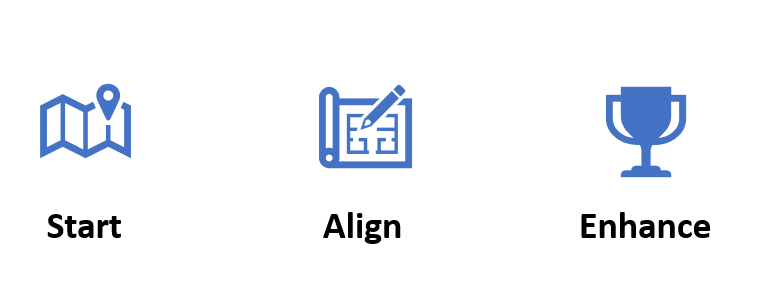

# Journey towards the target architecture

Adopting cloud technologies is a journey.

Business priorities and the need to bring new technologies online in order to unlock capabilities or features will influence the speed at which an organization deploys and scales out a cloud environment.

Over time, the organization iterates and matures the deployed technologies, processes and skilling to progress towards that destination.

However, this doesn't mean you arrive at the destination immediately, the journey takes time - which will vary depending on the size of the organization, the current technical footprint and the skilling maturity within technical teams.

If we use the analogy of a trip along a freeway there might be a number of different *on-ramps* to join onto the freeway - but the *destination* is the same.

Those on-ramps represent where organizations are today in their cloud adoption plans and the specific guidance needed to continue to develop the cloud environment:

| On-ramp | Description | Further guidance |
|---------|---------|---------|
|**Start** |For organizations who are at the beginning of their cloud adoption journey (also referred to as 'greenfield') who are looking to implement a new cloud environment, based on best practices and proven architectural patterns.   Start with the Azure landing zone conceptual architecture to understand the recommended end state.   Next, explore each of the design areas to understand the key themes that comprise the considerations and decisions needed in order to design and implement the landing zone that best fits your requirements   | [What is an Azure Landing Zone](./index.md)   [Azure Landing Zone Design areas](./design-areas.md) |
|**Refactor** | For organziations who have an existing environment that needs modification to adopt the best practices (also referred to as 'brownfield).   Use the transition from brownfield guidance in order to understand the decision points and technical approach to refactoring environments to align with the guidance in the Ready methodology|[Refactor a landing zone](./refactor.md) |
|**Enhance** | For environments that are already in line with the best practices but the organization is looking to add additional controls or features.   Explore the articles that explain the considerations as part of enhancing the key on-going processes for cloud environments, such as management, governance and security.| [Enhance guidance for management](../considerations/landing-zone-operations.md)   [Enhance guidance for governance](../considerations/landing-zone-governance.md)   [Enhance guidance for security](../considerations/landing-zone-security.md) |

## Next steps

To understand the decisions you need to make when implementing an Azure landing zone, explore the Azure landing zone design areas in order to understand the specific technical topics to consider.

> [!div class="nextstepaction"]
> [Azure Landing Zone design areas](./design-areas.md)