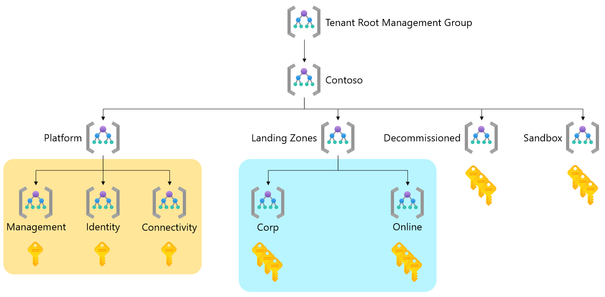
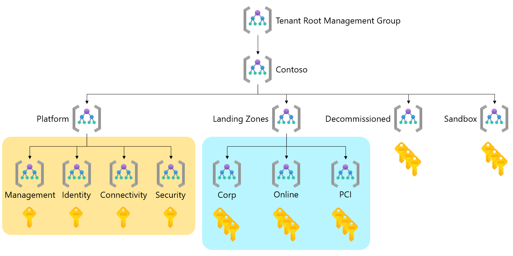

# Tailoring the Azure Landing Zones Architecture to meet requirements

As part of the Azure landing zone (ALZ) guidance, there are several reference [implementation options](/azure/cloud-adoption-framework/ready/enterprise-scale/implementation) available; ALZ with Virtual WAN, ALZ with traditional Hub & Spoke, ALZ foundation, ALZ for small enterprises. These are provided to help organizations get started quickly, using configurations that deliver the Azure landing zone conceptual architecture and the best practices in the design areas.

The reference implementations are based on a wealth of best practice and learnings from teams across Microsoft from engagements with customers and our partners and represent the '80' side of the 80/20 rule. The various implementations take opinionated positions of technical decisions that are part of the architecture design process.

At the same time, it should be acknowledged that not all use cases are the same, not all organizations can use an implementation approach in the exact way it was intended. For those situations, organizations should explore this guidance and understand the considerations needed when a requirement for tailoring is identified.

## What is a "landing zone archetype" in Azure Landing Zones?

A landing zone archetype describes what needs to be true to ensure a landing zone (Azure Subscription) will meet the expected environment and compliance requirements at a given scope. This can include the following:

- Azure Policy Assignments
- Role-Based Access Control (RBAC) Assignments
- Centrally managed Resources (networking etc.)

You can consider each Management Group in the resource hierarchy as contributing to the final landing zone archetype output due to the way policy inheritance works in Azure. As such, it's important to think about what is already being applied at the levels above in the resource hierarchy when designing lower levels.

Although there's a close relationship between Management Groups and landing zone archetypes, a Management Group alone is not a landing zone archetype. Instead, it forms part of the framework used to implement each of the landing zone archetypes in your environment.

This can be seen in the Azure landing zone conceptual architecture where Policy Assignments are created at the intermediate root Management Group, 'Contoso', for settings which must apply to all workloads, with additional Policy Assignments created at lower levels of the hierarchy for more specific requirements.

Subscription placement within the Management Group hierarchy determines the resultant set of Azure Policy and Access control (IAM) assignments that are inherited, applied and enforced to that particular landing zone (Azure Subscription).

Additional processes and tooling might be required to ensure a landing zone has the required centrally managed Resources. This might include, but is not limited to:

- Diagnostic settings to send activity log data to a Log Analytics workspace
- Continuous export settings for Microsoft Defender for Cloud
- Virtual Network (VNet) with managed IP address spaces for application workloads
- Linking of Virtual Networks to a DDoS Standard Plan

>[!NOTE]
> In the Azure Landing Zone reference implementations, Azure Policies with the `DeployIfNotExists` and `Modify` [effects](/azure/governance/policy/concepts/effects) are used to achieve the deployment of some of the above resources; following the [Policy-driven governance](/azure/cloud-adoption-framework/ready/enterprise-scale/design-principles#policy-driven-governance) design principle.
> 
> See [Adopt policy-driven guardrails](/azure/cloud-adoption-framework/ready/enterprise-scale/dine-guidance) for more information

## Azure Landing Zones Conceptual Architectures "built-in" Archetypes

Although the conceptual architecture includes example landing zone archetypes for application workloads such as 'Corp', and 'Online', which might be applicable to you and meet the requirements you have. You might want to make changes to these or create new ones entirely, depending on your organizations needs and requirements.

>[!TIP]
> Review the landing zone archetypes in the Azure Landing Zone accelerator here: [Management groups in the Azure landing zone accelerator](/azure/cloud-adoption-framework/ready/landing-zone/design-area/resource-org-management-groups#management-groups-in-the-azure-landing-zone-accelerator)

You might also want to create changes elsewhere in the resource hierarchy. When planning the hierarchy for your implementation of Azure landing zones for your organization, follow the guidelines in the [design areas.](/azure/cloud-adoption-framework/ready/landing-zone/design-areas)

Taking some of the examples landing zone archetypes from the conceptual architecture, the below will help you understand their purpose and intended usage:

| Landing Zone Archetype (Management Group) | Purpose/Usage                                                                                                                                                                                                                                                          |
| ----------------------------------------- | ---------------------------------------------------------------------------------------------------------------------------------------------------------------------------------------------------------------------------------------------------------------------- |
| Corp                                      | Workloads, such as internal systems used to run the business which shouldn't be publicly facing on the internet directly, but can be via a firewall or NVA in the central hub VNet/s in the connectivity subscription/s. Can be thought of more as "private" workloads. |
| Online                                    | Workloads, such as directly publicly facing, internet, web apps. These might also have hybrid connectivity and peering to other VNets, including on-premises.                                                                                                          |
| Sandbox | Workloads, that are in the early stages of development, testing or ideation that require a less restrictive resultant set of policies applied to allow innovation. For example, you might allow access to services that are otherwise restricted in the rest of your hierarchy, within the sandbox management group.

## Scenarios where tailoring might be required

As mentioned above we provide some common landing zone archetypes in [Azure Landing Zone Conceptual Architecture](/azure/cloud-adoption-framework/ready/landing-zone/#azure-landing-zone-conceptual-architecture) of 'Corp', 'Online'. However, these are not fixed and the only permitted landing zone archetypes for application workloads. It is anticipated that some customers and partners will need to tailor the landing zone archetypes to suit their needs and requirements. 

Before a customer or partner tailors the landing zone archetypes it is important to understand the concepts (detailed above on this page) and also visualize the area of the hierarchy that we suggest you customize, as shown below:

***Azure Landing Zone Conceptual Architecture Default Hierarchy***

The Azure Landing Zone Conceptual Architecture default hierarchy is show above with two areas of the hierarchy highlighted, one beneath 'Landing Zones' and the other beneath 'Platform'. 

### Tailoring Application Landing Zone Archetypes

The area highlighted in blue, beneath the 'Landing Zones' Management Group is the **most common and safest** place in the hierarchy to add additional archetypes to meet new or additional requirements that cannot be added as additional policy assignments to an existing archetype utilizing the existing hierarchy. 

For example, a customer with a new requirement to host a set of application workloads that need to meet PCI compliance requirements but it doesn't need to apply to all workloads for the customer across their entire estate. The simplest and safest way for the customer to meet this new requirement is to create a new Management Group called 'PCI' beneath the 'Landing Zones' Management Group in the hierarchy and assign additional policies like the [Microsoft Defender for Cloud Regulatory Compliance](/azure/defender-for-cloud/update-regulatory-compliance-packages) policy initiative for [PCI v3.2.1:2018](/azure/governance/policy/samples/built-in-initiatives#regulatory-compliance) to the new 'PCI' Management Group; this forms a new archetype.

The customer can then place new or move existing Azure Subscriptions into the new 'PCI' Management Group to make it inherit the required additional policies; forming the new archetype. 

>[!TIP]
> Guidance on what to consider and what happens when moving Azure Subscriptions between Management Groups in relation to RBAC and Azure Policy can be found [here.](/azure/cloud-adoption-framework/ready/enterprise-scale/transition#subscription-move)

### Tailoring Platform Landing Zone Archetypes

Some customers might also wish to tailor the area highlighted in orange, beneath the 'Platform' management group. These are referred to as platform landing zones.

For example, a customer might have a dedicated SOC team that require their own archetype to host their workloads that need to meet a different set of Azure Policy and RBAC assignment requirements than what the 'Management' Management Group does. Therefore the customer can create a new 'Security' Management Group beneath the 'Platform' Management Group and make the required Azure Policy and RBAC assignments to it and then place new or move existing Azure Subscriptions into the new 'Security' Management Group to make it inherit the required additional policies; forming the new archetype. 

### Example of a Tailored Azure Landing Zone Hierarchy

The below diagram shows a tailored Azure Landing Zone hierarchy, using the examples from above:

***Tailored Azure Landing Zone Hierarchy***

## Important points to consider and follow when tailoring

Below are some important points to consider and follow when considering to tailoring your implementation of the Azure Landing Zones archetypes in the hierarchy.

- Tailoring the hierarchy is not mandatory, the default archetypes and hierarchy we provide is suitable for majority of scenarios
- Do not re-create your organizational hierarchy, teams or departments in archetypes
- Always try to build upon the existing archetypes and hierarchy to meet new requirements
- Only create new archetypes when truly needed
  - For example, a new compliance requirement (PCI) is required for only a subset of application workloads and doesn't need to apply to all workloads
- Only create new archetypes in the highlighted areas in the above diagrams
- Avoid going beyond 4 layers of hierarchy depth to avoid complexity and unnecessary exclusions etc.
  - Instead, expand archetypes horizontally instead of vertically in the hierarchy
- Do not create archetypes for environments (Development, Test, Production)
  - See [How do we handle "dev/test/production" workload landing zones in the Azure Landing Zones conceptual architecture?](/azure/cloud-adoption-framework/ready/enterprise-scale/faq#how-do-we-handle-devtestproduction-workload-landing-zones-in-enterprise-scale-architecture)