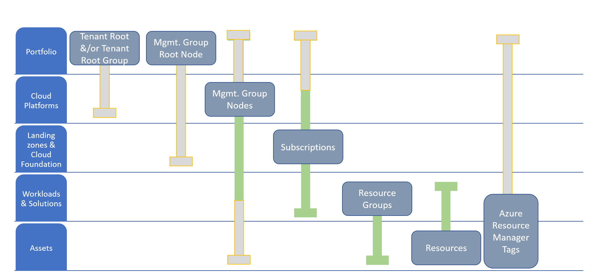

<!-- markdownlint-disable MD026 -->

# How do Azure products support the portfolio hierarchy?

In [Understanding and aligning the portfolio hierarchy](./hosting-hierarchy.md), a set of definitions for the portfolio hierarchy and role mapping established a hierarchy of scope for most portfolio approaches. As described in that article, you may not need each of the levels or _scopes_ outlined below. Minimizing the number of layers reduces complexity, so these layers should not all be viewed as a required best practice.

This article shows how each level or scope of the hierarchy is supported in Azure through organizational tools, deployment and governance tools, and some solutions in the Cloud Adoption Framework.

## Organizing the hierarchy in Azure

Azure Resource Manager includes several organizational approaches that help organize assets at each level of the cloud hierarchy.

> [!NOTE]
> The slide bars below demonstrate common variants in alignment. The gray parts of the slide bars are common but should only be used when required by a specific business requirement. The points following the image below describe only the suggested best practice.

- **Portfolio:** The enterprise or business unit probably won't contain any technical assets, but might affect cost decisions. The enterprise and business units should be represented in the root nodes of the management group hierarchy.
- **Cloud platforms:** Each environment should have its own node in the management group hierarchy.
- **Landing zones and platform foundations:** Each landing zone should be represented as a subscription. Likewise, platform foundations should be contained in their own subscriptions. There are various subscription designs that could call for a subscription per cloud or per workload, which would change the organizing tool for each.
- **Workload:** Each workload should be represented as a resource group. Resource groups are also commonly used to represent solutions, deployments, or other technical grouping of assets.
- **Asset:** Each asset is inherently represented as a resource in Azure.

### Organize with tags

Variants from the best practice are common. Deviations from the above best practice should be recorded by tagging all assets with a tag to represent each of the relevant layers of the hierarchy. For more information, see [Recommended naming and tagging conventions](../../ready/azure-best-practices/naming-and-tagging.md).
