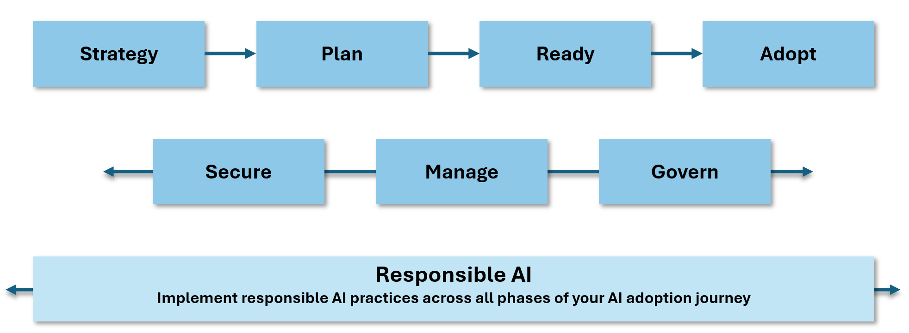

# Responsible AI adoption

- Intro to Responsible AI, and why it matters when adopting AI into your organization.

## The Responsible AI Principles

Microsoft believes in [empowering responsible AI practices](https://www.microsoft.com/ai/responsible-ai).

There are **six key principles** for responsible AI:

- **Fairness**: AI systems should treat all people fairly. The same recommendations should be made to everyone. Fairness is important to ensure that AI systems don't discriminate against people based on their personal characteristics.
- **Reliability and safety**: Operating reliably, safely, and consistency under a variety of conditions is important for AI systems to help build trust.
- **Privacy and security**: AI systems should respect privacy and maintain security, protecting private and confidential information, and resist attacks and attempts to corrupt or compromise the system.
- **Inclusiveness**: AI systems should empower everyone and engage people. Inclusive design practices can help AI system developers understand and address potential exclusion barriers in a product or service. Inclusiveness helps create opportunities to innovate and design experiences that benefit everyone.
- **Transparency**: AI systems should be transparent and understandable. AI systems might help inform decisions that have great impact on people's lives, so it's important that people understand how these decisions are made.
- **Accountability**: AI systems, and people designing and deploying then, should be accountable and answerable.

The responsible AI principles should be considered across each phase of the AI adoption journey. From strategy and planning, to implementation, and securing, managing, and governing your AI initiatives.

## The importance of responsible AI

- **Unintended consequences**: Careful planning and oversight are important to reduce the risk of unforeseen impacts with ethical implications.
- **Evolving threats**: Novel threats appear regularly as AI technology evolves, and it's important to stay ahead of these threats. Staying aligned to the principles of responsible AI can help mitigate some of these threats.
- **Bias**: Mitigating bias in AI can be challenging, but it's important to ensure that AI systems are fair and unbiased. The responsible AI principles can help guide you in this area.
- **Sensitive technologies**: Certain technologies like facial recognition can be considered a sensitive technology due to the risk to fundamental freedoms and human rights. It's important to consider the implications of using such technologies and to ensure that they're used responsibly.

## Azure facilitation

Microsoft Azure provides a range of tools, services and resources to help you build responsible AI systems. Here are some examples:

### Build safer systems with Azure AI Content Safety

Use [Azure AI Content Safety](/azure/ai-services/content-safety/) to detect harmful user-generated and AI-generated content in applications and services. Content Safety helps you analyze generated content in your AI applications, including text and images, to ensure that it's safe and appropriate for your users. For example, Content Safety provides the following capabilities:

- **[Prompt Shields (jailbreak detection)](/azure/ai-services/content-safety/concepts/jailbreak-detection)**: Scans text and documents for the risk of a [User input attack](/rest/api/cognitiveservices/contentsafety/text-operations/detect-text-jailbreak), or jailbreak, on an LLM model.
- **[Groundedness detection](/azure/ai-services/content-safety/concepts/groundedness)**: Detects if the text responses of an LLM are grounded in the source materials provided by the users.
- **[Protected material detection](/azure/ai-services/content-safety/concepts/protected-material)**: Detects if the text responses of an LLM contain protected material, such as copyrighted text, song lyrics, articles, web content, and more.
- **[Custom categories (rapid)](/azure/ai-services/content-safety/concepts/custom-categories-rapid)**: Define emerging harmful content patterns and scan text and images for matches.
- **[Analyze Text API](/rest/api/cognitiveservices/contentsafety/text-operations/analyze-text)**: Analysis of potentially harmful text content. Typically identifies categories like hate, self harm, sexual, or violent content.
- **[Analyze Image API](/rest/api/cognitiveservices/contentsafety/image-operations/analyze-image)**: Analysis of potential harmful image content. Typically identifies categories like hate, self harm, sexual, or violent content.

### Understand responsible use of AI with Azure AI services

Microsoft provides a list of transparency notes for AI-relevant Azure services. Use the following link to learn more about the guidelines on how to responsibly use AI in applications. Different services within the Azure AI service suite are represented:

- [Responsible use of AI with Azure AI services](/azure/ai-services/responsible-use-of-ai-overview)

### Use the Responsible AI dashboard for Azure Machine Learning

If you're building systems with Azure Machine Learning, you can assess your AI systems using the [Responsible AI dashboard](/azure/machine-learning/concept-responsible-ai-dashboard). The Responsible AI dashboard provides a single interface to help you implement Responsible AI in practice. Here's a few of the Responsible AI components:

- **Data analysis**: Understand and explore your dataset distributions and statistics.
- **Model overview and fairness assessment**: Evaluate the performance of your model, and evaluate your model's group fairness issues.
- **Error analysis**: View and understand how errors are distributed in your dataset.
- **Model interpretability**: Understand how your model's predictions and how those overall and individuals predictions are made.
- **Counterfactual what-if**: Observe how feature perturbations would affect your model predictions.
- **Causal analysis**: Use historical data to view the causal effects of treatment features on real-world outcomes.

### Guidelines to develop AI responsibly

|Resource|Description|
|--------|-----------|
|[Hands-on tools for building effective human-AI experiences](https://www.microsoft.com/en-us/haxtoolkit/)|The HAX Toolkit is for teams building user-facing AI products. It helps you conceptualize what the AI system will do and how it will behave. Use it early in your design process.|
|[Conversational AI guidelines](https://www.microsoft.com/research/uploads/prod/2018/11/Bot_Guidelines_Nov_2018.pdf)|In order for people and society to realize the full potential of bots, they need to be designed in such a way that they earn the trust of others. These guidelines are aimed at helping you to design a bot that builds trust in the company and service that the bot represents.|
|[Inclusive AI design guidelines](https://inclusive.microsoft.design/tools-and-activities/InPursuitofInclusiveAI.pdf)|These guidelines are intended to help you design AI that is inclusive and accessible to everyone.|
|[AI Fairness Checklist](https://query.prod.cms.rt.microsoft.com/cms/api/am/binary/RE4t6dA)|Use the AI fairness checklist to determine whether your AI system is fair and unbiased.|
|[Responsible AI](/azure/machine-learning/concept-responsible-ai) in Azure Machine Learning|Review these responsible AI resources if you build AI systems with Azure Machine Learning.|

## Next steps

> [!div class="nextstepaction"]
> [AI strategy overview](./strategy.md)
