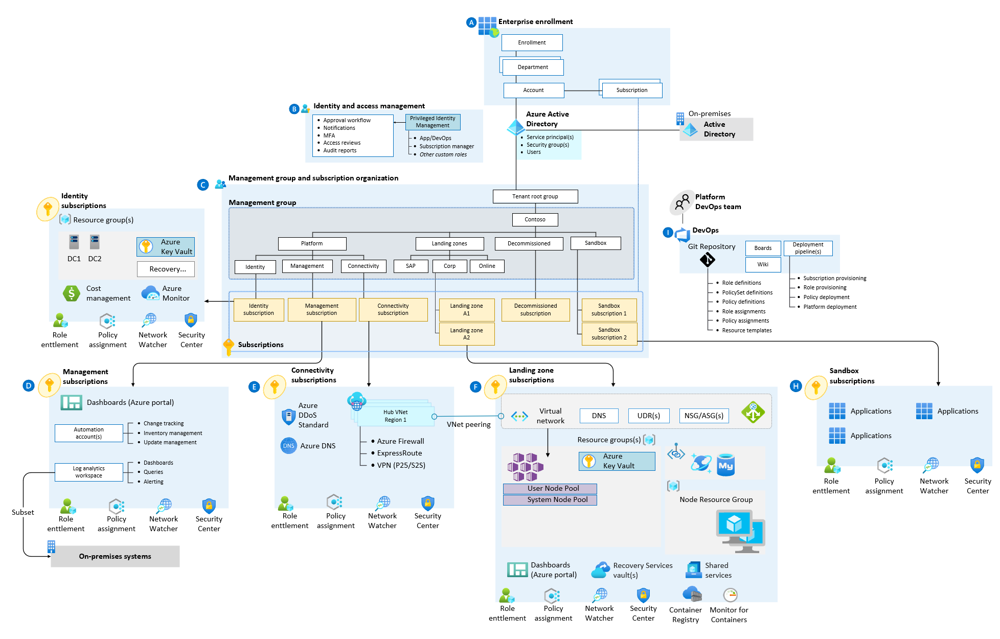

# Construction set for AKS enterprise-scale scenario

The enterprise-scale AKS construction set represents the strategic design path and target technical state for an Azure Kubernetes Service (AKS) landing zone. Prepare your enterprise-scale landing zone for a scalable Azure Kubernetes Service (AKS) cluster by using the AKS construction set. Learn about the assets that the AKS construction set brings to your project. The AKS construction set is a collection of templates that provides an architectural approach and reference implementation. The implementation follows the architecture and best practices of the Cloud Adoption Framework.

The construction set templates are open source. You can adapt the templates to create an architecture that meets your needs. The following guidance provides design considerations for implementing a scalable AKS cluster in your landing zone. The design decisions your organization makes, based on this guidance, can lay the groundwork for scalability.

## To begin, implement an enterprise-scale landing zone

The AKS construction set assumes that an enterprise-scale landing zone has been successfully implemented. For more information on this prerequisite, review these articles:

- [Start with Cloud Adoption Framework enterprise-scale landing zones](../../ready/enterprise-scale/index.md)
- [Implement Cloud Adoption Framework enterprise-scale landing zones in Azure](../../ready/enterprise-scale/implementation.md)

If you are not operating within an enterprise-scale landing zone topology, you might want to follow the guidance found in the [AKS Baseline reference architecture](/azure/architecture/reference-architectures/containers/aks/secure-baseline-aks).

## What the AKS construction set provides

The construction set approach to landing zones provides these assets to support your project:

- A modular approach, so that you can customize environment variables
- Design guidelines to aid in evaluating critical decisions
- The landing zone architecture
- A Microsoft-recommended AKS reference implementation based on the [AKS secure baseline](https://github.com/mspnp/aks-secure-baseline)

## Design guidelines

These articles provide guidelines for the AKS enterprise-scale scenario:

- [Identity and access management](./eslz-identity-and-access-management.md)
- [Network topology and connectivity](./eslz-network-topology-and-connectivity.md)
- [Management and monitoring](./eslz-management-and-monitoring.md)
- [Business continuity and disaster recovery](./eslz-business-continuity-and-disaster-recovery.md)
- [Security, governance, and compliance](./eslz-security-governance-and-compliance.md)
- [Platform automation and DevOps](./eslz-platform-automation-and-devops.md)

## Example conceptual reference architecture

The following conceptual reference architecture is an example that shows a golden state for an enterprise scale landing zone with a corporate landing zone subscription and shows design areas and best practices.

## AKS construction set reference implementation for online landing zone

The AKS construction set reference implementation is an open-source collection of Terraform templates. Terraform templates deploy infrastructure components like virtual machines, networks, or storage to Azure. To get the templates, see [Enterprise-Scale Construction Set for Azure Kubernetes Services using Terraform](https://github.com/Azure/caf-terraform-landingzones-starter/tree/starter/enterprise_scale/construction_sets/aks/online/aks_secure_baseline). This reference implementation currently deploys a simplistic version of an AKS implementation that can sit in its own subscription within the online management group of an enterprise-scale landing zone. An application deployed in the subscription for an online landing zone will be internet-facing, and does not require hybrid connectivity.

## Next steps

Learn about design considerations for identity and access management for your AKS enterprise-scale scenario.

- [Identity and access management for Azure Kubernetes Service (AKS) enterprise-scale scenario](./eslz-identity-and-access-management.md)
